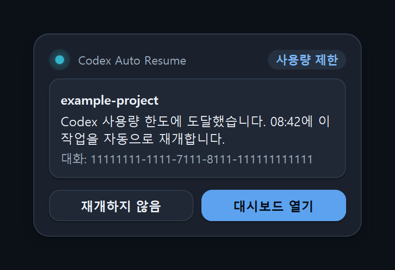

# Codex Auto Resume

**Windows에서 사용량 한도가 풀리면 똑같은 그 Codex 작업을 자동으로 이어 갑니다.**

[](https://github.com/songyb111-gachon/codex-auto-resume-windows/actions/workflows/test.yml)
[](https://github.com/songyb111-gachon/codex-auto-resume-windows/releases/latest)
[](#설치)
[](LICENSE)
[](#언어)

<sub>🇺🇸 <a href="README.md">English README</a> · 프로그램은 아홉 개 언어로 표시됩니다: English · 한국어 · 日本語 · 简体中文 · 繁體中文 · Español · Deutsch · Français · Português (Brasil)</sub>

Codex가 작업 도중에 멈추고 오전 6시 34분에 다시 해 보라고 말합니다. 오전 6시 34분에 사용자는
자고 있고, 아침에 보면 작업은 멈춘 그 자리 그대로입니다.

Codex Auto Resume는 한도가 풀릴 때까지 기다렸다가, 이어 가도 정말 안전한지 확인한 뒤 **바로 그
대화**를 이어서 진행시킵니다. 돌아왔을 때 멈춰 있는 작업이 아니라 끝난 작업을 보게 됩니다. 일시적인
rate limit, 네트워크 장애, 시간 초과, 서버 오류, 끊긴 스트림도 복구하지만, 이름을 댈 수 있고 다시
시도해도 안전한 장애일 때만 그렇게 합니다.

Windows ChatGPT/Codex 데스크톱 앱을 위한 작은 로컬 watcher입니다. Codex의 로컬 상태를 읽기 전용으로 관찰하고, 무엇이 실패했는지 분류한 뒤,
공식 `codex queue` 명령으로 continuation 메시지 한 건을 보냅니다. watcher 자체에는 네트워크 코드가 없고, 이 프로젝트로 전송되는 것도
없습니다. 재개하기 전의 사용량 확인은 공식 Codex 바이너리에 묻는 것이고 그 답은 OpenAI가 줍니다. 재개된 턴은 직접 시작한 턴과 똑같이 데스크톱 앱 안에서
사용자의 Codex 설정대로 실행되어 OpenAI로 갑니다. Codex 대화 안에서 이 플러그인의 도구와 명령이 돌려준 결과는 그 대화와 함께 OpenAI로 갑니다.
Codex에서 설치할 때는 GitHub에서 릴리스를 내려받습니다. 그리고 v0.5.7로 설치하면 Codex가 사용자가 설정해 둔 모든 Git
마켓플레이스도 새로 고칩니다(이 마켓플레이스만 지정하는 동작은 v0.6.0부터입니다).

**모든 실패를 재시도하지는 않습니다.** 이름 붙일 수 없는 실패는 건드리지 않습니다.

|  |  |
| --- | --- |
| **복구합니다** | Codex 사용량 한도, 그리고 Codex가 구체적인 오류 코드를 기록한 경우의 다음 장애: rate limit(HTTP 429) · 네트워크 장애 · 타임아웃 · 일시적 서버 오류(5xx) · 스트림 끊김. Codex 0.153.4는 많은 타임아웃, 스트림 끊김, 502/503/504 오류를 일반 코드로 기록합니다. status가 없으면 재시도하지 않지만, status가 함께 오면 그 값으로 분류합니다(429는 rate limit, 408·425는 타임아웃, 500~599는 서버 오류, 그 밖의 4xx는 영구). 자체 재시도를 포기한 HTTP 429는 `responseTooManyFailedAttempts`로 기록하는데, 이것은 rate limit으로 보고 복구합니다. 같은 코드라도 status가 429가 아니거나 없으면 재시도하지 않습니다 |
| **손대지 않습니다** | 사용자 취소 · 권한 · 승인 필요 · 콘텐츠 정책 · 잘못된 요청 · 컨텍스트 길이 초과 · 영구 인증 실패 · 분류되지 않은 모든 것 |
| **식별 방식** | 정확한 대화 UUID 하나. `--last`도, "가장 최근 것"도, 제목이나 폴더 이름도 쓰지 않습니다 |
| **설정 방법** | 시작 메뉴에서 여는 Windows 창(v0.6.0부터 개요·대기 중·기록·통계·진단·설정 여섯 페이지의 대시보드), Codex 안의 설정 패널, 명령줄 |
| **언어** | English · 한국어 · 日本語 · 简体中文 · 繁體中文 · Español · Deutsch · Français · Português (Brasil). 대시보드, 알림 영역 팝업, Windows 알림, Codex 안의 패널, Codex에 보내는 이어서 하기 메시지가 모두 이 언어들로 표시됩니다. 기본은 Windows 언어를 따르고 직접 고를 수도 있습니다. [언어](#언어) 참고 |
| **알려줍니다** | 중단 감지 · 복구 시작 · 결과 · 복구 중단 시 알림. v0.6.4 다음 릴리스부터는 알림 영역 옆에 제품 자신의 카드로 나타나고, 카드가 나타나면 안 될 때는 Windows 자체 알림으로 나타납니다. 워처가 실행 중인 동안에는 알림 영역 아이콘이 자동 복구가 일시 정지 상태인지, 몇 건이 대기 중이고 몇 건이 Codex에서 실행 중인지, 다음 확인까지 얼마나 남았는지를 툴팁으로 보여 줍니다(v0.6.0부터) |
| **개인정보** | 텔레메트리 없음, 분석 없음, 자동 업데이트 확인 없음, 자격 증명은 읽지 않음. 창의 *업데이트 확인*은 눌렀을 때만 GitHub에 가장 최근 릴리스를 묻고, 그것과 *호환성 데이터 새로 받기*는 이 PC에 관한 것을 아무것도 보내지 않은 채 raw.githubusercontent.com에서 Codex 호환성 데이터도 받아 옵니다. watcher에는 네트워크 코드가 없으며, 사용량 확인과 재개된 턴, 그리고 대화 안에서 이 플러그인의 도구와 명령이 돌려준 결과는 여느 Codex 통신처럼 Codex를 통해 OpenAI로 갑니다. 설치 스크립트는 GitHub에서 릴리스를 내려받고, v0.5.7의 설치기는 Codex가 사용자가 설정해 둔 모든 Git 마켓플레이스를 새로 고치게 합니다(이 마켓플레이스만 지정하는 동작은 v0.6.0부터입니다) |

> **먼저 알아두실 제한 하나.** 복구 메시지가 전달되려면 Codex가 그 대화를 열어 둔 상태여야 합니다.
> 앱을 재시작했다면 그 대화를 한 번만 열어 주시면 이후는 알아서 진행됩니다.
> [왜 그런지](#먼저-읽어야-할-제한-사항)

## 설치

**Windows 10/11. Python 불필요. 관리자 권한 불필요.**

### Codex에서 설치 (권장)

플러그인을 추가한 뒤, Codex에게 **auto resume 설정해줘** 라고 말하면 됩니다.

```
codex plugin marketplace add songyb111-gachon/codex-auto-resume-windows
codex plugin add codex-auto-resume@codex-auto-resume-windows
```

그러면 플러그인의 설치 스크립트가 실행됩니다. 이 저장소의 릴리스에서 해당 버전 압축 파일을
HTTPS로 내려받아, 플러그인의
[`scripts/release.json`](https://github.com/songyb111-gachon/codex-auto-resume-windows/blob/main/scripts/release.json)에
그 버전용으로 기록된 digest와 SHA-256을 대조합니다. 이 digest는 릴리스가 게시된 뒤 이 저장소에
커밋되는 것으로, 릴리스 자체에서 오는 값이 아닙니다. 플러그인에 들어 있는 `release.json`에
digest가 없는 버전이면 릴리스에 함께 게시된 `.sha256`과 대조하고, 그렇게 했다고 알려 줍니다.
digest가 기록된 마지막 버전보다 새로운 버전이 여기에 해당하고, 설치된 플러그인 자신의 버전은
언제나 여기에 해당합니다. 릴리스는 자기 자신의 digest를 담을 수 없고, 설치한 뒤에는 플러그인이 설치된
사본에서 실행되기 때문입니다. 이어서 내용이 정말 이 제품의 이 버전인지 확인한 다음에야, 현재
Windows 사용자에게만 설치합니다. 설치되는 것은 설치 폴더(기본값 `%USERPROFILE%\.codex-auto-resume`)
안의 파일, 시작 메뉴 항목(알림이 켜져 있을 때이며, 기본값은 켜짐입니다), 사용자 단위 레지스트리 값, 그리고 Codex에 등록되는 이 플러그인과 그
마켓플레이스(그 설치본을 가리킵니다)입니다. 플러그인의 지침에 따라 Codex가 실행하기 전에 무엇을
할지 먼저 알려 줍니다.

이 경로는 게시된 압축 파일을 내려받으며, v0.5.0부터 v0.5.7까지의 압축 파일은 모두 예전의 단일 작업(single-job) 릴리스
워크플로가 빌드했습니다. 이 워크플로는 GitHub Actions를 고정되지 않은 태그로 참조했고, 그 실행 파일은 바이트 단위로 똑같이 다시 빌드할 수 없습니다. 무엇이
이를 대신하는지는 [릴리스 압축 파일로 설치](#릴리스-압축-파일로-설치)의 2단계에 있습니다. 그 변경은 v0.6.0부터입니다.

GitHub에서 추가한 플러그인에는 스킬과 그 설치 스크립트와 엔진의 Python 소스가 들어 있지만, 그
소스를 실행할 인터프리터가 없고, 매니페스트에는 MCP 서버가 선언되어 있지 않습니다(함께 들어 있는
`.mcp.json`이 가리키는 실행 파일은 릴리스에만 있습니다). 실제로 실행되는 워처와 설정 창과 패널의
서버와 Windows 런타임은 모두 그 릴리스에서 옵니다.
그래서 다운로드가 필요하며, 스크립트가 무엇을 하고 무엇을 하지 않는지 미리 확인하고 싶다면
[`docs/PLUGIN.ko.md`](https://github.com/songyb111-gachon/codex-auto-resume-windows/blob/main/docs/PLUGIN.ko.md)를
읽어 보세요.

### 릴리스 압축 파일로 설치

설치 스크립트에 맡기지 않고 릴리스를 직접 내려받고 싶다면:

1. [최신 릴리스](https://github.com/songyb111-gachon/codex-auto-resume-windows/releases/latest)에서
   `CodexAutoResume-vX.Y.Z-win-x64.zip`을 받습니다.
2. **압축을 풀기 전에 확인합니다.** `Install.cmd`는 자신이 들어 있던 압축 파일을 검증하지
   않으므로(해시도 서명도 확인하지 않습니다), 이 단계가 곧 검증입니다. 내려받은 폴더에서
   PowerShell로 다음을 실행합니다.

   ```powershell
   (Get-FileHash .\CodexAutoResume-vX.Y.Z-win-x64.zip -Algorithm SHA256).Hash
   ```

   출력된 값이 압축 파일 옆에 게시된 `.sha256` 파일의 값, 그리고 `main` 브랜치의
   [`scripts/release.json`](https://github.com/songyb111-gachon/codex-auto-resume-windows/blob/main/scripts/release.json)에
   그 버전용으로 기록된 digest와 같아야 합니다 (`Get-FileHash`는 대문자로 출력하지만 대소문자는
   상관없습니다). `.sha256`은 압축 파일과 같은 곳에서 오므로 파일이 온전하다는 것을 보여 줍니다.
   `release.json`의 값은 릴리스 파일이 아니라 이 저장소의 커밋이므로 별도의 기록이며, 이 값을
   바꾸려면 `main`에 새 커밋이 필요합니다. 이 값은 릴리스가 게시된 뒤에 추가되므로
   막 나온 버전은 아직 없을 수 있고 v0.5.1까지의 버전은 항목이 없으며, 아래의 attestation 확인은 이 값과 무관하게 할 수 있습니다.
   GitHub CLI가 있다면 어느 워크플로 실행과 어느 커밋이 이 파일을 빌드했는지 확인할 수 있습니다
   (attestation은 v0.5.4 이후의 압축 파일에 있습니다).

   ```powershell
   gh attestation verify .\CodexAutoResume-vX.Y.Z-win-x64.zip --repo songyb111-gachon/codex-auto-resume-windows
   ```

   하나라도 맞지 않으면 파일을 지우고 실행하지 마세요. 각 확인이 무엇을 증명하고 무엇은 증명하지 못하는지는
   [`docs/VERIFY.ko.md`](https://github.com/songyb111-gachon/codex-auto-resume-windows/blob/main/docs/VERIFY.ko.md)에
   있습니다. v0.5.0부터 v0.5.7까지의 압축 파일은 모두 예전의 단일 작업(single-job) 릴리스 워크플로가 빌드했습니다. 이
   워크플로는 GitHub Actions를 고정되지 않은 태그로 참조했고, 그 실행 파일은 바이트 단위로 똑같이 다시 빌드할 수 없습니다. 빌드와 게시 작업의 분리,
   정확한 커밋에 고정한 action, 재현 가능한 실행 파일은 게시된 v0.6.0 릴리스에 포함됩니다.
3. 아무 곳에나 압축을 풀고 **`Install.cmd`**를 더블클릭합니다.

압축 파일이 자체 Python 런타임을 담고 있어서 미리 설치할 것이 없고, 끝나면 권장 설정이 이미 켜져 있습니다. `Install.cmd`는 스스로 아무것도 내려받지
않습니다. Codex 플러그인도 압축 파일 안의 파일로 등록하므로 이 경로에서도 패널까지 함께 설치됩니다. 다만 Codex에 마켓플레이스 새로 고침은 요청합니다. v0.5.7과 그 이전 설치기는 모든 Git 마켓플레이스의 새로 고침을 요청합니다. 현재 v0.6.0 설치기는 이 제품의 마켓플레이스만 지정하므로, 방금 등록한 로컬 마켓플레이스에
대해서는 아무 일도 일어나지 않습니다. Codex가 무언가를 가져오는 것은 예전에 GitHub에서 등록한 이 마켓플레이스가 재지정 뒤에도 남아 있을 때뿐입니다. 이 변경은
v0.6.0부터입니다.

이 프로젝트가 빌드하는 것은 어느 것도 Authenticode 서명이 되어 있지 않습니다. 두 실행 파일도,
`Install.cmd`와 `Uninstall.cmd`도, PowerShell과 Python 스크립트도 마찬가지입니다. 함께 들어 있는
Python 인터프리터(`pythonw.exe`, `python.exe`와 Python DLL이며, 인터프리터의 Visual C++ 런타임
DLL 두 개는 Microsoft가 서명했습니다)는 Python Software Foundation의 서명을 그대로 유지하며,
워처는 그 `pythonw.exe`로 실행됩니다. 어느 경로로 설치하든 Smart App Control을 켜 두었다면
서명되지 않은 두 실행 파일, 곧 설정 창 `CodexAutoResumeSettings.exe`와 Codex가 플러그인의 도구와
패널을 위해 실행하는 `codex-auto-resume-mcp.exe`가 차단될 수 있습니다. 이 수동 경로에서는
탐색기가 내려받은 파일 표시를 유지하므로 `Install.cmd`와 `Uninstall.cmd`도 차단될 수 있고, 게시자를
알 수 없다는 SmartScreen 경고가 뜰 수 있습니다. 이런 경고나 차단은 파일에 서명이 없고 Microsoft에서
아직 평판이 쌓이지 않았다는(또는 인터넷에서 내려받은 스크립트 형식이라는) 뜻일 뿐, 이 프로젝트가
게시한 그 파일인지는 알려 주지 않습니다. 그것은 2단계가 알려 줍니다.

### 어느 쪽이든

두 경로 모두 같은 설치본 한 곳(기본값 `%USERPROFILE%\.codex-auto-resume`)에 설치됩니다. 워처 하나,
데이터베이스 하나, 설정 파일 하나, 로그인 항목 하나입니다. 어느 쪽이든 다시 실행하면 업그레이드이자
복구 경로이며, 대기 중인 재개를 그대로 유지합니다. 업그레이드할 때는 새 버전이 이어받도록 실행 중인
워처에 멈춰 달라고 요청하고 최대 1분까지 기다립니다. 강제로 종료하지는 않으며, 이전 워처가 아직
하던 일을 마치는 중이면 그대로 두고 그렇다고 알려 줍니다. 이 플러그인의 MCP 런처가 파일을 열고
있어서 Codex가 플러그인을 교체하지 못하면, 설치기는 그 런처를 강제로 종료하고 다시 시도합니다.
Codex는 다음에 필요할 때 새 런처를 시작합니다. `Uninstall.cmd`를 실행하거나 Codex에게 제거를
요청하면 제거됩니다. 경로마다 무엇이 남는지는 [제거](#제거)를 참고하세요.

설치 후에는 **시작 메뉴 → Codex Auto Resume**에서, 또는 Codex에게 *auto resume 설정 열어줘* 라고
말해서 설정을 바꿀 수 있습니다.

## 화면

작업이 중단되면 알림 영역 옆에 제품 자신의 디자인으로 된 **Codex Auto Resume** 카드가 나타나, 어느
작업이 왜 멈췄는지와 정확히 어느 대화인지 알려 줍니다. 아무것도 하지 않으면 재개됩니다. **재개하지
않음**은 취소만 하고, **대시보드 열기**는 대시보드의 대기 중 페이지를 열기만 합니다. 카드가 나타나면
안 될 때, 곧 세션이 잠겨 있거나 원격일 때, 전체 화면 앱이 떠 있을 때, 방해 금지나 집중 모드가 켜져
있을 때, 화면 읽기 프로그램이 실행 중일 때, 카드나 알림 영역 아이콘을 꺼 두었을 때는 같은 말과 같은 두
버튼을 담은 Windows 자체 알림이 대신 뜹니다. 카드가 보인 뒤에는 그 조용한 사본이 Windows 알림 센터에
들어가므로 어느 쪽이든 기록은 같습니다. 아래는 제품이 그리는 카드 그대로를 예시 자료로 화면 밖에서 밝은
테마와 어두운 테마로 렌더링한 것입니다. 각 줄이 무엇인지는 [알림](#알림)에 있습니다.

 

Codex 안에서 *auto resume 설정 열어줘* 라고 하면, 무엇이 대기 중인지 보여 주고 대부분을 그 자리에서
바꿀 수 있는 패널이 열립니다. 일반, 복구, 알림, 이어서 하기 메시지, 모양 부분이 있고, 워처가 실제로
보낼 메시지의 미리보기와 대기 중인 대화마다의 스위치가 있습니다. 패널은 모양에서 테마를 따로 고르지
않는 한 Codex의 밝은 테마·어두운 테마를 따르고, Codex의 움직임 줄이기 설정도 따릅니다. 패널에서
저장한 언어나 테마는 곧바로 적용됩니다. 직접 입력 메시지는 패널에 보이기만 하고 고칠 수는 없으며, 고치는
곳은 대시보드뿐입니다. 아래 그림은 Codex 창을 찍은 사진이 아니라, 플러그인이 Codex에 제공하는
바로 그 리소스를 그대로 렌더링한 것입니다.


시작 메뉴에서는 대시보드가 열립니다. Codex를 꺼 둔 상태에서도 동작하는 독립 창으로, 워처가 무엇을
하고 있는지, 무엇이 대기 중이고 언제 다시 확인하는지, 무엇이 어떻게 끝났는지, 최근 일주일 수치, 워처
상태, 그리고 설정을 한 창에서 보여 줍니다. 머리글의 불빛은 워처가 하는 일을 보여 줍니다. 워처가 실행 중이고 자동 복구가
켜져 있으면 불빛은 청록색이고 은은하게 빛납니다. 감시 중에는 천천히 숨 쉬고, 기다리는 중에는 가만히
있고, 때가 된 작업을 확인할 때는 작은 호가 돌고, 복구 중에는 조금 더 빠르게 숨 쉽니다. 일시 정지되었거나
멈추면 빛나지 않는 회색이고, 확인이 필요하면 주황색으로 한 번 부드럽게 맥동합니다. 옆의 단어가 늘 어느
상태인지 알려 줍니다.
설정 > 모양의 **테마**는 창과 팝업을 밝게 또는 어둡게 그리며, 기본값인 *시스템 설정 따르기*는
Windows에 설정된 앱 모드를 따릅니다. 화면 언어나 테마가 바뀌면(창에서 저장했든, Codex에서 바꿨든,
Windows가 밝게와 어둡게 사이에서 바뀌었든) 창이 스스로 닫혔다가 같은 페이지, 같은 자리에서 다시
열립니다. 다만 저장하지 않은 변경 사항이 있을 때는 다시 열지 않습니다. 같은 모양 부분의 **움직임
줄이기**는 이 애니메이션을 멈추며, Windows 자체의 애니메이션 설정도 항상 따릅니다. 고대비 모드에서는
테마와 상관없이 그림자와 색조를 뺍니다. 네이티브 창이며, 로컬 웹 서버를 띄우거나 브라우저를 여는
일은 없습니다.

이 문서의 창 그림은 합성 기록을 넣은 임시 설치에서 밝은 테마로 찍은 것입니다. 창이 어떻게 보이는지를 보여 줄 뿐
실제 복구 장면이 아니며, 실제 Codex에서 복구를 관찰했다는 증거도 아닙니다.


대기 중인 복구마다 왜 기다리는지와 언제 다시 확인하는지가 보이고, **기다리는 이유**는 선택한 작업에
대해 워처가 마지막으로 기록한 안전 확인 목록을 보여 줍니다. 줄마다 있는 **자동 이어 가기** 스위치는
그 작업이 속한 대화의 자동 복구를 끄거나 켭니다. 클릭에는 그 줄을 그릴 때의 정확한 중단과 대화가
함께 실리며, 누르는 사이에 끝났거나 사라졌거나 다른 대화의 것으로 밝혀진 작업에 대한 클릭은 거절되고
아무것도 바꾸지 않습니다. 어느 쪽이든 스위치는 아무것도 보내지 않습니다. **지금 다시 확인**은 워처에게
지금 다시 살펴보라고 요청할 뿐입니다. 모든 확인은 그대로 적용되고, 전부 통과해야만 보냅니다.
**취소**는 그 중단과 그것을 이어받는 것 전부의 복구를 멈춥니다. 아직 보내지 않은 기록은 그대로
취소하고, 이미 Codex에 넘어갔을 수 있는 것은 표시만 해 두었다가 아직 큐에 있으면 되가져오며, 이미
끝난 기록에도 표시를 남겨 그 작업의 이후 실패가 새 연쇄를 시작하지 못하게 합니다. 이미 Codex에서
실행 중인 이어서 하기는 멈추지 않으며, 확인 문구가 그렇게 말해 줍니다. **모두 취소**는 대기 중인 복구
전부에 같은 일을 정확한 기록 하나씩 합니다. 한꺼번에 다시 시도하는 기능은 일부러 두지 않았습니다.
**이 대화는 끄기**는 그 대화에서 대기 중인 복구를 취소하고, 다시 켤 때까지 그 대화의 자동 복구를 꺼
둡니다. 그러면 대기 중 페이지와 기록 페이지에 **이 대화 다시 켜기**가 나타납니다.


워처가 실행 중인 동안에는 알림 영역에도 아이콘이 나타납니다. 워처 프로세스 자신의 것이라서 워처가
시작하면 생기고 멈추면 사라지며, 없는 워처를 있는 것처럼 보여 줄 수 없습니다. 아이콘에는 워처 상태를
나타내는 작은 배지가 붙습니다. 툴팁은 자동 복구가 일시 정지 상태인지, 몇 건이 대기 중이고 몇 건이
Codex에서 실행 중인지, 다음 확인까지 얼마나 남았는지를 보여 줍니다.

아이콘을 한 번 클릭하면 옆에 작은 팝업이 열리고, 다시 클릭하면 닫힙니다. 팝업에는 워처 상태, 대기
중·복구 중인 작업 수, 다음 확인, 대기 중인 작업 최대 세 개(작업마다 그 작업의 정확한 중단과 대화에 묶인
스위치가 있습니다), **자동 복구 일시 정지** 또는 **자동 복구 다시 켜기**, **대시보드 열기**가 있습니다.
다른 곳을 클릭하거나 Esc를 눌러도 닫힙니다. 팝업은 워처 프로세스 안, 아이콘과 같은 스레드에서 실행되고
다른 모든 화면과 같은 제어 계층을 거치며, 팝업 안의 어떤 것도 이어서 하기 메시지를 보낼 수 없습니다.
오른쪽 클릭 메뉴는 그대로입니다. **Codex Auto Resume 열기**, **자동 복구 일시 정지**(일시 정지 상태라면
**자동 복구 다시 켜기**), **워처 중지**가 있고, 팝업이 어두울 때는 메뉴도 어둡게 그려집니다. 팝업과
메뉴는 워처를 다시 시작하지 않아도 다음에 열릴 때 새 언어나 테마를 씁니다. 남은 시간이 0이 되어도 워처가 다시 살펴볼 뿐, 그것
때문에 무언가를 보내지는 않습니다. 아이콘은 기본으로 켜져 있고 설정 페이지의 **알림 영역에 아이콘
표시**로 끌 수 있습니다.


모든 창, 팝업, 알림, Codex 안의 패널은 화면 언어를 따릅니다. 같은 팝업을 영어, 일본어,
중국어(간체), 독일어로 표시한 모습입니다.

   

## 먼저 읽어야 할 제한 사항

이 도구는 Windows ChatGPT/Codex 데스크톱 앱이 **현재 로드하고 있는 스레드만** 자동 재개할 수 있습니다.

앱을 재시작하면 대상 스레드는 `notLoaded` 상태가 됩니다. 그리고 **미로드 스레드를 프로그램적으로 깨우는
지원된 방식은 확인되지 않았습니다.** 실측했을 때 미로드 스레드에 큐로 넣은 메시지는 스레드가
미로드 상태로 있던 90초 동안 큐에만 남고 대화 턴으로 전달되지 않았습니다. 증거는
[`docs/evidence/unloaded-thread-delivery.json`](https://github.com/songyb111-gachon/codex-auto-resume-windows/blob/main/docs/evidence/unloaded-thread-delivery.json)에
있습니다. 그런 메시지는 나중에 스레드가 다시 로드될 때 Codex가 전달할 수도 있습니다. 그래서 이
도구는 방금 로드된 것을 확인한 스레드에만 메시지를 큐에 넣고, 메시지가 도착하기 전에 스레드가
미로드로 보고되면 자기가 넣은 메시지를 거둬 달라고 Codex에 요청합니다. Codex가 회수를 확인해 주지
않으면 메시지가 큐에 남을 수 있으며, 그 기록은 `submission_unknown`으로 표시되고 다시 보내지
않습니다.

따라서 미로드 스레드는 **사용자가 ChatGPT 앱에서 그 대화를 직접 열어야만** 이후 자동 재개됩니다.
그전까지 watcher는 `waiting_for_loaded_thread` 상태로 조용히 기다립니다. 창과 Codex 패널은 이를
공개 코드 `waiting_thread`로 다루며 화면에는 "대화 열기 대기"로 보여 주고, 명령줄은 상태와
코드를 나란히 출력합니다. 화면 자동화를 쓰지 않고,
대화를 강제로 열지 않으며, 혹시나 하는 마음으로 메시지를 큐에 넣지도 않습니다.

즉 **앱 재시작을 넘나드는 완전 무인 자동 재개가 아닙니다.** 이 문서는 그렇지 않은 척하지 않습니다.

## 무엇을 복구하고 무엇을 복구하지 않는가

자동으로 복구합니다:

| 장애 | 정책 |
| --- | --- |
| 사용량 한도 (`usageLimitExceeded`) | 실제 리셋 시각까지 기다린 뒤 실시간 사용량을 다시 확인 |
| 연결 실패 (`httpConnectionFailed`) | 상한 있는 backoff |
| 타임아웃 (HTTP 408/425) | 상한 있는 backoff |
| 일시적 rate limit (HTTP 429, `rateLimitExceeded`, 그리고 429를 달고 온 `responseTooManyFailedAttempts`) | 상한 있는 backoff. 첫 대기는 최소 1분 |
| 서버 오류 (HTTP 5xx, `serverOverloaded`, `internalServerError`) | 상한 있는 backoff |
| 스트림 끊김 (`responseStreamDisconnected`, `responseStreamConnectionFailed`) | 상한 있는 backoff |

절대 복구하지 않습니다. 사람이 판단해야 하고, 재시도는 시도 횟수만 낭비합니다:

사용자 취소 · 권한 · 승인 필요 · 콘텐츠 정책 · 잘못된 요청 · 컨텍스트 길이 초과 ·
영구 인증 실패 (401/403, `unauthorized`) · `badRequest` · `sandboxError` ·
status가 429가 아닌 `responseTooManyFailedAttempts` · **분류되지 않은 모든 것**.

분류는 구조적으로 합니다. Codex가 기록하는 `codexErrorInfo` variant를 먼저 보고, 그 variant가 담은
HTTP status를 봅니다. 메시지 문구는 구조화된 코드가 아예 없을 때만, 그리고 코드가 없는 전송 계층
장애에 한해서 참고합니다. 구조화된 코드를 메시지 문구가 뒤집는 일은 없습니다.

복구에는 세 겹의 상한이 있습니다. 하나의 중단마다 최대 4회, 눈에 보이는 진전 없이 3번 연속 복구되면
멈춤, 그리고 한 작업이 받을 수 있는 이어서 보내기는 그 작업의 모든 실패를 통틀어 최대 6회입니다.
복구 턴이 다시 실패하면 새 예산으로 시작하지 않고 같은 연쇄를 이어받습니다. 작업당 상한은 1~10만
받습니다. 사용자가 그 대화를 직접 이어서 진행했다면 오래된 중단은 그 위에 덮어쓰지 않고 버립니다.

## 정확히 그 대화만

복구 대상은 언제나 **정확한 대화 UUID**로만 지정됩니다. `--last`를 쓰지 않고, "가장 최근 스레드"를
고르지 않으며, 제목·프로젝트 이름·작업 디렉터리·최근 사용 순서로 대화를 찾지 않습니다. 알림에 보이는
이름은 표시용일 뿐이고, 식별에는 쓰이지 않습니다.

## 설정

설정할 수 있는 것은 모두 한곳에 있고, 세 가지 방법으로 닿을 수 있습니다.

- **시작 메뉴 → Codex Auto Resume** — 대시보드의 설정 페이지입니다. Codex가 닫혀 있거나,
  플러그인이 꺼져 있거나, 네트워크·로그인·시스템 Python이 없어도 동작합니다. 설정은 설정하는
  대상이 쓸 수 없을 때 가장 필요하기 때문입니다.
- **Codex 안에서** — auto resume 설정을 열어 달라고 하면 대화 안에 패널이 나타납니다.
- **명령줄** — 스크립트와 복구용입니다.

세 곳 모두 같은 검증기를 거쳐 같은 파일에 쓰므로, 한곳에서 정한 값이 다른 곳에도 그대로
보입니다. 직접 편집한 설정 파일은 읽을 때 검증되어, 잘못된 값은 절반만 적용되는 대신 안전한
기본값으로 바뀝니다.

설정 페이지는 다섯 부분으로 나뉩니다.

| 부분 | 들어 있는 것 |
| --- | --- |
| 일반 | 화면 언어, Windows 로그인 시 시작, 알림 영역 아이콘, 표시할 알림 |
| 자동 복구 | 분류된 중단 가운데 어떤 종류를 복구할지. 종류마다 체크박스가 하나씩 있습니다 |
| 이어서 하기 메시지 | Codex에 보내는 메시지의 언어와 스타일, 직접 입력 메시지, 실제 문장 미리보기 |
| 모양 | 테마(시스템 설정 따르기, 밝게, 어둡게), 움직임 줄이기 |
| 고급 | 중단당 시도 횟수, 진전 없는 복구 뒤 멈출 시점, 작업당 이어서 하기 횟수, 재시도 간격 |

워처가 복구하는 종류에는 모두 체크박스가 있고 기본으로 체크되어 있습니다. 로그인 서비스를 일시적으로
쓸 수 없는 경우(`auth_service_transient`)는 v0.6.2까지 끌 방법 없이 복구되었고, 지금은 **로그인 서비스
오류** 체크박스가 있습니다.

스위치는 동작하는 무언가를 켜고 끕니다(알림, 알림 영역 아이콘, 움직임 줄이기, 로그인 시 시작, 대화
하나의 자동 복구). 체크박스는 목록에서 어떤 항목을 적용할지 고릅니다(위의 중단 종류, 표시할 알림).
같은 설정은 대시보드와 패널에서 같은 종류입니다.

안전 속성은 설정이 아니므로 끌 수 없습니다. 분류되지 않은 실패를 다시 시도하거나, 제목으로
대화를 고르거나, 전송 여부가 불확실한 것을 다시 보내거나, 강제로 보내는 옵션은 없습니다.
빠뜨린 것이 아니라 일부러 그렇게 만들었습니다.

### 언어

화면은 English, 한국어, 日本語, 简体中文, 繁體中文, Español, Deutsch, Français, Português (Brasil)로
표시됩니다. **화면 언어**의 기본값은 *시스템*이며, Windows가 첫 번째로 꼽는 언어를 따르고 이
제품에 없는 언어면 영어로 표시합니다. 직접 고른 언어는 Windows보다 우선하며 재시작·복구·업데이트
뒤에도 유지됩니다. 환경 변수 `CODEX_AUTO_RESUME_LANG`은 Windows가 알려 주는 언어를 대신하므로,
설정이 *시스템*일 때만 언어를 정합니다. 새 언어는 곧바로 보입니다. 대시보드는 그 언어로 스스로 다시
열리고, 패널은 그 언어로 다시 그려지며, 팝업, 메뉴, 알림은 다음에 나타날 때부터 그 언어를 씁니다.

### 이어서 하기 메시지

워처는 작업을 이어 갈 때 Codex에 짧은 메시지 하나와, 자기가 시작한 턴을 정확히 알아보기 위한 한
줄을 보냅니다. **이어서 하기 언어**는 그 메시지의 언어를(기본값은 화면 언어), **메시지 스타일**은
문장을 정합니다.

| 스타일 | 말하는 내용 |
| --- | --- |
| 간단히 | 다시 시도해 달라고만 합니다 |
| 기본(기본값) | 작업이 멈춘 이유를 말한 뒤 다시 시도해 달라고 합니다 |
| 자세히 | 지금까지의 작업을 확인하고 이미 끝난 일은 반복하지 말라고도 요청합니다 |
| 직접 입력 | 직접 쓴 문장 |

**직접 입력** 메시지는 쓴 그대로 보내며, 번역하거나 고쳐 쓰지 않습니다. 모든 중단에 쓸 메시지
하나를 쓰거나 중단 종류마다 따로 쓸 수 있고, 비어 있으면 모든 중단에 쓰는 메시지로, 그다음 기본
메시지로 대신합니다. `{reason}`, `{category}`, `{attempt}`, `{max_attempts}`, `{reset_time}`만 쓸 수
있으며, 프롬프트·답변·제목·경로·계정·토큰을 메시지에 넣게 되는 자리표시자는 이름을 밝혀 거절하고,
최대 2000자입니다. **미리보기**는 워처가 보낼 때 쓰는 바로 그 코드로 만든, 중단 종류별로 실제
보내질 문장을 보여 줍니다.

직접 입력 문장은 대시보드에서만 쓸 수 있습니다. Codex는 메시지를 미리 보고 언어나 스타일을 바꿀
수 있지만, 문장 자체는 정할 수 없습니다. 대화에 자동으로 보내지는 문장이 모델이 설득당해 바꿀 수
있는 것이어서는 안 되기 때문입니다.

메시지는 무엇을 복구할지를 바꾸지 않습니다. 스타일과 문장은 워처가 이미 하기로 결정한 복구에
쓸 말을 고를 뿐입니다.

## 알림

워처가 중단을 기록하면 작업 이름이 적힌 알림 하나를 보여 줍니다. v0.6.4 다음 릴리스부터 이 알림은
알림 영역 옆에 제품 자신의 디자인으로 된 카드로 나타나며, Windows 알림과 같은 말과 같은 단추를 담고,
카드가 보인 뒤에는 같은 알림이 조용히 Windows 알림 센터에 더해집니다. 카드가 나타나면 안 될 때는 대신
Windows 자체 알림을 보여 줍니다. **알림 영역 옆에 알림을 카드로 표시**(설정 > 일반 > Windows)가 꺼져
있을 때, 방해 금지나 집중 모드가 켜져 있을 때, 전체 화면 앱 위에서, 세션이 잠겨 있거나 원격일 때, 화면
읽기 프로그램이 실행 중일 때, 알림 영역 아이콘이 꺼져 있을 때입니다.

```
Payment retry refactor
Codex 사용량 한도에 도달했습니다. 05:56에 이 작업을 자동으로 재개합니다.
example-project  ·  대화: 0a1b2c3d-0109-7000-8000-000000000109
                         [재개하지 않음]   [대시보드 열기]
```

첫 줄은 대화 제목, 없으면 프로젝트, 없으면 작업 폴더 이름, 그것도 없으면 "Codex 작업"입니다.
**정확한 스레드 UUID는 항상 표시합니다.** 제목은 겹칠 수 있지만 식별자는 겹치면 안 되기
때문입니다. 일시적인 실패일 때는 어떤 종류였는지를 밝혀 "네트워크 문제 · Codex 작업이 일시적으로
중단되었습니다. 자동으로 다시 시도합니다."라고 적고, **다시 시도하지 않음** 버튼과 함께 보여 줍니다.

Windows는 세 줄까지만 그리고 나머지는 버리므로, 네 줄이 아니라 세 줄이고, 이유가 식별자보다
앞에 옵니다.

이 이름들은 표시용일 뿐입니다. 복구는 제목·프로젝트·최근 여부로 대화를 고르지 않습니다.

아무것도 하지 않으면 재개됩니다. 그것이 기본값입니다. **재개하지 않음** / **다시 시도하지 않음**은
그 중단 하나와 그것을 이어받는 것의 자동 재개를 취소할 뿐, 다른 것은 건드리지 않습니다.
**대시보드 열기**는 대시보드의 대기 중 페이지를 열고 그 밖의 일은 하지 않습니다.

비슷한 선택을 두 곳에서 더 할 수 있으며, 둘 다 옆에 표시된 바로 그 중단과 대화에 묶여 있습니다.
알림 영역 팝업의 작업마다 붙은 스위치와, 대시보드 대기 중 페이지의 **자동 이어 가기** 열입니다.
이 스위치는 그 중단 하나를 취소하는 것이 아니라, 그 작업이 속한 대화의 자동 복구를 다시 켤 때까지
끄거나 켭니다. 누르는 사이에 끝났거나 사라졌거나 다른 대화의 것으로 밝혀진 작업에 대한 클릭은
거절되고 아무것도 바꾸지 않습니다. 세 곳 모두 무엇도 보내지 않습니다. 워처가 이어 가도 되는지만
바꾸고, 보내기 전에는 워처가 여전히 모든 것을 확인합니다. Codex 자체의 사용량 한도 안내에는
아무것도 덧붙일 수 없으며, 그 이유는
[docs/PLUGIN.ko.md](https://github.com/songyb111-gachon/codex-auto-resume-windows/blob/main/docs/PLUGIN.ko.md)에
있습니다.

알아 둘 점:

- 버튼에는 처리기가 필요하므로 `install`이 사용자별 `codex-auto-resume:` URL 프로토콜을
  `HKCU\Software\Classes`에 등록합니다. `uninstall`은 그것이 이 설치본을 가리킬 때만 다시 지웁니다.
- 이 프로토콜이 받는 동작은 정확히 두 가지입니다. 재개 하나를 취소하는 것과, 정해진 목록에 있는
  대시보드 페이지 하나를 여는 것입니다. 악의적이거나 잘못 입력한 URI가 할 수 있는 일은 재개를
  *멈추거나* 창을 여는 것뿐이며, 재개를 *발생시킬* 수는 없고, 중단 id는 실제 기록과 맞아야 합니다.
- 알림에는 표시용 이름, 로컬 시각, 스레드 UUID만 나오고 프롬프트 내용, 오류 본문, 계정 정보는
  나오지 않습니다. 중단 종류는 분류된 범주에 대한 이 제품의 레이블이지 오류 문장이 아닙니다. 표시
  이름은 `threads.name`에서만 가져오며, 이 스키마에서 원래의 첫 프롬프트를 담는 `title`, `preview`,
  `first_user_message`는 읽지 않습니다.
- 알림은 화면 언어로 표시됩니다.
- 보내는 주체는 **Codex Auto Resume**로 표시되고 이 프로젝트의 아이콘이 함께 나옵니다. PowerShell이나
  Python 이름은 보이지 않습니다. 이것은 설치가 시작 메뉴 바로 가기와 알림 발신자 식별자를 등록해 두기
  때문이며, Windows는 그 등록 없이는 토스트를 그리지 않습니다.
- 최선을 다해 보여 줄 뿐입니다. 보여 줄 수 없어도 재개는 원래대로 일어납니다.

이후 세 가지 알림이 더 있습니다. 복구 시작, 결과, 그리고 복구를 완전히 중단했을 때. 각각 상태 변화
자체에서 한 번만 발생하므로 알림 내용과 기록된 상태가 어긋날 수 없습니다. 어느 알림을 끄더라도
작업이 복구되는지는 달라지지 않습니다.

## 요구 사항

- Windows 10/11.
- 공식 Windows ChatGPT/Codex 데스크톱 앱. 실행 중이어야 하며, 엔진이
  `%LOCALAPPDATA%\OpenAI\Codex\bin\<hash>\codex.exe`에 있어야 합니다.
- 엔진은 자동으로 찾습니다. 검증된 버전은 그대로 신뢰하고, Codex가 업데이트되어 처음 보는 버전이
  나오면 `codex queue`가 여전히 `--thread`와 `--message`를 제공할 때만 받아들이며, 이때
  `status`와 `doctor`가 "검증되지 않음"이라고 표시합니다. 그 인터페이스를 증명하지 못하는 것은
  추측하지 않고 거부합니다.

**두 설치 경로 모두 Python이 필요하지 않습니다.** 설치본이 자체 런타임(Python 3.13.15)을 함께
가져오고, 플러그인의 설치 스크립트는 PowerShell입니다. Python 3.12 이상은 소스 체크아웃에서 엔진을
직접 실행할 때만 필요합니다. CI는 라이브가 아닌 테스트를 Python 3.12, 3.13, 3.14에서 반드시 통과해야
하는 작업으로 돌리고, 3.15 사전 릴리스에서는 결과를 보여 주되 막지는 않는 참고 작업으로 돌립니다.

## Codex에서 관리하기

설치하고 나면 어느 경로로 설치했든 같은 스킬을 쓸 수 있습니다. 앱에서 이렇게 말하면 됩니다.

> 자동 재개 설정해 줘

그다음부터는 "자동 재개 상태 보여 줘", "대기 중인 자동 재개 보여 줘", "자동 재개 설정 열어 줘",
"자동 재개 꺼 줘"와 "자동 재개 다시 켜 줘", "이 작업 자동 재개 취소해 줘", "자동 재개 통계 보여 줘",
"이 복구 진행 기록 보여 줘", "지금 다시 확인해 줘", "이 복구 시도 횟수 돌려줘", "워처 시작해 줘",
"복구 기록 지워 줘", "자동 재개 메시지 미리 보여 줘", "자동 재개 제거해 줘"처럼 말하면 됩니다.

"자동 재개 메시지 미리 보여 줘"는 플러그인의 도구 17개 가운데 하나인 `preview_recovery_message`를
씁니다. 읽기 전용이라 아무것도 저장하거나 보내지 않고, 중단 종류 하나에 대해 워처가 보낼 문장을 지금의
언어와 스타일로, 또는 미리보기에만 쓸 언어와 스타일로 보여 줍니다. Codex는 화면 언어, 이어서 하기
언어, 메시지 스타일(직접 입력으로 바꾸는 것까지), 테마를 바꿀 수 있지만 직접 입력 문장은 쓸 수 없습니다. 그
문장은 대화에 자동으로 보내지므로 Windows 대시보드의 설정 > 이어서 하기 메시지에서만 씁니다.

자동화를 줄이는 쪽에는 확인을 받으라는 표시가 없습니다. 자동 복구 일시 정지, 대화 하나 끄기, 지금
다시 확인이 그렇고, 메시지 미리보기는 읽기 전용입니다. 다시 켜기, 설정 변경, 워처 시작, 복구 취소, 시도 횟수 되돌리기, 기록
지우기는 MCP의 `destructiveHint`로 승인을 요청합니다. 실제 확인 창은 Codex와 승인 설정에 달려 있습니다.
이 프로젝트의 테스트는 주석만 확인하며, 이번 릴리스에서 실제 Codex의 승인 동작을 관찰한 적은 없습니다.

플러그인은 명령줄과 시작 메뉴 창이 쓰는 것과 같은 검증된 제어 계층 위에 놓인 얇은 앞단입니다. tool은
그 계층을 직접 호출하고, tool을 쓸 수 없을 때만 스킬이 명령줄로 넘어갑니다. 두 번째 엔진도,
백그라운드 서비스도 추가하지 않습니다. 상태는 플러그인 디렉터리 바깥의
`%USERPROFILE%\.codex-auto-resume\`에 두므로, 플러그인을 업데이트하거나 제거해도 대기 중인 재개를
잃지 않습니다. 워처는 Codex 앱을 닫아도 계속 실행되며, Windows에 로그인할 때 다시 시작됩니다.

플러그인 구조, 설치 스크립트가 무엇을 하고 무엇을 하지 않는지, 업데이트와 제거의 수명 주기, 그리고
사용량 한도 안내에 왜 체크박스를 넣지 않는지는
[docs/PLUGIN.ko.md](https://github.com/songyb111-gachon/codex-auto-resume-windows/blob/main/docs/PLUGIN.ko.md)에
있습니다.

> 설치본은 하나이며, 두 경로 모두 그 하나로 모입니다. 소스 체크아웃도 함께 돌리신다면 둘 중 하나만
> 남기세요. 상태가 나뉘면 워처가 둘이 되고, 워처가 둘이면 같은 작업을 두 번 재개할 수 있습니다.
> 설치 과정이 이를 감지하고, 두 번째를 만드는 대신 거부합니다.

## 안전 모델

실행 중에 이 도구가 직접 쓰는 것은 자기 `config/`와 `logs/`(그리고 Python이 이 도구의 프로그램 폴더 안에 쓰는 바이트코드 캐시)입니다. 설정에서
로그인 시 자동 시작을 켜거나 끄면 사용자 단위 Run 값이 바뀌고, 표시한 알림은 Windows 알림 기록에 남습니다. 자기 폴더 바깥에 쓰는 것은 하나뿐이고, 요청했을
때만 씁니다. 진단 페이지의 **진단 정보 내보내기...**와 명령줄의 `diagnostics`는 ID를 별칭으로 바꾸고 경로를 지운 JSON 묶음 하나를 사용자가 고른
경로에 씁니다. 아무것도 전송하지 않으며, 이미 있는 파일은 덮어쓰지 않습니다. 공식 인터페이스로 Codex에 요청하는 것은 정확한 스레드 하나에 continuation
메시지 한 건을 넣는 것(`codex queue`)과, 필요하면 그 메시지를 거둬들이는 것(App Server의 `thread/queue/delete`)입니다. 설치할
때는 `codex` CLI에 이 플러그인과 로컬 마켓플레이스 등록을 요청하며, 이 제품의 이름(`codex-auto-resume-windows`)으로 이미 등록된
마켓플레이스가 있으면 이 설치본을 가리키도록 바꿉니다. 또 설치할 때는 마켓플레이스를 새로 고치라고 Codex에 요청합니다. v0.5.7의 설치기는 사용자가 설정해
둔 모든 Git 마켓플레이스를 새로 고칩니다. `codex-auto-resume-windows`만 새로 고치는 동작은 v0.6.0부터입니다. `Uninstall.cmd`는
이 플러그인과 마켓플레이스가 아직 이 설치본을 가리킬 때에만 `codex` CLI에 등록 해제를 요청합니다.

코드로 강제하는 설계 규칙:

- **네트워크 코드 없음.** 복구 런타임은 네트워크 모듈을 import하지 않으며, `src/`나 `scripts/`
  아래에서 git이 추적하는 Python 파일에 `socket`, `ssl`, `http`, `urllib.request` 같은 흔한
  네트워킹 모듈을 import하는 줄이 생기면 테스트가 실패합니다. 그래서 워처는 스스로 연결을 열지
  않습니다.
  무엇이 무엇을 거쳐 네트워크에 닿는지는 [개인정보](#개인정보)에 있습니다.
- **Codex 파일을 쓰기 모드로 열지 않음.** Codex 데이터베이스는 `mode=ro`와 `query_only`로 열며,
  Codex의 데이터베이스, rollout, 설정 파일 중 어느 것도 쓰기 모드로 열지 않습니다. SQLite의 WAL
  모드 데이터베이스라면 읽기 전용 연결도 그 옆의 공유 메모리 인덱스(`-shm`)를 갱신할 수 있으며,
  Codex의 데이터베이스가 WAL을 쓰는지는 확인하지 않았습니다. Codex의 상태를 바꿀 때는 위에 적은
  대로 Codex에 요청합니다. 이 도구가 실행하는 Codex 프로세스는 여느 Codex 프로세스처럼 Codex 자신의
  로그와 캐시를 갱신할 수 있습니다.
- **실패하면 닫힘(fail closed).** 로드 상태를 모르거나, 사용량을 모르거나, 확인 수단을 쓸 수
  없거나, 조금이라도 모호하면 보내지 않고 기다립니다.
- **마지막 순간에 다시 확인.** 보내기 직전에 기록을 다시 읽어, 그 기록이 여전히 유효하고 허용되어
  있는지, 같은 앱이 실행 중이고 스레드가 로드되어 있는지, 사용량이 남아 있는지(읽은 지 30초가
  넘지 않은 사용량 값으로)를 확인합니다. 예약은 SQLite 쓰기 트랜잭션 하나로 이루어지므로 한 중단을
  예약할 수 있는 워처는 하나뿐이고, 하나의 Windows 세션 안에서는 같은 상태 디렉터리에 대해 한 번에
  워처 하나만 실행될 수 있습니다.
- **정확히 그 스레드만.** 스레드 ID는 정규 UUID인지 검증하고 별도의 argv 요소로 넘깁니다. Python
  코드는 `shell=True`, `os.system`, `eval`, `exec`를 쓰지 않고, 모든 하위 프로세스를 인자 목록으로
  실행합니다.
- **분류할 수 있는 것만.** 분류하지 못한 장애는 재시도하지 않으며,
  [무엇을 복구하고 무엇을 복구하지 않는가](#무엇을-복구하고-무엇을-복구하지-않는가)에서 복구하지
  않는다고 적은 종류도 재시도하지 않습니다.
- **값은 데이터일 뿐 스크립트가 아님.** Windows PowerShell은 설치기, 제거기, 플러그인 설치
  스크립트를 실행하며, 이 도구의 코드도 프로세스 목록 조회, 알림 표시, 시작 메뉴 바로 가기 생성에
  매번 고정된 스크립트로 PowerShell을 씁니다. 대화 제목이나 폴더 이름 같은 값은 환경 변수로 넘기며,
  스크립트는 이를 평범한 텍스트로 읽을 뿐 실행하지 않습니다. v0.4.0부터 v0.5.6까지의 릴리스는 그런
  이름을 스크립트 본문에 넣었기 때문에 곡선 따옴표가 든 이름이 PowerShell 코드를 실행할 수 있었고,
  v0.5.7부터는 값을 데이터로만 넘깁니다.
- **중복 재개 없음.** 외부 프로세스가 메시지를 받을 수 있게 되기 전에 중단 기록을 영속적으로
  예약합니다. 전송 결과가 불확실하면 다시 보내지 않습니다. 워처는 그 메시지가 실제로 도착했는지
  최대 24시간 동안 계속 확인하고, 도착했다면 재개된 것으로 기록합니다.
- **로그는 내용이 아니라 코드로.** 엔진 이벤트는 고정된 메시지 표에서 사유 코드, 타임스탬프,
  식별자로 기록하고 그 밖의 세부 값은 가리므로, 이 경로로는 프롬프트 내용, Codex 오류 본문, 계정
  식별자가 기록되지 않습니다. 기본 로그에는 이 도구의 상태 디렉터리 경로도 기록되는데, 기본
  위치라면 이 경로에 Windows 사용자 이름이 들어 있습니다. 엔진의 버전 문자열도 기록되는데, v0.6.4까지는
  검증되지 않은 엔진일 때만이었고, v0.6.4 다음 릴리스부터는 어느 엔진이든 호환성 레지스트리의 코드와
  함께입니다. Traceback은 별도의 순환 로그 `errors.log`에 기록되며, 여기에도 로컬 경로가 들어
  있습니다. 런처는 자기 예외 메시지를 `logs\launcher.log`에 기록합니다.
- **설정은 정책일 뿐.** 어떤 설정도 안전 속성을 끌 수 없습니다. [설정](#설정)을 참고하세요.
- **쓰지 않는 것:** GUI 자동화, 마우스·키보드 시뮬레이션, OCR, 화면 스크래핑, 접근성 API 클릭,
  바이너리 패치, DLL 주입, 프로세스 메모리 조작, 자격 증명 추출.

자세한 내용과 적대적 검토 결과는 [SECURITY.ko.md](SECURITY.ko.md)에 있습니다.

## 알려진 제한

- 재개하려면 그 대화가 Codex 앱에 열려 있어야 합니다. 맨 위의 제한 사항을 참고하세요.
- Windows 전용입니다. macOS와 Linux 계획은 없습니다.
- Codex의 로컬 상태 형식에 의존합니다. Codex가 그 형식을 바꾸면 이 도구는 재개하지 않고 멈추며,
  잘못 추측하지 않습니다.
- 사용량 한도 재개는 실제 사용량이 회복되었는지 확인한 뒤에만 진행합니다. 확인할 수 없으면 기다립니다.
- 알림 영역 팝업은 탐색기에서 실제로 아이콘을 클릭해 여는 방식으로는 아직 확인하지 않았습니다.
- 일본어, 중국어 간체·번체, 스페인어, 독일어, 프랑스어, 브라질 포르투갈어 번역은 원어민의 검토를
  거치지 않았습니다.

## 개인정보

이 프로젝트로 전송되는 것은 없습니다. 텔레메트리, 분석, 크래시 리포트, 자동 업데이트 확인, 자동 호환성
데이터 새로 받기가 없으며, 그것을 받을 이 프로젝트의 서버도 없습니다. 이 도구 자체는 프롬프트, 어시스턴트 응답, 도구 입출력,
파일 내용, 계정 식별자, 자격 증명, 오류 본문 중 어느 것도 어디로도 전송하지 않습니다. 복구
런타임(`src/`, `scripts/*.py`)은 네트워크 모듈을 import하지 않으며, `src/`나 `scripts/` 아래에서
git이 추적하는 Python 파일에 `socket`, `ssl`, `http`, `urllib.request` 같은 흔한 네트워킹 모듈을
import하는 줄이 생기면 테스트가 실패합니다.

이 도구 때문에 네트워크에 닿는 것은, 지금까지 확인한 범위에서는, OpenAI와 GitHub, 그리고 v0.5.7의 설치기가 실행되는 동안에는 사용자의 다른 Git 마켓플레이스가 호스팅된 곳으로 갑니다.

- **OpenAI, Codex를 통해서.** 재개하기 전에 이 도구가 실행한 공식 Codex 프로세스가 현재
  사용량을 OpenAI에 묻습니다. 재개된 턴은 데스크톱 앱 안에서 사용자의 Codex 설정대로 실행되며,
  직접 시작한 턴과 똑같이 그 대화를 OpenAI로 보냅니다. Codex 대화 안에서 이 플러그인의 도구나
  명령을 실행하면 그 결과(상태, 대화 ID가 담긴 대기 목록, 그리고 `status`, `doctor`, `logs` 같은
  명령이 출력하는 로컬 경로. 기본 위치라면 이 경로에 Windows 사용자 이름이 들어 있습니다)도 그
  대화의 일부가 되어, 여느 도구 출력처럼 Codex가 OpenAI로 보냅니다. v0.5.7에서는
  `get_status`와 `open_settings` tool도 설치 폴더 경로를 돌려줍니다. 이 두 tool에서 경로를 빼는
  변경은 v0.6.0부터입니다. 명령은 여전히 로컬 경로를 출력합니다.
- **GitHub, 설치할 때.** 플러그인으로 설치하거나 업데이트하면 설치 스크립트가 GitHub에서 해당
  버전의 릴리스 압축 파일을 HTTPS로 내려받습니다(그 버전의 digest가 플러그인에 기록되어 있지 않을
  때는 `.sha256` 파일도 함께). 올려 보내는 것은 없지만, 여느 다운로드와 마찬가지로 GitHub는 그
  요청을 보게 됩니다. 압축 파일을 직접 내려받는 것도 같은 GitHub 다운로드이며, 그 뒤
  `Install.cmd`는 스스로 아무것도 내려받지 않지만 마켓플레이스 새로 고침은 Codex에 요청합니다(다음
  항목).
- **GitHub, 사용자가 요청할 때.** 진단 페이지의 *업데이트 확인*은 페이지를 읽지 않는 `HEAD` 요청 한 번으로
  github.com에 가장 최근 릴리스를 묻습니다. v0.6.4 다음 릴리스부터는 같은 페이지의 *호환성 데이터 새로
  받기*와, github.com이 답한 *업데이트 확인*이 raw.githubusercontent.com의 고정된 주소 하나로 `GET`을 한 번
  보내 Codex 호환성 데이터를 받아 옵니다. 요청에는 사용자의 기계에 관한 것이 들어 있지 않습니다. 이
  설치본 자신의 검증기가 올바른 데이터일 때만 보관하며, 그 데이터는 워처를 더 조심스럽게 만들 수만
  있습니다. 둘 다 사용자가 요청하지 않으면 일어나지 않습니다.
- **설치기가 실행될 때의 마켓플레이스 호스트.** v0.6.0은 `codex-auto-resume-windows`만 지정합니다.
  로컬 등록으로 바꾼 뒤에도 예전 Git 등록이 남아 있으면 Codex는 그 등록이 가리키는 곳에서 가져옵니다.
  v0.5.7까지의 설치기는 모든 Git 마켓플레이스를 새로 고치도록 요청하며, 그 호스트는 OpenAI나
  GitHub가 아닐 수도 있습니다.
  [릴리스 압축 파일로 설치](#릴리스-압축-파일로-설치)를 참고하세요.

Codex의 로컬 상태는 읽기 전용으로 엽니다. 복구 판단은 Codex의 구조화된 기록(그리고 Codex가 오류
코드를 기록하지 않은 경우에만 오류 메시지 속 전송 장애 문구의 짧은 목록)으로 하고 대화 내용으로
하지 않지만, 대화 내용을 지나가는 읽기는 있습니다. 사용량 한도의 리셋 시각을 찾으려고 실패 직전의
rollout 파일을 최대 8 MiB까지 메모리에서 파싱해 rate limit 숫자만 남기고, 자기 메시지가
도착했는지 확인하려고 SQLite가 그 대화의 사용자 메시지와 대기 메시지에서 자기 표식을 찾게 합니다.
그 내용은 메모리에서만 다루고 버리며, 저장하지 않고 기본 로그에도 남기지 않습니다.

이 도구가 자기 기록으로 남기는 것은 설치 폴더(기본값 `%USERPROFILE%\.codex-auto-resume\`) 아래에
있습니다. 그 밖에는 시작 메뉴 바로가기, 로그인 시작 항목, 알림에 필요한 Windows 등록, 그리고
Codex에 등록된 이 플러그인과 마켓플레이스를 남기며, 이 중 이 설치본에 속한 것은 `Uninstall.cmd`가
정리합니다. 이와 별개로 Windows 알림 기록에는 표시했던 알림이 남고, 재개된 대화에는 continuation
메시지와 그 표식이 대화의 일부로 남습니다.

직접 입력 메시지는 설치 폴더 안의 로컬 설정 파일에만 저장됩니다. 다만 다른 모든 이어서 하기 메시지와
마찬가지로, 그 문장은 재개된 대화에 보내져 대화의 일부가 되고 그 대화와 함께 OpenAI로 갑니다. 그러니
대화에 넣고 싶지 않은 내용은 쓰지 마세요. 화면 번역은 제품과 함께 설치되는 로컬 파일이며, 언어를
고르거나 바꾸는 일로 네트워크 요청이 생기지는 않습니다. 자세한 내용은
[PRIVACY.ko.md](https://github.com/songyb111-gachon/codex-auto-resume-windows/blob/main/PRIVACY.ko.md)를
참고하세요.

## 제거

릴리스 압축 파일의 `Uninstall.cmd`를 실행하거나, Codex에게 auto resume 제거를 요청하면 됩니다.
`Uninstall.cmd`는 기본적으로 설정과 대기 중인 재개를 남겨 두므로(기본 로그와 오류 로그는 지우고,
`logs\launcher.log`는 남습니다) 다시 설치해도 잃지 않습니다.
이것까지 지우려면 `Uninstall.cmd -Purge`를 실행하거나 설치 폴더(기본값
`%USERPROFILE%\.codex-auto-resume\`)를 직접 지우면 됩니다. Codex에게 요청하면 워처를 멈추고,
Windows 등록과 플러그인을 제거하며, 함께 지워 달라고 하지 않는 한 설정과 대기 중인 재개는 남겨
둡니다. 프로그램 파일이 남아 있는 설치 폴더는 사용자가 직접 지우도록 남겨 둡니다.
`Uninstall.cmd`는 이 제품의 마켓플레이스가 아직 이 설치본을 가리키고 있으면 그것도 Codex에서
제거합니다.

소스 체크아웃에서는 같은 명령줄 도구의 `python src\auto_resume.py uninstall`이 이 도구의 상태와
로그까지 지웁니다(`--keep-logs`를 붙이면 로그가, `--keep-state`를 붙이면 설정과 대기 중인 복구가
남습니다).

제거는 의도적으로 보수적입니다.

- 먼저 워처에 멈춰 달라고 요청합니다. 그 뒤에도 워처가 실행 중이거나 **실행 여부를 확인할 수
  없으면** 아무것도 지우지 않고 중단합니다.
- 로그인 자동 시작 값과 알림 식별자는 **이** 설치본에 속할 때만 제거합니다. 다른 사본을 시작하는
  값은 지우지 않고 알립니다. 시작 메뉴 항목은 알림 식별자가 다른 설치본에 속해 있으면 남겨 둡니다.
  알림 식별자가 아예 등록되어 있지 않으면, 정해진 위치에 있는 시작 메뉴 항목을 누구의 것인지
  확인하지 않고 제거합니다.
- 자기 것임을 증명할 수 있는 디렉터리 안에서만 지웁니다. 소스 명령은 지우려는 디렉터리마다 이
  도구의 provenance marker(`.owned-by-codex-auto-resume`)가 있어야 하고, `Uninstall.cmd`는 설치
  루트나 `config/`에 그 marker가 있거나 `runtime.json`이 바로 그 디렉터리를 가리켜야 합니다. 단지
  `app`, `runtime`, `config`, `logs`라는 이름의 폴더가 들어 있을 뿐인 디렉터리는 거부하고 그 사실을
  알리며, 그 안의 것은 하나도 지우지 않습니다.
- 소스 명령은 소유한 디렉터리 안에서도 자기 파일 이름만 지우므로 그 안의 관계없는 파일은
  남습니다. `Uninstall.cmd`는 프로그램 폴더 `app\`과 `runtime\`을 통째로 지우고, `-Purge`를 붙이면
  `config\`와 `logs\`의 나머지도 지웁니다.
- `Uninstall.cmd`는 이 플러그인과 마켓플레이스가 아직 이 설치본을 가리키고 있을 때에만 `codex`
  CLI에 제거를 요청하고, 다른 곳을 가리키고 있으면 그대로 두고 알립니다. 플러그인을 제거하면
  Codex가 자기 캐시에 있던 플러그인 사본을 지웁니다. 소스 명령은 Codex 등록을 건드리지 않습니다.
- 어느 방법도 ChatGPT나 Codex 대화, Codex 파일, 사용자 저장소, 상위 디렉터리를 직접 지우지
  않습니다.

## 도움말 · 보안

- 문제 신고와 진단 방법: [SUPPORT.ko.md](https://github.com/songyb111-gachon/codex-auto-resume-windows/blob/main/SUPPORT.ko.md)
- 보안 모델, 검토 과정, 발견되어 고친 문제: [SECURITY.ko.md](SECURITY.ko.md)
- 기여 방법: [CONTRIBUTING.ko.md](https://github.com/songyb111-gachon/codex-auto-resume-windows/blob/main/CONTRIBUTING.ko.md)

요약하면, 복구 런타임에는 네트워크 코드가 없고 자격 증명을 읽지 않습니다. Codex의 상태는 읽기 전용으로 읽고, Codex의 파일은 어느 것도 쓰기 모드로 열지
않으며, Codex의 상태를 바꿀 때는 공식 인터페이스로 Codex에 요청합니다. OpenAI에 닿는 것은 Codex 자신의 통신이고, 불확실하면 보내지 않고 멈추며,
제거는 보수적입니다. 배포되는 코드가 스스로 하는 다운로드는 플러그인 설치 스크립트가 GitHub에서 해당 릴리스를 가져오는 것뿐이며, 설치하기 전에 그 파일을
확인합니다. v0.5.7의 설치기는 사용자가 설정한 Git 마켓플레이스를 새로 고치라고 Codex에 요청하기도 합니다 ([릴리스 압축 파일로
설치](#릴리스-압축-파일로-설치) 참고). v0.5.4 이후의 릴리스 압축 파일에는 GitHub 빌드 출처 증명(attestation)도 있으며, 내려받은 파일을 직접
확인하는 방법은
[docs/VERIFY.ko.md](https://github.com/songyb111-gachon/codex-auto-resume-windows/blob/main/docs/VERIFY.ko.md)에
있습니다. v0.5.0부터 v0.5.7까지의 압축 파일은 모두 예전의 단일 작업 릴리스 워크플로가 GitHub Actions를 고정되지 않은
태그로 참조해 빌드했고, 그 실행 파일은 바이트 단위로 똑같이 다시 빌드할 수 없습니다. 빌드와 게시 작업의 분리, 커밋에 고정한 action, 재현 가능한 실행 파일은
v0.6.0부터입니다. 이 프로젝트가 빌드하는 것은 어느 것도 Authenticode 서명이 되어 있지 않고, 함께 들어 있는 Python 인터프리터는 Python
Software Foundation의 서명을 유지합니다.

이 프로젝트는 세 차례의 적대적 검토와 뮤테이션 테스트, 크래시 구간 매트릭스, 프로세스 간 경합
테스트를 거쳤습니다. 확인된 문제는 고쳤고 회귀 테스트로 덮었습니다.

보안 문제를 발견하면 이 저장소에 이슈를 열어 주세요. 공개 이슈에 자격 증명, 토큰, 비공개 대화
전문, 비공개 저장소 내용을 붙여넣지 말아 주세요. 진단에 필요하지 않습니다.

## 그 밖의 문서

- 보안 모델과 적대적 검토 결과: [SECURITY.ko.md](SECURITY.ko.md)
- 무엇을 읽고, 무엇을 저장하고, 무엇이 어디로 가는지: [PRIVACY.ko.md](https://github.com/songyb111-gachon/codex-auto-resume-windows/blob/main/PRIVACY.ko.md)
- 내려받은 압축 파일을 확인하고 릴리스를 직접 다시 빌드하는 방법, 그리고 그 확인이 증명하는 것과 증명하지 못하는 것: [docs/VERIFY.ko.md](https://github.com/songyb111-gachon/codex-auto-resume-windows/blob/main/docs/VERIFY.ko.md)
- 플러그인 계층, 설치 스크립트가 가져올 수 있는 것과 확인하는 것, 업데이트와 제거의 수명 주기, 사용량 한도 안내에 체크박스를 넣지 못하는 이유: [docs/PLUGIN.ko.md](https://github.com/songyb111-gachon/codex-auto-resume-windows/blob/main/docs/PLUGIN.ko.md)
- 이 제품이 한다고 말하는 모든 것과, 그 하나하나가 실제로 확보한 근거 등급: [docs/FEATURE_MATRIX.ko.md](https://github.com/songyb111-gachon/codex-auto-resume-windows/blob/main/docs/FEATURE_MATRIX.ko.md)
- 릴리스 전에 사람이 실제 Windows 기계에서 실제 Codex를 상대로 밟는 인수 절차와, 단계마다 적어 두어야 할 것: [docs/LIVE_ACCEPTANCE.ko.md](https://github.com/songyb111-gachon/codex-auto-resume-windows/blob/main/docs/LIVE_ACCEPTANCE.ko.md)
- 개발 과정: [docs/DEVELOPMENT.ko.md](https://github.com/songyb111-gachon/codex-auto-resume-windows/blob/main/docs/DEVELOPMENT.ko.md)
- 앞으로 릴리스마다 나아갈 방향(약속이 아니라 계획): [docs/ROADMAP.ko.md](https://github.com/songyb111-gachon/codex-auto-resume-windows/blob/main/docs/ROADMAP.ko.md)
- 같은 영역의 다른 프로젝트들과의 비교: [docs/COMPARISON.ko.md](https://github.com/songyb111-gachon/codex-auto-resume-windows/blob/main/docs/COMPARISON.ko.md)
- 팔레트와 마크: [docs/BRAND.ko.md](https://github.com/songyb111-gachon/codex-auto-resume-windows/blob/main/docs/BRAND.ko.md)
- 변경 이력: [CHANGELOG.ko.md](https://github.com/songyb111-gachon/codex-auto-resume-windows/blob/main/CHANGELOG.ko.md)
- 기여자: [CONTRIBUTORS.ko.md](CONTRIBUTORS.ko.md)

명령줄 사용법과 아키텍처, 테스트 실행 방법은 영어 [README](README.md)에만 있습니다.

## 라이선스

MIT. [LICENSE](LICENSE)를 참고하세요.
