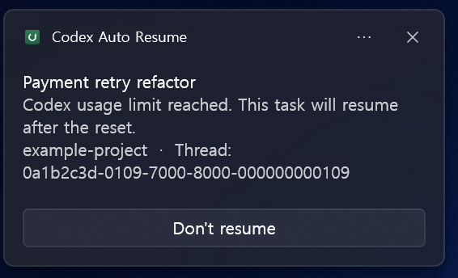
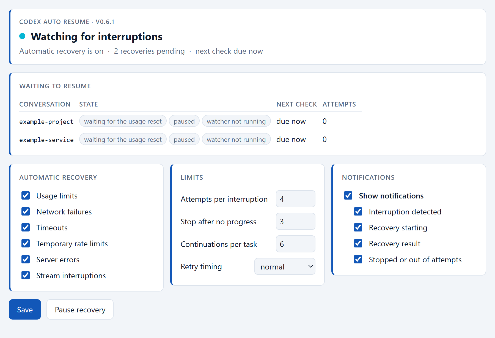
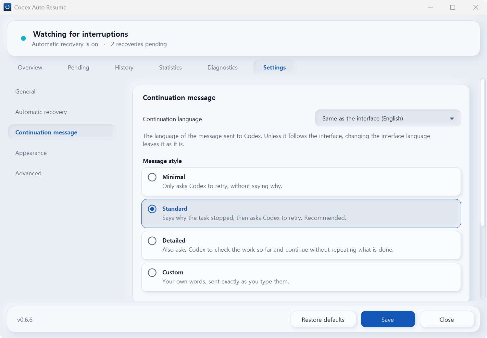

# Codex Auto Resume

**Safe auto-resume and auto-retry for interrupted Codex tasks on Windows.**

[](https://github.com/songyb111-gachon/codex-auto-resume-windows/actions/workflows/test.yml)
[](https://github.com/songyb111-gachon/codex-auto-resume-windows/releases/latest)
[](#install)
[](LICENSE)

<sub>🇰🇷 <a href="README.ko.md">한국어 README</a></sub>

Hit a Codex usage limit, a rate limit, or a dropped connection in the middle of a long task?
Codex Auto Resume waits, checks that it is genuinely safe, and then continues **that exact
conversation** — so you come back to finished work instead of a stopped task.

It is a small local watcher for the Windows ChatGPT/Codex desktop app. It reads Codex's own state
read-only, classifies what actually went wrong, and sends one continuation message through the
official `codex queue` command. Nothing leaves your machine.

**It deliberately does not retry everything.** A failure it cannot name is left alone.

|  |  |
| --- | --- |
| **Recovers** | Codex usage limits · rate limits (HTTP 429) · network failures · timeouts · temporary server errors (5xx) · dropped response streams |
| **Never touches** | user cancellation · permission · approval · content policy · invalid requests · context length · permanent authentication failures · anything unclassified |
| **Identity** | the exact conversation UUID only — never `--last`, never "the most recent one", never a title or a folder name |
| **Configure it** | a Windows settings app, a settings panel inside Codex, or the command line |
| **Tells you** | Windows notifications when a task is interrupted, when recovery starts, how it went, and when it gives up |
| **Sends nowhere** | local only: no telemetry, no account access, no network calls of its own |

> **One honest limitation, up front.** Codex has to currently have that conversation open for a
> recovery to be delivered. If the app restarted since, open the conversation once and recovery
> continues on its own. [Why this is unavoidable today](#please-read-this-limitation-first).

## Install

**Windows 10/11. No Python needed. No administrator rights.**

### From Codex (recommended)

Add the plugin, then ask Codex to **set up auto resume**.

```
codex plugin marketplace add songyb111-gachon/codex-auto-resume-windows
codex plugin add codex-auto-resume@codex-auto-resume-windows
```

Codex will run the plugin's setup script, which downloads the matching release from this
repository's releases over HTTPS, checks its SHA-256, checks the contents really are this
product at this version, and only then installs — into your user profile, touching nothing
outside it. It will tell you before it does any of that.

The plugin on its own is only the skills and the panel; the watcher, the settings window
and the Windows runtime come from that release. That is why there is a download, and why
it is worth reading [`docs/PLUGIN.md`](docs/PLUGIN.md) if you would rather know exactly
what the script will and will not do before running it.

### From the release archive

If you would rather not have anything download on your behalf:

1. Download `CodexAutoResume-<version>-win-x64.zip` from the
   [latest release](https://github.com/songyb111-gachon/codex-auto-resume-windows/releases/latest).
2. Check it against the `.sha256` published beside it, if you like.
3. Extract it anywhere and double-click **`Install.cmd`**.

The archive carries its own Python runtime, so there is nothing to install first, and the
recommended settings are already on when it finishes. It registers the Codex plugin from
inside the archive, so this route gets the panel too, with no network access at all.

### Either way

Both routes end at the same installation, in `%USERPROFILE%\.codex-auto-resume`: one
watcher, one database, one settings file, one sign-in entry. Running either again is the
upgrade and the repair path, and keeps anything already waiting to resume. `Uninstall.cmd`,
or asking Codex to remove it, reverses it.

Afterwards, change anything from **Start Menu → Codex Auto Resume**, or by asking Codex to
*open auto resume settings*.

## What it looks like

When a task is interrupted, Windows tells you — as **Codex Auto Resume**, not as whatever
process happened to raise it. Doing nothing resumes; the button is the only action, and it
only ever cancels.



Inside Codex, ask to *open auto resume settings* and the panel shows what is waiting and
lets you change any of it:



The same settings are in a standalone window from the Start Menu, which works with Codex
closed:



## Please read this limitation first

This tool can only auto-resume a thread that the Windows ChatGPT/Codex desktop app **currently has
loaded**.

After the app restarts, a target thread is `notLoaded`. There is **no verified, supported way to wake an
unloaded thread programmatically** — a message queued for an unloaded thread stays in the queue and is
never delivered as a conversation turn. This was measured, not assumed; see
[`docs/evidence/unloaded-thread-delivery.json`](docs/evidence/unloaded-thread-delivery.json).

So an unloaded thread is resumed **only after you open that conversation in the ChatGPT app yourself**.
Until then the watcher simply waits in a `waiting_for_loaded_thread` state. It will not use GUI
automation, will not force the conversation open, and will not queue a message on the off chance.

This is not fully unattended auto-resume across app restarts, and this README will not pretend otherwise.

## Project direction

> Keep the recovery engine small, local, conservative, and fail-closed. Spend complexity on making it
> easy to install and control, not on making the runtime do more.

The recovery engine is deliberately one small watcher. Everything else exists to see and control it:
a standalone Windows settings window, a settings panel inside Codex over MCP, the command line, and
Windows notifications. None of those can recover anything by itself, and the watcher keeps running
whether or not any of them is open.

What the project still avoids: a tray controller, a management web UI, a supervisor process, a
Windows service, a second recovery engine, and a second state database.

## Features

- Recovers usage limits and clearly classified temporary failures, on separate policies. Never
  retries a failure it cannot classify.
- Tracks the exact thread UUID. Never `--last`, never a guessed thread.
- Waits for the real reset timestamp when one is available, instead of sleeping a fixed number of hours.
- Verifies the desktop app is running and the thread is genuinely loaded before sending anything.
- Never resumes the same interruption twice, including across a crash or a watcher restart.
- Durable pending state in SQLite that survives reboots.
- Handles several interrupted threads independently.
- Bounded retry backoff, a global kill switch, and per-thread control.
- Single-instance protection, optional per-user Windows autostart, and a conservative uninstall.
- Three ways to change a setting — a Start Menu window, a panel inside Codex, and the command
  line — all writing the same file through the same validator, so they cannot disagree.
- Windows notifications across the lifecycle: interruption detected, recovery starting, how it
  turned out, and when it stops for good. Each one has its own switch.

## How it works

```
usage limit reached
  -> watcher reads Codex's local history (read-only) and sees usageLimitExceeded
  -> records the exact thread UUID in its own SQLite state
  -> waits until the reset timestamp
  -> checks the ChatGPT app is running and the thread is loaded
  -> re-checks live usage availability
  -> codex queue --thread <UUID> --message "<continuation>"
  -> the same thread continues the original work
```

The continuation message asks the agent to continue the interrupted work: to first check the current
thread context and the real repository/file state, to avoid redoing finished work, and to carry on
toward the original goal.

Loaded state is determined from the Windows Restart Manager: the app's own `codex.exe` engine holds the
thread's writer lock file open for exactly as long as the thread is loaded. The tool only reads that
ownership information. It never acquires a lock on the app's file.

## Requirements

- Windows 10/11.
- The official Windows ChatGPT/Codex desktop app, running, with its engine at
  `%LOCALAPPDATA%\OpenAI\Codex\bin\<hash>\codex.exe`.
- The engine is located automatically. A version this tool has been verified against is trusted
  outright; after a Codex update an unrecognised version is accepted only if `codex queue` still
  offers `--thread` and `--message`, and `status`/`doctor` label it as unverified. Anything that
  cannot prove that interface is refused rather than guessed at.

**Python is not required for the release install** — the archive brings its own runtime. Python
3.12+ is needed only if you run from a source checkout or install the plugin straight from the
marketplace.

## What is recovered, and what is not

Automatically recovered:

| Failure | Policy |
| --- | --- |
| Usage limit (`usageLimitExceeded`) | Waits for the real reset timestamp, then re-checks live usage |
| Connection failure (`httpConnectionFailed`) | Bounded backoff |
| Timeout (HTTP 408/425) | Bounded backoff |
| Transient rate limit (HTTP 429, `rateLimitExceeded`) | Bounded backoff |
| Server error (HTTP 5xx, `serverOverloaded`, `internalServerError`) | Bounded backoff |
| Stream disconnection (`responseStreamDisconnected`, `responseStreamConnectionFailed`) | Bounded backoff |

Never recovered — these need a person, and retrying only wastes attempts:

user cancellation · permission · approval required · content policy · invalid request ·
context length exceeded · permanent authentication (401/403, `unauthorized`) · `badRequest` ·
`sandboxError` · `responseTooManyFailedAttempts` · **anything unrecognised**.

Classification is structural: it reads the `codexErrorInfo` variant Codex writes, then an HTTP status
carried by that variant. Message text is consulted only when there is no structured code at all, and
only for transport failures that have none. A structured code is never overridden by message text.

Recovery is bounded twice over: at most 4 attempts per interruption, and it stops after 3 consecutive
recoveries that produced no visible progress. If you carry on in that conversation yourself, the old
interruption is dropped rather than replayed on top of your work.

## Managing it from Codex

Once it is installed, either route gives you the same skill. Just ask, in the app:

> Set up auto resume

and afterwards "show auto resume status", "show pending auto resumes", "open auto resume
settings", "turn auto resume off", "cancel auto resume for this task", "uninstall auto resume".

The plugin is a thin front end over the same command-line tool described below. It adds no second
engine and no background service. It keeps its state in `%USERPROFILE%\.codex-auto-resume\`, outside
the plugin directory, so updating or removing the plugin never loses a pending resume. The watcher
keeps running when the Codex app is closed, and starts again at Windows sign-in.

See [docs/PLUGIN.md](docs/PLUGIN.md) for the layout, exactly what the setup script will and will
not do, the update and removal lifecycle, and why the usage-limit notice does **not** get a checkbox.

> There is one installation, and both routes converge on it. If you also run a source checkout,
> keep only one: separate state means two watchers, and two watchers could resume the same task
> twice. Setup detects that and refuses rather than creating the second one.

## Running it from source

For development, or if you would rather run it yourself. This is not a third way to install the
product — it is the engine on its own, with no settings window, no panel and no bundled runtime,
and it needs **Python 3.12 or newer** on your PATH.

For development, or if you would rather run it yourself:

```bash
git clone https://github.com/songyb111-gachon/codex-auto-resume-windows.git
```

```bash
cd codex-auto-resume-windows
```

There is nothing to build. Verify your environment first:

```bash
python src\auto_resume.py doctor
```

`doctor` is read-only. It reports the discovered engine, whether the app is paired, whether the Restart
Manager probe works, and whether the local history is readable.

## Quick start

```bash
python src\auto_resume.py doctor
```

```bash
python src\auto_resume.py enable
```

```bash
python src\auto_resume.py run
```

`run` stays in the foreground and polls. Leave it running in a terminal while you work.

Check what it is doing:

```bash
python src\auto_resume.py status
```

```bash
python src\auto_resume.py pending
```

```bash
python src\auto_resume.py logs
```

Stop it:

```bash
python src\auto_resume.py disable
```

```bash
python src\auto_resume.py stop
```

`disable` is the kill switch: it immediately prevents any further resume while keeping your pending
records. `stop` asks a running watcher process to exit.

## Commands

| Command | What it does |
|---|---|
| `doctor` | Read-only environment check: engine, app pairing, Restart Manager, history. |
| `enable [thread-id]` | Turn auto-resume on globally, or for one thread. |
| `disable [thread-id]` | Kill switch: stop all automatic resumes, or just one thread. |
| `status` | Enablement, watcher state, autostart, engine, and record counts. |
| `pending` | Interruptions waiting to resume (`--all`, `--json`). |
| `cancel <thread-id>` | Cancel pending resumes for one thread and disable it. |
| `logs` | Recent log lines (`-n N`). |
| `run` | Run the watcher in the foreground (`--once`, `--poll N`). |
| `stop` | Ask a running watcher to exit. |
| `install` | Create the owned directories and state (`--startup`). |
| `uninstall` | Remove autostart and owned state/logs (`--keep-logs`). |

Global options: `--home` (where this tool keeps its own state), `--codex-exe`, `--codex-home`, `--quiet`.

By default, failures up to 6 hours old at the moment you run `enable` are still eligible. Change it with
`enable --lookback-hours N`.

## The notification

When the watcher records an interruption, Windows shows one notification naming the task, with a
single cancel button.

```
Payment retry refactor
Codex usage limit reached. This task will resume at 05:56.
example-project  ·  Thread: 0a1b2c3d-0109-7000-8000-000000000109
                                             [Don't resume]
```

The first line is the conversation title, or the project, or the working directory's name, or
"Codex task". The **exact thread UUID is always shown**: titles repeat, identity must not. A
temporary failure says "Codex was temporarily interrupted. Retrying automatically." instead, with a
**Don't retry** button.

Three lines, not four: Windows renders at most three and drops the rest, so the reason comes
before the identifiers rather than after them.

Those names are for display only. Recovery never resolves a thread by title, project or recency.

Doing nothing resumes — that is the default. Pressing the button cancels the auto-resume for that
one conversation and nothing else.

This is the only point where a control can be offered at the time it matters. By the time a usage
limit appears in the Codex app, that turn has already failed, so nothing can be added to the app's
own usage-limit notice; the watcher, however, is running. See [docs/PLUGIN.md](docs/PLUGIN.md) for
why the notice itself cannot get a checkbox.

Details worth knowing:

- The button needs a handler, so `install` registers a per-user `codex-auto-resume:` URL protocol
  under `HKCU\Software\Classes`. `uninstall` removes it again, and only when it points at this
  installation.
- That protocol accepts exactly one action, cancelling. A hostile or mistyped URI can only ever
  *stop* a resume, never cause one, and the interruption id must match a real record.
- The notification shows labels, a local time and the thread UUID — never prompt text, error text,
  or account data. Display names come from `threads.name` only; `title`, `preview` and
  `first_user_message` hold the raw first prompt on this schema and are never read.
- It is best effort. If it cannot be shown, the resume still happens exactly as it would have.
- They are attributed to **Codex Auto Resume**, with this project's own icon. That takes two
  registrations, not one: an AppUserModelID under `HKCU\Software\Classes\AppUserModelId` supplies
  the name and icon, and a Start Menu shortcut carrying the same id is what makes Windows draw
  the toast at all. Without the shortcut the platform accepts the notification, logs it, and
  files it in the notification centre without ever showing it. That was measured, not assumed.

Three more notifications follow the first: recovery starting, how it turned out, and recovery
stopping for good. Each is raised once, from the state change itself, so what the notification
says and what the record holds can never disagree. An uncertain submission is reported as
uncertain rather than as a failure that will be retried, because it is the one outcome that is
deliberately never resent.

Turn any of them off in the settings window, or from Codex, or with `update_settings`. Doing so
changes nothing about whether a task is recovered.

## Settings

Everything configurable lives in one place and is reachable three ways:

- **Start Menu → Codex Auto Resume** — a standalone window. It works with Codex closed, the
  plugin disabled, no network, no sign-in and no system Python, because configuration matters
  most exactly when the thing it configures is unavailable.
- **Inside Codex** — ask to open auto resume settings and a panel appears in the conversation.
- **The command line** — for scripting and for repair.

All three write the same file through the same validator, so a value set in one is the value the
others show. Nothing needs to be memorised and nothing needs hand-editing: a hand-written
settings file is validated on read, so a bad value is quietly replaced by the safe default and
you are left believing you changed something.

You can choose which classified failure categories are recovered, how many attempts each
interruption gets, when to give up after recoveries that produce nothing, how long to wait
between attempts, and which notifications appear.

You cannot switch off a safety property, because none of them is a setting. There is no option
that retries an unclassified failure, resolves a conversation by title, resends an uncertain
submission or forces a send — by design, not by omission.

## Windows startup

Optional, per-user, and never required:

```bash
python src\auto_resume.py install --startup
```

This writes a single value under `HKCU\Software\Microsoft\Windows\CurrentVersion\Run`. It needs no
administrator rights, touches nothing system-wide, and creates no service or scheduled task. It runs the
watcher with `pythonw.exe` so no console window appears, and it always pins the home directory that is
actually in effect so the autostarted watcher uses the same state and the same single-instance lock.

Running `install --startup` repeatedly does not create duplicate entries.

Consider running in the foreground for a while first, and enabling autostart only once you have seen a
real resume happen.

## Uninstall

```bash
python src\auto_resume.py uninstall
```

```bash
python src\auto_resume.py uninstall --keep-logs
```

Uninstall is deliberately conservative:

- It removes the autostart value, stops the watcher, and deletes this tool's own state and logs.
- It only unregisters an autostart value that belongs to **this** installation. A value that starts a
  different copy of the tool is reported and kept, never silently removed.
- It only deletes inside a directory that carries this tool's provenance marker
  (`.owned-by-codex-auto-resume`), so a directory it did not create is skipped and reported, never touched.
- Inside its own directories it still only deletes its own file names, so unrelated files survive.
- If a watcher is running, **or if it cannot verify whether one is running**, it aborts before deleting
  anything.
- It never deletes ChatGPT files, Codex files, user repositories, or a parent directory.

## Safety model

What it reads: Codex's local SQLite state and rollout files, opened read-only, plus its own state.

What it writes: only its own `config/` and `logs/`, and one continuation message to one exact thread via
the official `codex queue` CLI.

Design rules enforced in code:

- **Local only.** The Python code opens no network sockets. Model requests are made by the official,
  already-authenticated Codex binary, exactly as they would be normally.
- **Read-only on Codex data.** Codex databases are opened with `mode=ro` and `query_only`.
- **Fail closed.** Unknown loaded state, unknown usage, an unavailable probe, or any ambiguity results in
  waiting, never in sending.
- **Exact thread only.** Thread ids are validated as canonical UUIDs and passed as separate argv
  elements. No shell string is ever composed.
- **No duplicate resume.** The interruption is durably reserved before any external process can run. If
  the outcome of a send is uncertain, the tool stops and does not retry automatically.
- **No secrets in logs or state.** Prompt text, error text, and account/usage identifiers are never
  written. Log lines carry static reason codes, timestamps, and identifiers only.
- **Never used:** GUI automation, mouse or keyboard simulation, OCR, screen scraping, accessibility-API
  clicking, binary patching, DLL injection, process-memory manipulation, credential extraction.

## Known limitations

- Only threads already loaded in the app can be auto-resumed. Unloaded threads wait for you to open them.
- The blocking usage bucket cannot always be identified with certainty, so live availability is
  re-checked immediately before sending rather than trusted from history.
- Codex app updates are survivable but not guaranteed. Database files are found by schema generation
  (`state_5` -> `state_6`) and validated by the columns actually read, and an updated engine is accepted
  when the `codex queue` interface is unchanged. A change that removes a column this tool reads, or that
  alters the queue interface, still stops it: it refuses rather than guessing.
- If the watcher process dies in the narrow window after reserving but before the send result is known,
  that interruption is deliberately left unresumed rather than risking a duplicate.
- The full end-to-end path has now been observed once in ordinary use: a real usage limit was detected,
  the thread was confirmed loaded, the interruption was reserved, one continuation was submitted through
  `codex queue`, and delivery was independently confirmed 30 seconds later. That is one run, not a
  track record. Transient-failure recovery has been exercised by tests, not yet by a real outage.

## Testing

Run the automated suite:

```bash
python -m unittest discover -s tests
```

Set `PYTHONPATH=src` first (or use `set PYTHONPATH=src` on Windows).

These tests use fakes and temporary directories. They never contact the ChatGPT app and never send a
message to any conversation, so they are safe to run anywhere and are what CI runs.

There is also an opt-in, read-only live check against your real environment. It verifies binary
discovery, app pairing, loaded-state classification, and usage reading. It never sends anything:

```bash
set CODEX_AR_LIVE=1 && python -m unittest tests.test_integration_live
```

## Security

See [SECURITY.md](SECURITY.md) for the full model, the review process, and the issues that were found
and fixed. In short: no network access from this code, no credential reads, read-only against Codex
state, fail-closed behaviour, and a conservative uninstall.

The project went through three adversarial review rounds plus mutation testing, a crash-window matrix,
and a cross-process race test. Confirmed issues were fixed and covered by regression tests.

If you find a security issue, please open an issue on this repository.

## Documentation

| | |
| --- | --- |
| [docs/PLUGIN.md](docs/PLUGIN.md) | The Codex plugin layer: what the setup script may fetch and what it checks, the update and removal lifecycle, and why the usage-limit notice cannot get a checkbox. |
| [docs/COMPARISON.md](docs/COMPARISON.md) | Other projects in this space, and every feature adopted, adapted, rejected or deferred — with the reason. |
| [docs/BRAND.md](docs/BRAND.md) | The palette, the mark, and why each is what it is. |
| [docs/DEVELOPMENT.md](docs/DEVELOPMENT.md) | How it was built, including the measurements behind the loaded/notLoaded limitation. |
| [PRIVACY.md](PRIVACY.md) | What is read, what is stored, and what is sent anywhere. |
| [SECURITY.md](SECURITY.md) | The threat model and how to report a vulnerability. |
| [SUPPORT.md](SUPPORT.md) | Where to report each kind of problem, and what not to paste into a public issue. |
| [CONTRIBUTING.md](CONTRIBUTING.md) | Tests, the release build, fixture conventions, and the safety properties a change has to keep. |

## Development and credits

Built by **Youngbin Song** with the assistance of two AI development tools:

- **OpenAI Codex** — initial Windows/Codex architecture and protocol investigation, the exact-thread
  queue proof of concept, loaded/notLoaded verification, usage-limit and reset research, and the initial
  implementation.
- **Anthropic Claude Code** — took over that prototype, completed the watcher, CLI, Windows integration
  and persistence, expanded the tests, fixed correctness bugs, and ran the security and adversarial audits.

OpenAI Codex and Anthropic Claude Code are AI development tools, not human contributors or GitHub
accounts. See [CONTRIBUTORS.md](CONTRIBUTORS.md) for the full breakdown and
[docs/DEVELOPMENT.md](docs/DEVELOPMENT.md) for the development history, including the measurements behind
the loaded/notLoaded limitation.

## License

MIT. See [LICENSE](LICENSE).
