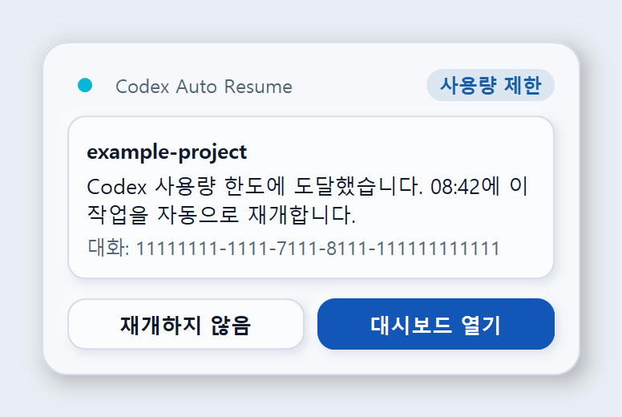
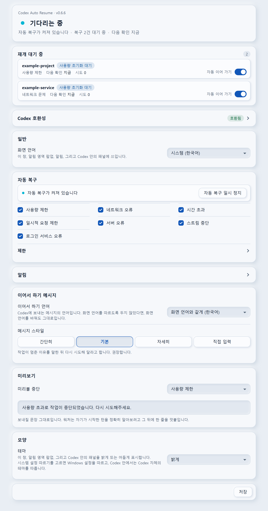

# Codex Auto Resume

**Windows에서 사용량 한도가 풀리면 똑같은 그 Codex 작업을 자동으로 이어 갑니다.**

[](https://github.com/songyb111-gachon/codex-auto-resume-windows/actions/workflows/test.yml)
[](https://github.com/songyb111-gachon/codex-auto-resume-windows/releases/latest)
[](#설치)
[](LICENSE)
[](https://github.com/songyb111-gachon/codex-auto-resume-windows/blob/main/docs/GUIDE.md#언어)

<sub>🇺🇸 <a href="https://github.com/songyb111-gachon/codex-auto-resume-windows/blob/main/README.md">English README</a> · 프로그램은 아홉 개 언어로 표시됩니다: English · 한국어 · 日本語 · 简体中文 · 繁體中文 · Español · Deutsch · Français · Português (Brasil)</sub>

Codex가 작업 도중에 멈추고 오전 6시 34분에 다시 해 보라고 말합니다. 오전 6시 34분에 사용자는
자고 있고, 아침에 보면 작업은 멈춘 그 자리 그대로입니다.

Codex Auto Resume는 한도가 풀릴 때까지 기다렸다가, 이어 가도 정말 안전한지 확인한 뒤 공식 `codex queue`
명령으로 이어서 하기 메시지 한 건을 보내 **바로 그 대화**를 이어 갑니다. 일시적인 rate limit, 네트워크
장애, 시간 초과, 서버 오류, 끊긴 스트림도 복구하지만, 이름을 댈 수 있고 다시 시도해도 안전한 장애일
때만 그렇게 합니다. **모든 실패를 재시도하지는 않습니다.**

이 페이지는 짧은 안내입니다. 모든 설정, 알림, 명령줄, 안전 모델과 개인정보까지 전부 담은 내용은
**[전체 안내서](docs/GUIDE.md)**에 있습니다.

|  |  |
| --- | --- |
| **복구합니다** | Codex 사용량 한도, 그리고 Codex가 구체적인 오류를 기록한 경우의 rate limit(HTTP 429) · 네트워크 장애 · 타임아웃 · 일시적 서버 오류(5xx) · 스트림 끊김 |
| **손대지 않습니다** | 사용자 취소 · 권한 · 승인 필요 · 콘텐츠 정책 · 잘못된 요청 · 컨텍스트 길이 초과 · 영구 인증 실패 · 분류되지 않은 모든 것 |
| **식별 방식** | 정확한 대화 UUID 하나. `--last`도, "가장 최근 것"도, 제목이나 폴더 이름도 쓰지 않습니다 |
| **설정 방법** | 시작 메뉴에서 여는 대시보드, Codex 안의 설정 패널, 명령줄 |
| **언어** | English · 한국어 · 日本語 · 简体中文 · 繁體中文 · Español · Deutsch · Français · Português (Brasil) |
| **개인정보** | 텔레메트리 없음, 분석 없음, 자동 업데이트 확인 없음. Codex에서 설치하면 GitHub에서 릴리스를 내려받고, 창의 *업데이트 확인*은 눌렀을 때만 GitHub에 가장 최근 릴리스를 묻습니다. 워처에는 네트워크 코드가 없으며, 사용량 확인과 재개된 턴은 여느 Codex 통신처럼 Codex를 통해 OpenAI로 갑니다 |

> **먼저 알아두실 제한 하나.** 복구 메시지가 전달되려면 Codex가 그 대화를 열어 둔 상태여야 합니다.
> 앱을 재시작했다면 그 대화를 한 번만 열어 주시면 이후는 알아서 진행됩니다.
> [왜 그런지](#먼저-읽어야-할-제한-사항)

## 설치

**Windows 10/11. Python 불필요. 관리자 권한 불필요.**

### Codex에서 설치 (권장)

플러그인을 추가한 뒤, Codex에게 **auto resume 설정해줘** 라고 말하면 됩니다.

```
codex plugin marketplace add songyb111-gachon/codex-auto-resume-windows
codex plugin add codex-auto-resume@codex-auto-resume-windows
```

설치 스크립트가 이 저장소의 릴리스에서 해당 버전 압축 파일을 HTTPS로 내려받아,
[`scripts/release.json`](https://github.com/songyb111-gachon/codex-auto-resume-windows/blob/main/scripts/release.json)에 그 버전용으로 기록된 digest와 SHA-256을
대조한 뒤 이 Windows 계정에만 설치합니다.

### 릴리스 압축 파일로 설치

1. [최신 릴리스](https://github.com/songyb111-gachon/codex-auto-resume-windows/releases/latest)에서
   `CodexAutoResume-vX.Y.Z-win-x64.zip`을 받습니다.
2. 압축을 풀기 전에, 내려받은 폴더에서 PowerShell로 확인합니다.

   ```powershell
   (Get-FileHash .\CodexAutoResume-vX.Y.Z-win-x64.zip -Algorithm SHA256).Hash
   ```

   출력된 값이 압축 파일 옆에 게시된 `.sha256` 파일의 값, 그리고
   [`scripts/release.json`](https://github.com/songyb111-gachon/codex-auto-resume-windows/blob/main/scripts/release.json)에 그 버전용으로 기록된 값과 같아야 합니다.
   자세한 확인 방법은 [docs/VERIFY.md](docs/VERIFY.md)에 있습니다.
3. 압축을 풀고 `Install.cmd`를 실행합니다.

### 어느 쪽이든

두 경로 모두 같은 설치본 한 곳(기본값 `%USERPROFILE%\.codex-auto-resume`)에 설치됩니다. 어느 쪽이든 다시
실행하면 업그레이드이자 복구 경로이며, 대기 중인 재개를 그대로 유지합니다.

## 처음 할 일

- 따로 설정할 것이 없습니다. 권장 설정이 처음부터 켜져 있습니다.
- 작업이 멈추면 그 작업을 알리는 카드가 알림 영역 옆에 나타납니다(카드를 띄우면 안 될 때는 Windows 자체
  알림). 그대로 두면 이어서 하고, **재개하지 않음**은 그 작업
  하나만 취소하며, **대시보드 열기**는 기다리는 작업을 보여 줍니다.
- 알림 영역 아이콘이 워처가 무엇을 하는지 보여 줍니다. 클릭하면 기다리는 작업을 보거나 자동 복구를 일시
  정지할 수 있습니다.
- **시작 메뉴 → Codex Auto Resume**에서 무엇이든 바꿀 수 있고, Codex에게 "자동 재개 상태 보여 줘",
  "대기 중인 자동 재개 보여 줘", "자동 재개 설정 열어 줘", "자동 재개 꺼 줘"처럼 말해도 됩니다.

## 화면

상태 불빛은 어디에 있든 숨을 쉽니다. 알림 카드, 대시보드, Codex 안의 패널, 알림 영역 아이콘 모두
그렇고, 아래 그림들도 함께 숨 쉽니다.

제품이 그리는 알림 카드입니다.



Codex 안의 패널입니다. Codex 창을 찍은 사진이 아니라, 플러그인이 Codex에 넘기는 바로 그 리소스를
그대로 그린 패널 자신의 페이지입니다.



시작 메뉴에서 여는 대시보드입니다. 합성한 예시 데이터로 그렸으며, 그림 속 대화는 누구의 작업도 아닌
예시입니다.


움직이는 알림 영역 아이콘입니다.


모든 부분을 모든 테마와 언어로 보려면 [전체 안내서](https://github.com/songyb111-gachon/codex-auto-resume-windows/blob/main/docs/GUIDE.md#화면)를 보세요.

## 먼저 읽어야 할 제한 사항

이 도구는 Windows ChatGPT/Codex 데스크톱 앱이 **지금 불러와 둔** 대화만 자동으로 이어 갈 수 있습니다.
앱을 다시 시작하면 대화는 `notLoaded`가 되고, 불러오지 않은 대화를 프로그램으로 깨우는 검증된 공식
방법은 없습니다. 그런 메시지는 나중에 그 대화를 다시 불러올 때 Codex가 전달할 수도 있습니다. 그래서 이
도구는 방금 불러와 있음을 확인한 대화에만 메시지를 넣고, 불러오지 않은 대화는 **사용자가 앱에서 그 대화를
직접 열어야만** 이어 갑니다. 화면 자동 조작을 쓰거나, 대화를 억지로 열거나, 혹시나 해서 메시지를 넣지
않습니다. 그 근거가 된 측정은 [전체 안내서](https://github.com/songyb111-gachon/codex-auto-resume-windows/blob/main/docs/GUIDE.md#먼저-읽어야-할-제한-사항)에 있습니다.

## 안전과 개인정보

멈춘 바로 그 대화만, UUID로 정확히 찾아 이어 가고, 이름을 댈 수 있는 장애일 때만 그렇게 합니다. 분류되지
않은 것은 건드리지 않고, 확실하지 않으면 보내지 않고 기다립니다. Codex의 상태는 읽기 전용으로만 읽으며,
이미 전달됐을 수도 있는 메시지는 다시 보내지 않습니다. 워처 자체에는 네트워크 코드가 없고 이 프로젝트로
보내는 것도 없습니다. 사용량 확인과 재개된 턴은 Codex를 통해 OpenAI로 가고, Codex에서 설치하면 GitHub에서
릴리스를 내려받습니다. 무엇을 읽고 저장하고 보내는지는
[PRIVACY.md](docs/PRIVACY.md)에, 위협 모델과 취약점 신고 방법은
[SECURITY.md](docs/SECURITY.md)에 있습니다.

## 요구 사항

- Windows 10/11, 그리고 실행 중인 공식 Windows ChatGPT/Codex 데스크톱 앱.
- 두 설치 경로 모두 Python이 필요하지 않습니다. 설치본이 자체 런타임을 함께 가져옵니다. Python 3.12
  이상은 소스 체크아웃에서 직접 실행할 때만 필요합니다.

## 제거

릴리스 압축 파일의 `Uninstall.cmd`를 실행하거나, Codex에게 auto resume 제거를 요청하면 됩니다.
기본적으로 설정과 대기 중인 재개는 남겨 두므로 다시 설치해도 잃지 않고, `Uninstall.cmd -Purge`는 이것까지
지웁니다. 자기 것임을 증명할 수 있는 것만 지웁니다. 이 도구의 provenance marker가 있는 디렉터리와, 이
설치본에 속한 Windows 등록만 지웁니다.

## 더 알아보기

- **[전체 안내서](docs/GUIDE.md)**: 위의 모든 내용과 모든 설정, 알림, 안전 모델, 개인정보
- 내려받은 압축 파일 확인과 릴리스 다시 빌드하기: [docs/VERIFY.md](docs/VERIFY.md)
- 이 제품이 한다고 말하는 모든 것과 그 근거 등급: [docs/FEATURE_MATRIX.md](docs/FEATURE_MATRIX.md)
- 플러그인 계층, 설치 스크립트가 가져오고 확인하는 것, 업데이트와 제거: [docs/PLUGIN.md](docs/PLUGIN.md)
- 같은 영역의 다른 프로젝트들, 그리고 각각이 이 제품보다 잘하는 점: [docs/COMPARISON.md](docs/COMPARISON.md)
- 앞으로의 방향(약속이 아니라 계획): [docs/ROADMAP.md](docs/ROADMAP.md)
- 무엇을 읽고, 무엇을 저장하고, 무엇을 어디로 보내는지: [PRIVACY.md](docs/PRIVACY.md)
- 보안 모델과 취약점 신고: [SECURITY.md](docs/SECURITY.md)
- 문제 종류별로 어디에 신고하는지, 그리고 공개 이슈에 붙여넣으면 안 되는 것: [SUPPORT.md](docs/SUPPORT.md)
- 테스트, 릴리스 빌드, 그리고 변경이 지켜야 하는 안전 속성: [CONTRIBUTING.md](docs/CONTRIBUTING.md)
- 변경 이력: [CHANGELOG.md](docs/CHANGELOG.md)
- 기여자: [CONTRIBUTORS.md](docs/CONTRIBUTORS.md)
- 이 제품이 내 PC와 내 Codex 버전에서 어떻게 동작했는지 보고하기(별도 도구):
  [codex-compat-reporter](https://github.com/songyb111-gachon/codex-compat-reporter). 횟수와 상태와
  시각만 담은 파일 하나를 쓰고, 보내기 전에 내가 먼저 읽습니다. 대화 내용도 식별자도 경로도 들어가지
  않습니다. 그렇게 온 보고는 **보고됨**이라는 별도 등급으로만 세며, 어떤 버전도 검증됨이나 점검됨으로
  올리지 않습니다.

## 만든 사람과 라이선스

**송영빈**이 두 AI 개발 도구, OpenAI Codex와 Anthropic Claude Code의 도움을 받아 만들었습니다. 자세한 내용은
[CONTRIBUTORS.md](docs/CONTRIBUTORS.md)에 있습니다.

MIT. [LICENSE](LICENSE)를 참고하세요.
