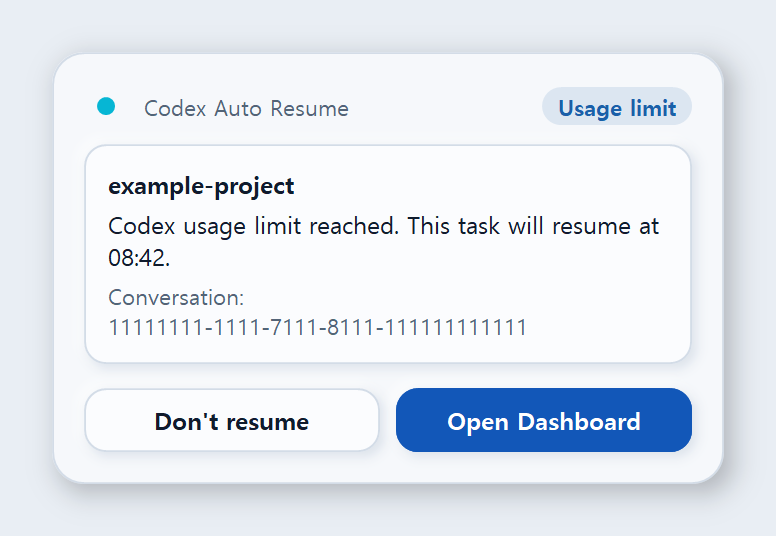
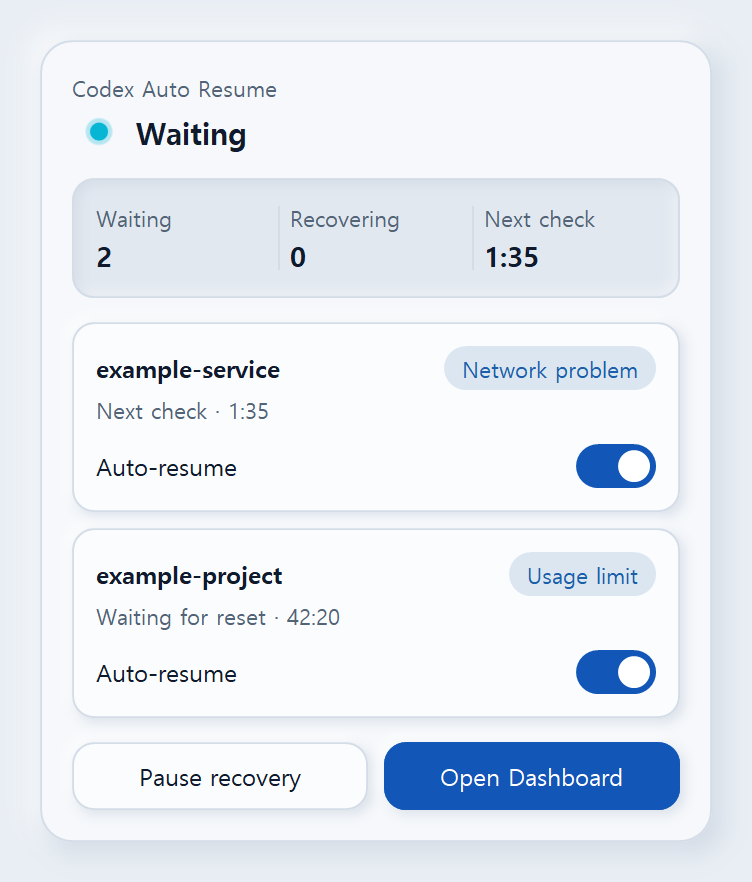
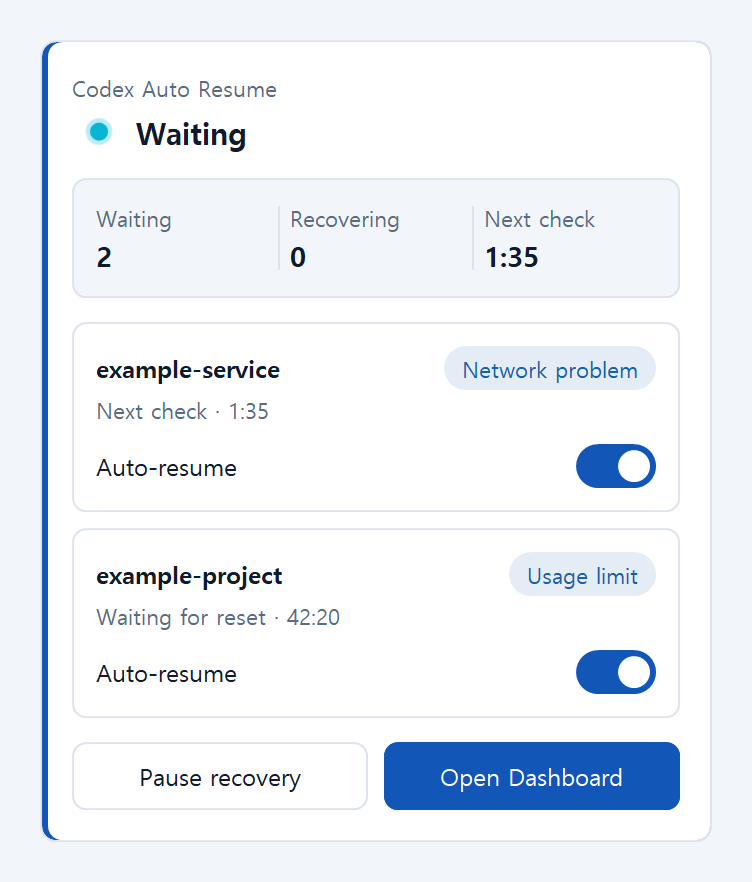
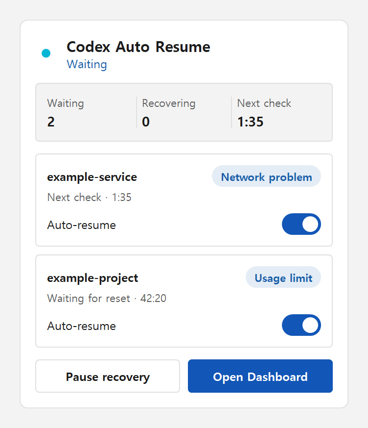
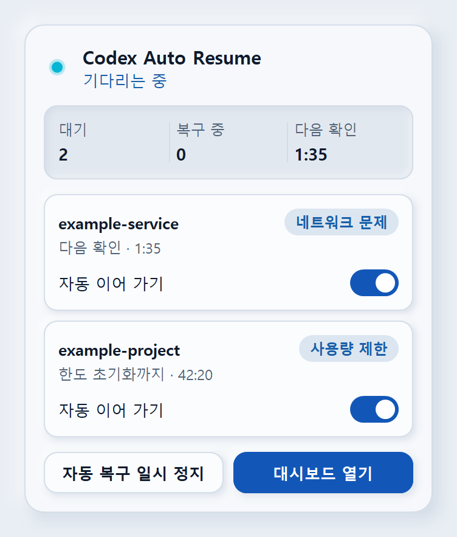
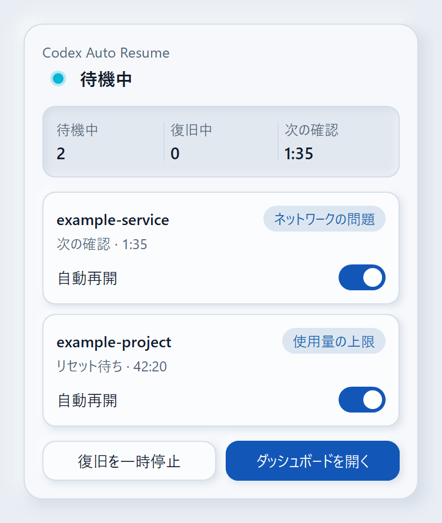
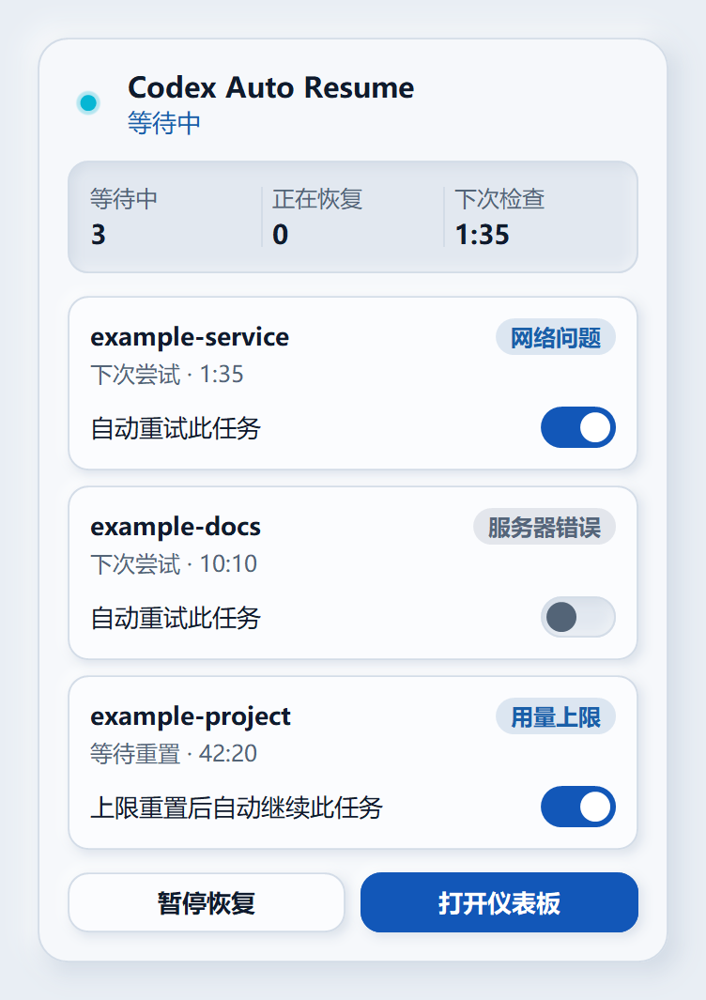
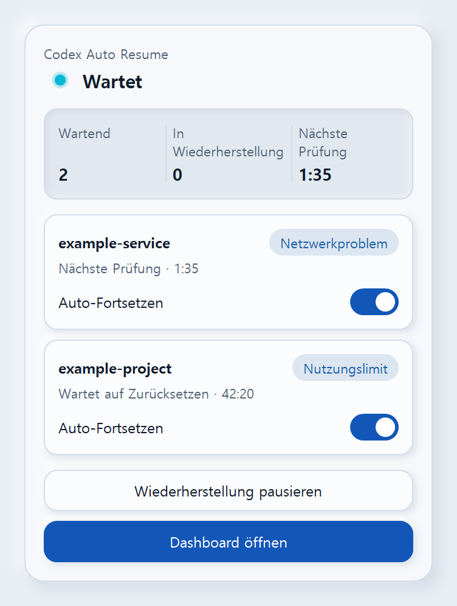

# Codex Auto Resume — the full guide

Everything about Codex Auto Resume in one place. The [README](../README.md) is the short version.

**Automatically resume the exact same Codex task on Windows after a usage limit resets.**

<sub>🇰🇷 <a href="https://github.com/songyb111-gachon/codex-auto-resume-windows/blob/ko/docs/GUIDE.md">한국어 안내서</a> · The app speaks nine languages: English · 한국어 · 日本語 · 简体中文 · 繁體中文 · Español · Deutsch · Français · Português (Brasil)</sub>

Codex stops mid-task and tells you to try again at 6:34 AM. You are asleep at 6:34 AM, and in
the morning the task is exactly where it stopped.

Codex Auto Resume waits out the reset, checks that continuing is genuinely safe, and then
continues **that exact conversation** — so you come back to finished work instead of a stopped
task. It also recovers temporary rate limits, network failures, timeouts, server errors and
interrupted streams, but only where the failure is one it can name and is safe to retry.

It is a small local watcher for the Windows ChatGPT/Codex desktop app. It reads Codex's own
state read-only, classifies what actually went wrong, and sends one continuation message
through the official `codex queue` command. The watcher has no network code of its own, and
nothing is sent to this project. Before a resume it checks your usage by asking the official
Codex binary, which gets the answer from OpenAI; the resumed turn then runs in your desktop app
under your own Codex settings and goes to OpenAI like any turn you start; what this plugin's
tools and commands return in a Codex conversation goes to OpenAI with that conversation;
setting it up from Codex downloads the release from GitHub; and installing with v0.5.7 also has
Codex refresh every Git marketplace you have configured (naming only this one is new in
v0.6.0).

**It deliberately does not retry everything.** A failure it cannot name is left alone.

|  |  |
| --- | --- |
| **Recovers** | Codex usage limits, and these when Codex records a specific error code for them: rate limits (HTTP 429) · network failures · timeouts · temporary server errors (5xx) · dropped response streams. Codex 0.153.4 records many timeouts, dropped streams and 502/503/504 errors with a generic code; one that carries no HTTP status is not retried, and one that carries a status is classified from it (429 a rate limit, 408 and 425 a timeout, 500-599 a server error, any other 4xx permanent). An HTTP 429 it has given up retrying is recorded as `responseTooManyFailedAttempts`, and that one is recovered as a rate limit; the same code with any other status, or none, is not |
| **Never touches** | user cancellation · permission · approval · content policy · invalid requests · context length · permanent authentication failures · anything unclassified |
| **Identity** | the exact conversation UUID only — never `--last`, never "the most recent one", never a title or a folder name |
| **Configure it** | a Windows window from the Start Menu — from v0.6.0, a Dashboard whose settings are one of its six pages — a settings panel inside Codex, or the command line |
| **Languages** | English · 한국어 · 日本語 · 简体中文 · 繁體中文 · Español · Deutsch · Français · Português (Brasil) — in the Dashboard, the notification-area popup, Windows notifications, the panel inside Codex and the continuation message sent to Codex. It follows Windows unless you choose one; see [Languages](#languages) |
| **Tells you** | Notifications when a task is interrupted, when recovery starts, how it went, and when it gives up - from v0.6.5 as a card of the product's own beside the notification area, with Windows' own notification wherever a card must not show. While the watcher runs it also shows a notification-area icon, whose tooltip says whether recovery is paused, how many recoveries are waiting, how many are running in Codex, and how long until the next check |
| **Privacy** | no telemetry, no analytics, no automatic update check, never reads your credentials. *Check for updates* in the window asks GitHub which release is newest, and only when you press it; it and *Refresh compatibility data* also fetch the Codex compatibility data from raw.githubusercontent.com, sending nothing about your machine. The watcher has no network code; the usage check, the resumed turn and what the plugin's tools and commands return in a conversation go to OpenAI through Codex, as Codex's traffic always does; setup downloads the release from GitHub; and the v0.5.7 installer has Codex refresh every Git marketplace you have configured (naming only this one is new in v0.6.0) |

> **One honest limitation, up front.** Codex has to currently have that conversation open for a
> recovery to be delivered. If the app restarted since, open the conversation once and recovery
> continues on its own. [Why this is unavoidable today](#please-read-this-limitation-first).

**Not the only tool in this space, and not the right one for everybody.** If you want the widest
possible recovery, an agent other than Codex, or a platform other than Windows, one of the
others will suit you better — [`docs/COMPARISON.md`](COMPARISON.md) is a map of ten of
them, re-surveyed on 2026-09-12, saying what each does better than this one.

## Install

**Windows 10/11. No Python needed. No administrator rights.**

### From Codex (recommended)

Add the plugin, then ask Codex to **set up auto resume**.

```
codex plugin marketplace add songyb111-gachon/codex-auto-resume-windows
codex plugin add codex-auto-resume@codex-auto-resume-windows
```

Codex will run the plugin's setup script, which downloads the matching release from this
repository's releases over HTTPS and checks its SHA-256 against the digest recorded for that
version in the plugin's
[`scripts/release.json`](https://github.com/songyb111-gachon/codex-auto-resume-windows/blob/main/scripts/release.json).
That digest is committed to this repository after the release is published; it does not come
from the release itself. A version with no digest in the plugin's copy of `release.json` is
checked against the `.sha256` published with the release instead, and the script says so. That
covers a version newer than the last recorded digest, and always the installed plugin's own
version, because a release cannot contain its own digest and after installation the plugin runs
from the installed copy. It then checks the contents really are this product at this version,
and only then installs, for your Windows user only: files in the installation folder (by
default `%USERPROFILE%\.codex-auto-resume`), a Start Menu entry (when notifications are on, as
they are by default), per-user registry values, and
this plugin's marketplace and plugin registration in Codex, pointed at that installation. The
plugin's instructions have Codex tell you before it does any of that.

This route downloads the matching published archive. Archives v0.5.0 through
v0.5.7 were built by the earlier single-job release workflow, with GitHub Actions referred to
by floating tags and executables that cannot be rebuilt byte for byte. Step 2 of [From the
release archive](#from-the-release-archive) lists what replaces that; those changes are new in
v0.6.0.

The plugin as added from GitHub carries the skills, that setup script and the engine's Python
source, but no interpreter to run that source, and its manifest declares no MCP server (the
`.mcp.json` it carries points at an executable that only the release contains); the running
watcher, the settings window, the panel's own server and the Windows runtime all come from
that release. That is why there is a download, and why it is worth reading
[`docs/PLUGIN.md`](https://github.com/songyb111-gachon/codex-auto-resume-windows/blob/main/docs/PLUGIN.md)
if you would rather know exactly what the script will and will not do before running it.

### From the release archive

If you would rather download the release yourself instead of having the setup script do it:

1. Download `CodexAutoResume-vX.Y.Z-win-x64.zip` from the
   [latest release](https://github.com/songyb111-gachon/codex-auto-resume-windows/releases/latest).
2. **Verify it before you extract it.** `Install.cmd` does not verify the archive it came in (no
   hash, no signature), so this step is the check. In PowerShell, in the folder you downloaded it to:

   ```powershell
   (Get-FileHash .\CodexAutoResume-vX.Y.Z-win-x64.zip -Algorithm SHA256).Hash
   ```

   The value must match the `.sha256` file published beside the archive, and the digest
   recorded for that version in
   [`scripts/release.json`](https://github.com/songyb111-gachon/codex-auto-resume-windows/blob/main/scripts/release.json)
   on the `main` branch (`Get-FileHash` prints capital letters; the case does not matter). The
   `.sha256` comes from the same place as the archive, so it shows the download is intact; the
   `release.json` entry is a commit in this repository, not a release asset, so it is a separate
   record: changing it takes a new commit on `main`. It is added after a
   release is published, so a brand-new version may not be listed yet, and anything before
   v0.5.2 has no entry; the attestation check
   below does not depend on it. With the GitHub CLI you can check which workflow run and commit
   built the archive (archives from v0.5.4 on carry an attestation):

   ```powershell
   gh attestation verify .\CodexAutoResume-vX.Y.Z-win-x64.zip --repo songyb111-gachon/codex-auto-resume-windows
   ```

   If anything does not match, delete the file and do not run it.
   [`docs/VERIFY.md`](https://github.com/songyb111-gachon/codex-auto-resume-windows/blob/main/docs/VERIFY.md)
   explains each check and what it does and does not prove. Archives
   v0.5.0 through v0.5.7 were built by the earlier single-job release workflow, which referred
   to its GitHub Actions by floating tags and produced executables that cannot be rebuilt byte
   for byte. Separate build and publish jobs, actions pinned to exact commits, and reproducible
   executables are included in the published v0.6.0 release.
3. Extract it anywhere and double-click **`Install.cmd`**.

The archive carries its own Python runtime, so there is nothing to install first, and the
recommended settings are already on when it finishes. `Install.cmd` downloads nothing itself:
it registers the Codex plugin from the files in the archive, so this route gets the panel too.
It does ask Codex to refresh marketplaces, though. The installer in v0.5.7 and earlier asks
Codex to refresh every Git marketplace you have configured. From v0.6.0 the
installer names only this product's marketplace, which does nothing for the local
registration it has just made; Codex fetches only if an earlier GitHub registration of that
marketplace survived the repoint.

Nothing this project builds is Authenticode-signed: not the two executables, not `Install.cmd`
or `Uninstall.cmd`, and not its PowerShell or Python scripts. The bundled Python interpreter
keeps the Python Software Foundation's signature (`pythonw.exe`, `python.exe` and the Python
DLLs; its two Visual C++ runtime DLLs are signed by Microsoft), and the watcher runs under that
`pythonw.exe`. On either route, Smart App Control, where it is turned on, may block the two
unsigned executables: the settings window `CodexAutoResumeSettings.exe` and
`codex-auto-resume-mcp.exe`, which Codex starts for the plugin's tools and panel. On this manual
route it may also block `Install.cmd` and `Uninstall.cmd`, and SmartScreen may warn of an
unknown publisher, because Explorer keeps the downloaded-file mark. Such a warning or block means the file is unsigned and has no
reputation with Microsoft yet (or is a script type downloaded from the internet); it does not
tell you whether the file is the one this project published. Step 2 does.

### Either way

Both routes end at the same installation, by default in `%USERPROFILE%\.codex-auto-resume`: one
watcher, one database, one settings file, one sign-in entry. Running either again is the
upgrade and the repair path, and keeps anything already waiting to resume. An upgrade asks the
running watcher to stop and waits up to a minute so the new version takes over; it never kills
it, and if the old one is still finishing it leaves it running and says so. If Codex cannot
replace the plugin because this plugin's own MCP launcher is holding its files open, the
installer force-stops that launcher and tries again; Codex starts a new one when it next needs
it. `Uninstall.cmd`, or asking Codex to remove it, removes it; see [Uninstall](#uninstall) for
what each route leaves behind.

Afterwards, change anything from **Start Menu → Codex Auto Resume**, or by asking Codex to
*open auto resume settings*.

## What it looks like

When a task is interrupted, a card in the product's own design appears beside the notification
area, as **Codex Auto Resume**: which task stopped, why, and exactly which conversation it is.
Doing nothing resumes. **Don't resume** only ever cancels, and **Open Dashboard** only opens the
Dashboard's Pending page. Where a card must not be shown — the session is locked or remote, an
app is full screen, Do not disturb or Focus is on, a screen reader is running, or the card or the
notification-area icon is switched off — Windows' own notification appears instead, with the same
words and the same two buttons; once a card has been seen, a silent copy of it goes to Windows'
notification center, so the history is the same either way. Below is the card as the product
draws it, in the light and the dark theme, rendered off-screen from sample data;
[The notification](#the-notification) says what each line is.



Inside Codex, ask to *open auto resume settings* and the panel shows what is waiting and lets
you change most of it, in sections for General, Recovery, Notifications, Continuation message
and Appearance, with a Preview of the exact message the watcher would send and a switch for each
waiting conversation. It follows Codex's light or dark theme unless you choose one under
Appearance, and Codex's reduced-motion preference - and, from v0.6.10, the Reduce motion and the Design
chosen in the Dashboard, which it draws in but does not offer; a language or theme saved there applies at once.
A Custom message is shown there but not edited; that happens only in the Dashboard. This is the
panel's own page, rendered from the exact resource the plugin serves to Codex, rather than a
photograph of the Codex window around it:


The Start Menu opens the Dashboard, a standalone window that works with Codex closed: what the
watcher is doing, what is waiting and when it is next looked at, what finished and how, the
last week's numbers, the watcher's health, and the settings. The light in its header shows what
the watcher is doing. While it is running and recovery is on, the light is cyan and blinks the
way the notification-area icon does: while the watcher watches, the dot slowly dims and comes back,
and once it is lit a small glow spreads from it and draws back in; it breathes the same way while the
watcher waits for a task's reset or retry, turns a small arc while it checks a task that has come due, and blinks a little faster
while it recovers. Paused or stopped, it is plain grey; amber, blinking slowly for as long as it
lasts, means it needs you. The word beside it
always says which. **Theme**, under Settings > Appearance, draws the window, the popup and the
notification card light or dark; its default, *Use system setting*, follows the app mode Windows is
set to. **Theme in Codex**, beside it, is the panel's own: *Same as Theme* (the default, which is how
every panel looked before it existed), *Codex's theme*, *Light* or *Dark* - so the window can keep a
Light or Dark of its own while the panel follows Codex, or the panel can keep one whatever Codex does. When the
interface language or the theme changes - saved in the window, changed in Codex, or Windows
switching between light and dark - the window closes and opens again by itself, on the same page
and in the same place, but never over changes you have not saved. **Reduce motion**, also under
Appearance, stops those animations, and Windows' own animation setting is always honoured; High
Contrast mode drops the shadows and tints, whatever the theme. It is a native window; there is no
local web server and nothing opens in a browser.

**Design**, under Appearance from v0.6.10, draws the Dashboard, the popup, the notification card and
the panel in Codex one of three ways; light or dark is still the Theme's. *Soft*, the default, is
raised, as described above. *Classic (v0.6.2)* is flat, as v0.6.2 was - white cards with a hairline
and a thin accent bar down their left edge, the current tab underlined - and its light breathes with
its glow. *Plain* is flat and grey, with smaller corners, and its light dims without a glow. Every
design moves alike - switches glide and the notification card rises in - and no design stops motion:
Reduce motion, above, does that. v0.6.10 also had *Soft, without motion*, which drew exactly what
Soft draws under Reduce motion; since v0.6.11 it is Reduce motion, and a Dashboard that had it chosen
opens in Soft with Reduce motion on, looking just as it did. The words, the layout and the sizes are the same in every design,
and the Pending and History lists stay plain rows in each. High Contrast replaces every design, and Reduce motion stops the
motion in each. The Design is set in the Dashboard only: Codex draws the panel in it but cannot
change it, and restoring the recommended settings puts it back to Soft. The popup in each design, in
the light theme:

| Soft | Classic (v0.6.2) | Plain |
| --- | --- | --- |
|  |  |  |

The Dashboard's Overview, the panel and the notification card are pictured in each design too
(`docs/images/design-*.png`).

The window pictures on this page are captured from a scratch installation holding synthetic
records, in the light theme. They show what the windows look like; they do not show a real
recovery, and they are not evidence that one was observed in Codex.


Each waiting recovery shows why it is waiting and when it is next checked, and **Why it is
waiting** lists the watcher's safety checks for the selected task as the watcher last recorded
them. The **Auto-resume** switch on each row turns automatic recovery off or on for that
task's conversation. The click carries the exact interruption and conversation the row was
drawn from, and a click that reaches a task which has since finished, disappeared or turned
out to belong to another conversation is refused and changes nothing; either way the switch sends
nothing. **Retry now** only asks the watcher to look again now — every check still applies, and
nothing is sent unless they all pass. **Cancel** stops recovering that interruption and
everything that continues it: a record that was never sent is cancelled outright, one that may
already be in Codex is marked and taken back if it is still queued, and a finished one is
marked too, so no later failure of that task can start a new chain from it. A turn already
running in Codex is not stopped, and the confirmation says so. **Cancel all** does the same to
every waiting recovery, one exact record at a time; there is deliberately no way to retry them
all at once. **Turn off for this conversation** cancels its waiting recoveries and keeps
automatic recovery off for that conversation until you turn it back on — the Pending and History
pages then offer **Turn on for this conversation**:


While the watcher runs it also puts an icon in the notification area. It belongs to the watcher
process itself, so it appears when one starts and goes when it stops. Its mark alone says what the
watcher is doing - it wears no badge - so it is the same picture as the Dashboard's taskbar
button. Its tooltip says whether recovery is paused, how many recoveries
are waiting, how many are running in Codex and how long until the next check - or, until you have
seen it, that a recovery failed.

The icon moves, in the mark it already has. While the watcher watches, the head - the bright dot at
the end of the ring - breathes, dimming toward the icon's deep blue and back every 4.4 seconds, and
after three breaths it sweeps along the ring's white stroke and back, clockwise, at full
brightness: 3.52 seconds out, a moment at the far end, 3.52 seconds back and 1.54 at home. It never
breathes while it travels, and it never crosses the gap at the top of the ring. While a recovery is
in progress it sweeps out and back over and over, twice as quickly - once every 3.96 seconds -
without breathing. Paused, it is grey and still; when something needs you it turns amber and
breathes slowly in its place, every 5.6 seconds, for as long as it lasts; after a recovery fails it
turns red and sweeps out and back like a recovery, twice as quickly - once every 1.98 seconds -
blinking as it goes, every 1.2 seconds, and stays red until you have seen it: click the icon to open the popup, or bring the Dashboard to the
front. A recovery that starts afterwards clears it as well. Nothing moves under Reduce motion, Windows' animation setting, High Contrast or battery
saver, while the session is locked, or while Windows keeps the icon in the overflow area, where
nobody would see it. While the Dashboard is open, its taskbar button moves the same way and
stops for the same reasons.


While the watcher is watching, the light breathes: one cycle every 4.4 seconds, the dot dimming to
62% of its colour and back along a cosine, with a glow that rides that brightness and reaches 0.6 of
the dot's radius past its edge. It is the same light in the window, in the notification-area popup,
in the panel in Codex and on the notification card. A recovery in progress breathes it every 2.8
seconds, attention every 5.6 and a failure every 1.2; waiting breathes as monitoring does and checking holds it lit and still; Reduce motion, Windows' animation setting and
High Contrast hold it still too.


A single click on the icon opens a small popup beside it, and another click closes it: the
watcher's state, how many tasks are waiting and recovering, the next check, up to three waiting
tasks, each with its own **Auto-resume** switch bound to that task's exact interruption and conversation,
**Pause recovery** or **Resume recovery**, and **Open Dashboard**. A click anywhere else, or Esc,
closes it too. The popup runs inside the watcher process, on the icon's own thread, and goes
through the same control layer as every other surface; nothing in it can send a continuation.
The right-click menu is what it was: it opens the Dashboard, pauses or resumes recovery, and
stops the watcher; it is drawn dark while the popup is. The popup and the menu take up a new
language or theme the next time they open, without restarting the watcher. The countdown only means the watcher looks again — nothing is sent because it
reaches zero. The icon is on by default and can be switched off on the Settings page.


Every window, the popup, the notifications and the panel inside Codex follow the interface
language. The same popup in Korean, Japanese, Simplified Chinese and German:

   

## Please read this limitation first

This tool can only auto-resume a thread that the Windows ChatGPT/Codex desktop app **currently has
loaded**.

After the app restarts, a target thread is `notLoaded`. There is **no verified, supported way to wake an
unloaded thread programmatically**. When this was measured, a message queued for an unloaded thread
stayed in the queue and was not delivered as a conversation turn during the 90 seconds the thread
stayed unloaded; see
[`docs/evidence/unloaded-thread-delivery.json`](https://github.com/songyb111-gachon/codex-auto-resume-windows/blob/main/docs/evidence/unloaded-thread-delivery.json).
Codex may still deliver such a message later, when the thread next loads. So this tool queues only
for a thread it has just confirmed is loaded, and asks Codex to withdraw its own queued message if the
thread is reported unloaded before the message arrives. If Codex does not confirm the withdrawal, the
message may stay queued; the record is then marked `submission_unknown` and is never resent.

So an unloaded thread is resumed **only after you open that conversation in the ChatGPT app yourself**.
Until then the watcher simply waits in its `waiting_for_loaded_thread` state, which the window and
the Codex panel report as the public code `waiting_thread` and show as "waiting for the
conversation", and which the command line prints beside the state. It
will not use GUI automation, will not force the conversation open, and will not queue a message on
the off chance.

This is not fully unattended auto-resume across app restarts, and this guide will not pretend otherwise.

## Project direction

> Keep the recovery engine small, local, conservative, and fail-closed. Spend complexity on making it
> easy to install and control, not on making the runtime do more.

The recovery engine is deliberately one small watcher. Everything else exists to see and
control it: a standalone Windows window — a settings window up to v0.5.7, a Dashboard from
v0.6.0 — a settings panel inside Codex over MCP, the command line, the watcher's own
notification-area icon and the popup it opens, and Windows notifications. None of those can
recover anything by itself, and the watcher keeps running whether or not any of them is open.

What the project still avoids: a separate tray process, a management web UI, a supervisor process, a
Windows service, a second recovery engine, and a second state database. The notification-area icon and
its popup are not an exception: the watcher owns both, so they cannot show a watcher that is not
there, and everything their menus, buttons and switches offer goes through the same control layer
as the other surfaces.

## Features

- Recovers usage limits and clearly classified temporary failures, on separate policies. Never
  retries a failure it cannot classify.
- Tracks the exact thread UUID. Never `--last`, never a guessed thread.
- Waits for the real reset timestamp when one is available, instead of sleeping a fixed number of hours.
- Verifies the desktop app is running and the thread is genuinely loaded before sending anything.
- Never resumes the same interruption twice, including across a crash or a watcher restart.
- Durable pending state in SQLite that survives reboots.
- Handles several interrupted threads independently.
- Bounded retry backoff, a global kill switch, and per-thread control.
- Single-instance protection, optional per-user Windows autostart, and a conservative uninstall.
- Three ways to change a setting — the Dashboard from the Start Menu, a panel inside Codex, and
  the command line — all writing the same file through the same validator, so they cannot disagree.
- Nine interface languages: English, Korean, Japanese, Simplified and Traditional Chinese,
  Spanish, German, French and Brazilian Portuguese. It follows Windows unless you choose one.
- Light and dark themes: the Dashboard and the popup follow Windows, and the panel follows Codex,
  unless you choose one. High Contrast is always honoured.
- A continuation message you can shape: its language, a Minimal, Standard or Detailed style, or
  your own Custom words, with a Preview built by the same code the watcher sends with.
- A Dashboard that shows what the watcher is doing and why each task is waiting, with an
  Auto-resume switch per waiting task, and a popup from the notification-area icon with the
  same state, the next check and up to three waiting tasks.
- Windows notifications across the lifecycle: interruption detected, recovery starting, how it
  turned out, and when it stops for good. Each one has its own check box under one switch for
  them all, and the interruption notification can cancel that recovery or open the Dashboard.

## How it works

```
usage limit reached
  -> watcher reads Codex's local history (read-only) and sees usageLimitExceeded
  -> records the exact thread UUID in its own SQLite state
  -> waits until the reset timestamp
  -> checks the ChatGPT app is running and the thread is loaded
  -> re-checks live usage availability
  -> codex queue --thread <UUID> --message "<continuation>"
  -> the same thread continues the original work
```

What the continuation says depends on two settings: **Continuation language**, which by default
follows the interface language, and **Message style**. *Standard*, the default, says why the task
stopped and asks Codex to retry ("The task was interrupted because the usage limit was reached.
Please retry."); *Minimal* only asks it to retry; *Detailed* also asks it to check the existing
conversation and the current state of the work and to carry on without repeating what is already
done; *Custom* sends your own words. Up to v0.6.2 it was one fixed English sentence per kind of
interruption. The watcher adds one line after the message so it can recognise the exact turn it
starts. No style changes what is recovered; see [The continuation message](#the-continuation-message).

Loaded state is determined from the Windows Restart Manager: the app's own `codex.exe` engine holds the
thread's writer lock file open for exactly as long as the thread is loaded. The tool only reads that
ownership information. It never acquires a lock on the app's file.

## Requirements

- Windows 10/11.
- The official Windows ChatGPT/Codex desktop app, running, with its engine at
  `%LOCALAPPDATA%\OpenAI\Codex\bin\<hash>\codex.exe`.
- The engine is located automatically, and no version is trusted by its version string alone:
  whichever one is found, before a Codex update or after one, is accepted only if `codex queue`
  still offers `--thread` and `--message`. `status`/`doctor` then name it with one of three words
  that all send alike - *verified*, where a real recovery on that exact version confirmed it; *checked* (from
  v0.6.7), where the maintainer's own checks passed on that exact version and nothing confirmed
  more; *compatible*, where the compatibility data makes no claim about it. A local check that
  fails on a version the data checked or verified reads as *failed here* - the cause is then most
  likely this computer rather than that version - and it sends nothing, exactly as *incompatible*
  does. Anything that cannot prove that interface is refused rather than guessed at.
- Your own machine can say something about a version too.
  [codex-compat-reporter](https://github.com/songyb111-gachon/codex-compat-reporter) is a separate,
  public tool that turns this installation's own records into one report — counts, states and
  times, no conversation text and no identifiers — which you read before you send it. It reaches
  GitHub only when you open the pull request yourself, and
  [CONTRIBUTING.md](CONTRIBUTING.md#sending-a-compatibility-report) says how that pull request is
  checked and filed: with no step by the maintainer, usually within minutes, after which the pull
  request is closed with one comment that says where the report went, or why it waits. Reports from other people are kept apart from this project's own evidence and carry a
  grade of their own, *reported*, which stands beside those words and never becomes one of them.
  Nothing can prove that a report was not written by hand on the machine that sent it, so a report
  never moves a version up the ladder, and a version whose own evidence says nothing stays
  *compatible* however many reports arrive.

  From v0.6.10 the Dashboard's Diagnostics page shows them in one muted line directly under *Codex
  version* - *Reported by others: worked 3 · failed 1 · neither 1* - and `doctor` and `compat`
  print the same counts. They count reports, one per GitHub name per Codex version, not machines.
  A report counts as *worked* when at least one record it delivered ended recovered, as *failed*
  when at least one ended in a failed recovery, and as *neither* when no delivered record ended
  either way, which includes a report that delivered nothing. A report whose records say both is
  counted in each, and the line then adds *counted in both* and how many, so worked, failed and
  neither, less those, add up to the reports. Only reports filed in this repository count, and
  only for your exact version: *none yet* means none is filed for it, and a check that cannot
  vouch for the version shows *-* there, as it does for the version itself. The counts arrive with
  each release, in a file of their own beside the compatibility data - no request fetches them, so
  a report filed later waits for the next release. They change nothing: no capability's state, no
  check and nothing the watcher sends moves with them, and Codex is never handed them - the
  compatibility card in the Codex panel points to the Dashboard instead.

**Python is not required by either install route** — the installation brings its own runtime
(Python 3.13.15), and the plugin's setup script is PowerShell. Python 3.12 or newer is needed only if
you run the engine from a source checkout; see [Testing](#testing) for the versions CI runs.

## What is recovered, and what is not

Automatically recovered:

| Failure | Policy |
| --- | --- |
| Usage limit (`usageLimitExceeded`) | Waits for the real reset timestamp, then re-checks live usage |
| Connection failure (`httpConnectionFailed`) | Bounded backoff |
| Timeout (HTTP 408/425) | Bounded backoff |
| Transient rate limit (HTTP 429, `rateLimitExceeded`, and `responseTooManyFailedAttempts` carrying a 429) | Bounded backoff, with a first wait of at least a minute |
| Server error (HTTP 5xx, `serverOverloaded`, `internalServerError`) | Bounded backoff |
| Stream disconnection (`responseStreamDisconnected`, `responseStreamConnectionFailed`) | Bounded backoff |

Never recovered — these need a person, and retrying only wastes attempts:

user cancellation · permission · approval required · content policy · invalid request ·
context length exceeded · permanent authentication (401/403, `unauthorized`) · `badRequest` ·
`sandboxError` · `responseTooManyFailedAttempts` with any status but 429 · **anything unrecognised**.

Classification is structural: it reads the `codexErrorInfo` variant Codex writes, then an HTTP status
carried by that variant. Message text is consulted only when there is no structured code at all, and
only for transport failures that have none. A structured code is never overridden by message text.

Recovery is bounded three times over: at most 4 attempts per interruption, it stops after 3
consecutive recoveries that produced no visible progress, and one task receives at most 6
continuations in total across every failure of it — a failure of our own recovery turn continues that
same chain instead of starting a fresh budget. The per-task limit accepts 1 to 10 and nothing outside
it. If you carry on in that conversation yourself, the old interruption is dropped rather than
replayed on top of your work.

## Managing it from Codex

Once it is installed, either route gives you the same skill. Just ask, in the app:

> Set up auto resume

and afterwards "show auto resume status", "show pending auto resumes", "open auto resume
settings", "turn auto resume off" and "turn auto resume back on", "cancel auto resume for this
task", "show auto resume statistics", "show the timeline for that recovery", "try that recovery
now", "give that recovery its attempts back", "start the watcher", "clear auto resume history",
"preview the auto resume message", "uninstall auto resume".

"Preview the auto resume message" uses `preview_recovery_message`, one of the plugin's 17 tools. It
is read-only: it shows the exact text the watcher would send for one kind of interruption, under the
current language and style or under ones named for the preview alone, and it saves nothing and sends
nothing. Codex can change the interface language, the continuation language, the message style,
including switching it to Custom, and the theme, but it cannot write a Custom message: that text is sent into your
conversations automatically, so it is written only in the Dashboard, under Settings >
Continuation message. Nor can it change what moves: Reduce motion and, from v0.6.10, the Design
are set in the Dashboard too. The panel in Codex draws in both.

Nothing that turns automation down is marked as needing your confirmation: pausing recovery, turning
it off for one conversation, asking for a re-check. Previewing the message is read-only. Turning it back on, changing a setting, starting
the watcher, cancelling a recovery, giving a recovery its attempts back and clearing the history are
all marked with MCP's `destructiveHint` to request approval. Codex and your approval settings
decide whether to show a prompt; this project's tests check the annotations, and actual
Codex approval behavior has not been observed for this release.

The plugin is a thin front end over the same validated control layer the command line and the Start
Menu window use: its tools call that layer directly, and the skill falls back to the commands below
when the tools are not available. It adds no second engine and no background service. It keeps its
state in `%USERPROFILE%\.codex-auto-resume\`, outside the plugin directory, so updating or removing
the plugin never loses a pending resume. The watcher keeps running when the Codex app is closed, and
starts again at Windows sign-in.

See [docs/PLUGIN.md](https://github.com/songyb111-gachon/codex-auto-resume-windows/blob/main/docs/PLUGIN.md) for the layout, exactly what the setup script will and will
not do, the update and removal lifecycle, and why the usage-limit notice does **not** get a checkbox.

> There is one installation, and both routes converge on it. If you also run a source checkout,
> keep only one: separate state means two watchers, and two watchers could resume the same task
> twice. Setup detects that and refuses rather than creating the second one.

## Running it from source

For development, or if you would rather run it yourself. This is not a third way to install the
product — it is the engine on its own, with no settings window, no panel and no bundled runtime,
and it needs **Python 3.12 or newer** on your PATH (CI runs it on 3.12, 3.13 and 3.14).

```bash
git clone https://github.com/songyb111-gachon/codex-auto-resume-windows.git
```

```bash
cd codex-auto-resume-windows
```

There is nothing to build. Verify your environment first:

```bash
python src\auto_resume.py doctor
```

`doctor` queues no message and opens none of Codex's files for writing; the only things it may
create are this tool's own state and log folders, the ownership marker in each, and its log
file, if they are missing. It reports the discovered engine, whether the app is paired, whether
the Restart Manager probe works, and whether the local history is readable.

## Quick start

```bash
python src\auto_resume.py doctor
```

```bash
python src\auto_resume.py enable
```

```bash
python src\auto_resume.py run
```

`run` stays in the foreground and polls. Leave it running in a terminal while you work.

Check what it is doing:

```bash
python src\auto_resume.py status
```

```bash
python src\auto_resume.py pending
```

```bash
python src\auto_resume.py logs
```

Stop it:

```bash
python src\auto_resume.py disable
```

```bash
python src\auto_resume.py stop
```

`disable` is the kill switch: it immediately prevents any further resume while keeping your pending
records. `stop` asks a running watcher process to exit.

## Commands

| Command | What it does |
|---|---|
| `doctor` | Environment check that queues nothing: engine, app pairing, Restart Manager, history. |
| `enable [thread-id]` | Turn auto-resume on globally, or for one thread. |
| `disable [thread-id]` | Kill switch: stop all automatic resumes, or just one thread. |
| `status` | Enablement, watcher state, autostart, engine, and record counts. |
| `pending` | Interruptions waiting to resume (`--all`, `--json`). |
| `cancel <thread-id>` | Cancel pending resumes for one thread and disable it. |
| `logs` | Recent log lines (`-n N`). |
| `run` | Run the watcher in the foreground (`--once`, `--poll N`). |
| `stop` | Ask a running watcher to exit. |
| `install` | Create the owned directories and state (`--startup`). |
| `uninstall` | Remove autostart and owned state/logs (`--keep-logs`, `--keep-state`). |
| `diagnostics` | Write one redacted diagnostics file, to read before you share it (`--out`). |
| `downgrade-state --to 2` | Rewrite the state file for a v0.5 release; stop the watcher first. |
| `compat` | What the Codex Compatibility Registry says about this Codex, from the watcher's last report (`--live` to check now and write nothing, `--json`, `--import FILE` to validate a data file and keep it only if it passes). |

Global options: `--home` (where this tool keeps its own state), `--codex-exe`, `--codex-home`, `--quiet`.

By default, failures up to 6 hours old at the moment you run `enable` are still eligible. Change it with
`enable --lookback-hours N`.

## The notification

When the watcher records an interruption, it shows one notification naming the task. From
v0.6.5 it appears as a card in the product's own design beside the notification area, with the
same words and the same buttons as Windows' notification, and the same notification is added to
Windows' notification center silently once the card has been seen. Windows' own notification is
shown instead whenever a card must not be: with **Show notifications as a card beside the
notification area** off (Settings > General > Windows), with Do not disturb or Focus on, over a
full-screen app, on a locked or remote session, while a screen reader runs, or when the
notification-area icon is off.

```
Payment retry refactor
Codex usage limit reached. This task will resume at 05:56.
example-project  ·  Conversation: 0a1b2c3d-0109-7000-8000-000000000109
                         [Don't resume]   [Open Dashboard]
```

The first line is the conversation title, or the project, or the working directory's name, or
"Codex task". The **exact thread UUID is always shown**: titles repeat, identity must not. A
temporary failure names what kind it was — "Network problem · Codex was temporarily interrupted.
Retrying automatically." — with a **Don't retry** button instead.

Three lines, not four: Windows renders at most three and drops the rest, so the reason comes
before the identifiers rather than after them.

Those names are for display only. Recovery never resolves a thread by title, project or recency.

Doing nothing resumes — that is the default. **Don't resume** / **Don't retry** cancels the
auto-resume for that one interruption and whatever continues it, and nothing else. **Open
Dashboard** opens the Dashboard on its Pending page and does nothing more.

This is the only point where a control can be offered at the time it matters. By the time a usage
limit appears in the Codex app, that turn has already failed, so nothing can be added to the app's
own usage-limit notice; the watcher, however, is running. See [docs/PLUGIN.md](https://github.com/songyb111-gachon/codex-auto-resume-windows/blob/main/docs/PLUGIN.md) for
why the notice itself cannot get a checkbox.

A related choice is offered in two more places, each bound to the exact interruption and
conversation it is shown beside: an **Auto-resume** switch on each task in the notification-area popup, and the
**Auto-resume** column on the Dashboard's Pending page. Rather than cancelling one interruption,
that switch turns automatic recovery off for the task's conversation until it is switched
back on. A click that reaches a task which has since finished, disappeared or turned out to belong
to a different conversation is refused and changes nothing. None of the three sends anything: they
change whether the watcher may, and the watcher still checks everything before it does.

Details worth knowing:

- The buttons need a handler, so `install` registers a per-user `codex-auto-resume:` URL protocol
  under `HKCU\Software\Classes`. `uninstall` removes it again, and only when it points at this
  installation.
- That protocol accepts exactly two actions: cancelling one resume, and opening one page of the
  Dashboard from a fixed list. A hostile or mistyped URI can only ever *stop* a resume or open a
  window, never cause one, and the interruption id must match a real record.
- The notification shows labels, a local time and the thread UUID — never prompt text, error text,
  or account data. The kind of interruption is the product's own label for the classified
  category, not the error text. Display names come from `threads.name` only; `title`, `preview`
  and `first_user_message` hold the raw first prompt on this schema and are never read.
- Notifications are in the interface language.
- It is best effort. If it cannot be shown, the resume still happens exactly as it would have.
- They are attributed to **Codex Auto Resume**, with this project's own icon, not to PowerShell
  or Python. That takes two
  registrations, not one: an AppUserModelID under `HKCU\Software\Classes\AppUserModelId` supplies
  the name and icon, and a Start Menu shortcut carrying the same id is what makes Windows draw
  the toast at all. Without the shortcut the platform accepts the notification, logs it, and
  files it in the notification centre without ever showing it. That was measured, not assumed.

Three more notifications follow the first: recovery starting, how it turned out, and recovery
stopping for good. Each is raised once, from the state change itself, so what the notification
says and what the record holds can never disagree. An uncertain submission is reported as
uncertain rather than as a failure that will be retried, because it is the one outcome that is
deliberately never resent.

Turn any of them off in the Dashboard, or from Codex, or with `update_settings`. Doing so
changes nothing about whether a task is recovered.

## Settings

Everything configurable lives in one place and is reachable three ways:

- **Start Menu → Codex Auto Resume** — the Dashboard's Settings page. It works with Codex
  closed, the plugin disabled, no network, no sign-in and no system Python, because
  configuration matters most exactly when the thing it configures is unavailable.
- **Inside Codex** — ask to open auto resume settings and a panel appears in the conversation.
- **The command line** — for scripting and for repair.

All three write the same file through the same validator, so a value set in one is the value the
others show. Nothing needs hand-editing: a hand-written settings file is validated on read, so a
bad value is replaced by the safe default rather than half-applied.

The Settings page is split into five sections:

| Section | What is in it |
| --- | --- |
| General | Interface language, starting at Windows sign-in, the notification-area icon, and which notifications appear |
| Automatic recovery | Which classified kinds of interruption are recovered, one check box each |
| Continuation message | The language and style of the message sent to Codex, your own Custom message, and a Preview of the exact text |
| Appearance | The theme - Use system setting, Light or Dark - the panel's Theme in Codex, the Design - Soft, Classic (v0.6.2) or Plain - and Reduce motion |
| Advanced | Attempts per interruption, when to give up after recoveries that produce nothing, continuations per task, and retry timing |

Every kind of interruption the watcher recovers has a check box, ticked by default. From v0.6.3 to
v0.6.9 there was one more, **Sign-in service failures**, for a sign-in service that is temporarily
unavailable (`auth_service_transient`), and this guide said that kind had been recovered with no way to
turn it off up to v0.6.2. It never was: no error Codex records was ever classified as that kind, so the
check box could change nothing. From v0.6.10 it is gone, with its Custom message; the kind comes back
only when a real Codex error is seen to carry it.

A switch turns on or off something that runs - notifications, the notification-area icon, Reduce
motion, starting at sign-in, automatic recovery for one conversation - and a check box picks which
items of a list apply: the kinds of interruption above, and which notifications appear. A setting is
the same kind in the Dashboard and in the panel.

You cannot switch off a safety property, because none of them is a setting. There is no option
that retries an unclassified failure, resolves a conversation by title, resends an uncertain
submission or forces a send — by design, not by omission.

### Languages

The interface speaks English, 한국어, 日本語, 简体中文, 繁體中文, Español, Deutsch, Français and
Português (Brasil). **Interface language** defaults to *System*, which follows the first language
Windows lists and falls back to English for a language this product does not ship. A language
you choose wins over Windows and is kept across restarts, repairs and updates. The
`CODEX_AUTO_RESUME_LANG` environment variable replaces what Windows reports, so it decides the
language only while the setting is *System*. A new language shows at once: the Dashboard reopens
itself in it, the panel redraws in it, and the popup, the menu and notifications use it from the
next time they appear.

### The continuation message

When the watcher resumes a task it sends Codex one short message, followed by one line it uses to
recognise the exact turn it started. **Continuation language** decides the language of that message
(by default, the interface language) and **Message style** its words:

| Style | What it says |
| --- | --- |
| Minimal | Only asks Codex to retry |
| Standard (default) | Says why the task stopped, then asks Codex to retry |
| Detailed | Also asks Codex to check the work so far and not to repeat what is already done |
| Custom | Your own words |

A **Custom** message is sent exactly as you typed it and is never translated or reworded. You can
write one message for every interruption, or one for each kind; an empty one falls back to the
message for every interruption, then to Standard. It may use `{reason}`, `{category}`,
`{attempt}`, `{max_attempts}` and `{reset_time}` and nothing else — a placeholder that would put
your prompt, the reply, a title, a path, your account or a token into the message is refused by
name — and it is at most 2000 characters. **Preview** shows the exact text that would be sent for
each kind of interruption, built by the same code the watcher sends with.

Custom message text can only be written in the Dashboard. Codex can preview the message and change
its language or style, but it cannot set the text: words sent automatically into your conversations
must not be something a model can be talked into changing.

Nothing about the message changes what is recovered. The style and the text choose words for a
recovery the watcher has already decided to make.

## Windows startup

Optional, per-user, and never required:

```bash
python src\auto_resume.py install --startup
```

This writes a single value under `HKCU\Software\Microsoft\Windows\CurrentVersion\Run`. It needs no
administrator rights, touches nothing system-wide, and creates no service or scheduled task. It runs the
watcher with `pythonw.exe` so no console window appears, and it always pins the home directory that is
actually in effect so the autostarted watcher uses the same state and the same single-instance lock.

Running `install --startup` repeatedly does not create duplicate entries.

Consider running in the foreground for a while first, and enabling autostart only once you have seen a
real resume happen.

## Uninstall

Run `Uninstall.cmd` from a release archive, or ask Codex to uninstall auto resume.
`Uninstall.cmd` keeps your settings and pending recoveries by default (it deletes its main and
error logs; `logs\launcher.log` and `logs\codex-start.log` stay), so reinstalling picks them up; `Uninstall.cmd -Purge` deletes those too, or you can delete the installation folder
(by default `%USERPROFILE%\.codex-auto-resume\`) yourself. Asking Codex stops the watcher,
removes its Windows registrations and the plugin, and keeps your settings and pending
recoveries unless you ask it to delete them too; it leaves the installation folder, which still
holds the program files, for you to delete. `Uninstall.cmd` also removes this product's
marketplace from Codex while it still points at this installation.

From a source checkout, the same command-line tool also deletes this tool's own state and logs
(`--keep-logs` keeps the logs; `--keep-state` keeps settings and pending recoveries):

```bash
python src\auto_resume.py uninstall
```

```bash
python src\auto_resume.py uninstall --keep-logs
```

Uninstall is deliberately conservative:

- It asks the watcher to stop first. If a watcher is still running, **or if it cannot verify
  whether one is running**, it aborts before removing anything.
- It removes the sign-in autostart value and the notification identity only while they belong
  to **this** installation. A value that starts a different copy of the tool is reported and
  kept, never silently removed. The Start Menu entry is kept while the notification identity
  belongs to a different installation; if no notification identity is registered at all, the
  entry at its fixed location is removed without an ownership check.
- It deletes only inside directories it can prove it owns. The source command requires this
  tool's provenance marker (`.owned-by-codex-auto-resume`) in each directory it deletes from;
  `Uninstall.cmd` requires the marker at the installation root or in `config/`, or a
  `runtime.json` that names that very directory. A directory that merely contains folders called
  `app`, `runtime`, `config` or `logs` is refused and reported, and nothing in it is deleted.
- The source command deletes only its own file names inside its own directories, so unrelated
  files there survive. `Uninstall.cmd` removes the program folders `app\` and `runtime\` whole,
  and with `-Purge` also the rest of `config\` and `logs\`.
- `Uninstall.cmd` asks the `codex` CLI to remove this plugin and its marketplace only while they
  still point at this installation; if either points somewhere else, it leaves it configured and
  says so. Removing the plugin makes Codex delete its own cached copy of it. The source command
  does not touch the Codex registration.
- None of them deletes a ChatGPT or Codex conversation, a Codex file, a user repository or a
  parent directory itself.

## Safety model

What it writes itself while running: its own `config/` and `logs/` (plus the bytecode cache
Python writes inside its own program folder). Turning start-at-sign-in on or off from the
settings changes the per-user Run value, and Windows keeps the notifications it shows in its
notification history. One thing it writes elsewhere, and only when asked: **Export
diagnostics...** on the Diagnostics page, and `diagnostics` on the command line, write one
redacted JSON bundle to a path you choose (ids replaced by aliases; paths, the Windows user name
and anything shaped like an e-mail address removed); it sends nothing and refuses to overwrite an
existing file. What it asks Codex to do, through official interfaces: queue one continuation
message for one exact thread (`codex queue`), and withdraw that same queued message if it has
to (the App Server's `thread/queue/delete`). Installing asks the `codex` CLI to register this
plugin and its local marketplace, and a marketplace already registered under this product's
name (`codex-auto-resume-windows`) is repointed at this installation. Installing also asks
Codex to refresh marketplaces. The v0.5.7 installer refreshes every Git marketplace you have
configured. Refreshing only `codex-auto-resume-windows` is new in v0.6.0. `Uninstall.cmd` asks
the `codex` CLI to unregister the plugin and its marketplace, only while they still point here.

Design rules enforced in code:

- **No network code.** Nothing in the recovery runtime imports a networking module, and a test
  fails if an import line in a tracked Python file under `src/` or `scripts/` names one of the
  common networking modules (`socket`, `ssl`, `http`, `urllib.request` and others), so the
  watcher opens no connection of its own. What does reach the network, and through what, is listed under [Privacy](#privacy).
- **Opens no Codex file for writing.** Codex databases are opened with `mode=ro` and
  `query_only`, and no Codex database, rollout or configuration file is opened for writing. For a
  database in SQLite's WAL mode, a read-only reader may still update the shared-memory index
  (`-shm`) beside it; whether Codex's databases use WAL has not been checked. Changes to Codex's
  state are requested from Codex itself, as above. The Codex processes it starts may update
  Codex's own logs and caches, as any Codex process does.
- **Fail closed.** Unknown loaded state, unknown usage, an unavailable probe, or any ambiguity results in
  waiting, never in sending.
- **Checked again at the last moment.** Immediately before sending, it re-reads the record and
  checks that it is still valid and allowed, that the same app is running with the thread
  loaded, and that usage is available (from a usage reading at most 30 seconds old). The
  reservation is one SQLite write transaction, so only one watcher can reserve a given
  interruption, and only one watcher at a time can run against the same state directory
  within a Windows session.
- **Exact thread only.** Thread ids are validated as canonical UUIDs and passed as separate argv
  elements. No Python code uses `shell=True`, `os.system`, `eval` or `exec`, and every Python
  subprocess gets an argument list.
- **Only what it can classify.** A failure it cannot classify is not retried, and neither is any
  category listed as never recovered under
  [What is recovered, and what is not](#what-is-recovered-and-what-is-not).
- **Values are data, not script.** Windows PowerShell runs the installer, the uninstaller and the
  plugin's setup script. The tool's own code also uses it, each time with a fixed script, to list
  the ChatGPT/Codex processes, raise notifications and create the Start Menu shortcut. Values such
  as a conversation title or a folder name reach those scripts as environment variables, which the
  scripts read as plain text and do not run. Releases v0.4.0 through v0.5.6 wrote those names into
  the script text, where a name containing a curly quote could run PowerShell; v0.5.7 and later
  pass them only as data.
- **No duplicate resume.** The interruption is durably reserved before any external process can
  accept a message. If the outcome of a send is uncertain, it is never resent: the watcher keeps
  checking for up to 24 hours whether the message arrived, and marks it resumed if it did.
- **Logs are built from codes, not from content.** Engine events are logged from a fixed message
  table as reason codes, timestamps and identifiers, with any other detail masked, so no prompt
  text, Codex error text or account identifier is written through it. The main log also records
  its own state directory, a path that, at the default location, contains your Windows user name,
  and the engine's version string - through v0.6.4 only for an engine this tool had not been
  verified against, from v0.6.5 for every engine, beside the Compatibility Registry's codes for it.
  Tracebacks go to a separate rotating `errors.log`, which also contains local paths. The launcher
  writes its own exception messages to `logs\launcher.log`.
- **Settings are policy only.** No setting can switch off a safety property; see
  [Settings](#settings).
- **Never used:** GUI automation, mouse or keyboard simulation, OCR, screen scraping, accessibility-API
  clicking, binary patching, DLL injection, process-memory manipulation, credential extraction.

## Privacy

Nothing is sent to this project: there is no telemetry, analytics, crash reporting, automatic
update check or automatic compatibility refresh, and no server of this project's to receive
them. The tool itself transmits none of your prompts, the assistant's replies, tool input or
output, file contents, account identifiers, credentials or error text anywhere. The recovery runtime (`src/`, `scripts/*.py`) imports no
networking module, and a test fails if an import line in a tracked Python file under `src/` or
`scripts/` names one of the common networking modules (`socket`, `ssl`, `http`,
`urllib.request` and others).

What this tool causes to reach the network, as far as has been checked, goes to OpenAI and
GitHub, and, while the v0.5.7 installer runs,
to wherever your other Git marketplaces are hosted:

- **OpenAI, through Codex.** Before a resume, the official Codex process this tool starts asks
  OpenAI for your current usage. The resumed turn runs in the desktop app under your own Codex
  settings and sends that conversation to OpenAI, as any turn you start does. When the plugin's
  tools or commands run inside a Codex conversation, what they return (status, pending
  recoveries with their conversation ids, and, from commands such as `status`, `doctor` and
  `logs`, local paths that at the default location contain your Windows user name) becomes part
  of that conversation, and Codex sends it to OpenAI like any tool output. In v0.5.7 the
  `get_status` and `open_settings` tools also return the installation folder's path. Removing
  it from those tools is new in v0.6.0. The commands
  still print local paths.
- **GitHub, when installing.** Installing or updating from the plugin makes the setup script
  download that version's release archive from GitHub over HTTPS (and its `.sha256` when the
  plugin has no digest recorded for that version). Nothing is uploaded, but GitHub sees the
  request, as with any download. Downloading the archive yourself is the same GitHub download;
  after that, `Install.cmd` downloads nothing itself, but it does ask Codex to refresh
  marketplaces (next item).
- **GitHub, when you ask.** *Check for updates* on the Diagnostics page asks github.com which
  release is newest, with one `HEAD` request that reads no page. From v0.6.5, *Refresh
  compatibility data* on the same page - and a *Check for updates* that github.com answered -
  fetches the Codex compatibility data with one `GET` to one fixed address on
  raw.githubusercontent.com, with nothing about your machine in it; this installation's own
  validator keeps it only if it is valid, and it can only make the watcher more careful. Neither
  happens unless you ask for it. What other people report about a Codex version is not fetched at
  all: its counts come with the release, and your own report reaches GitHub only as a pull request
  you open with the separate reporter.
- **Marketplace hosts, while an installer runs.** v0.6.0 names only
  `codex-auto-resume-windows`; if an earlier Git registration survives the local repoint,
  Codex fetches it from wherever it points. Installers through v0.5.7 instead ask Codex to
  refresh every configured Git marketplace, whose hosts may be neither OpenAI nor GitHub.
  See [From the release archive](#from-the-release-archive).

Codex's local state is opened read-only. Recovery decisions come from Codex's structured
records (and, only where Codex recorded no error code, a short list of transport-failure
phrases in the error message), not from what was said in the conversation, but some reads do pass over conversation content: for a
usage limit it parses up to 8 MiB of the conversation's rollout file before the failure to find
the reset time, keeping only the rate-limit numbers; and to confirm its own message arrived, it
has SQLite search that conversation's user and queued messages for its own marker. That content
is handled in memory and discarded; none of it is stored, and the main log does not record it.

Its own records live in the installation folder (by default `%USERPROFILE%\.codex-auto-resume\`).
Elsewhere it leaves a Start Menu shortcut, a sign-in entry, the Windows registrations its
notifications need, and this plugin and its marketplace registered in Codex; `Uninstall.cmd`
removes those that belong to this installation. Separately, Windows' notification history keeps
the notifications it showed, and each resumed conversation keeps the continuation message and
its marker as part of the conversation.

A Custom continuation message is stored only in the local settings file in the installation folder.
Like every continuation, though, what it says is sent into the resumed conversation, becomes part
of it and reaches OpenAI with it, so do not write anything there you would not put in that
conversation. The interface translations are local files installed with the product; choosing or
changing a language makes no network request. [PRIVACY.md](PRIVACY.md) has the details.

## Known limitations

- Only threads already loaded in the app can be auto-resumed. Unloaded threads wait for you to open them.
- Windows only: it works with the Windows ChatGPT/Codex desktop app, on Windows 10/11.
- The blocking usage bucket cannot always be identified with certainty, so live availability is
  re-checked immediately before sending rather than trusted from history.
- Codex app updates are survivable but not guaranteed. Database files are found by schema generation
  (`state_5` -> `state_6`) and validated by the columns actually read, and an updated engine is accepted
  when the `codex queue` interface is unchanged. A change that removes a column this tool reads, or that
  alters the queue interface, still stops it: it refuses rather than guessing.
- If the watcher process dies in the narrow window after reserving but before the send result is known,
  that interruption is deliberately left unresumed rather than risking a duplicate.
- The full end-to-end path has now been observed once in ordinary use: a real usage limit was detected,
  the thread was confirmed loaded, the interruption was reserved, one continuation was submitted through
  `codex queue`, and delivery was independently confirmed 30 seconds later. That is one run, not a
  track record. Transient-failure recovery has been exercised by tests, not yet by a real outage.
- The notification-area popup has not been exercised with a real click on its icon in Explorer.
- The Japanese, Simplified and Traditional Chinese, Spanish, German, French and Brazilian
  Portuguese translations have not been reviewed by native speakers.

## Testing

Run the automated suite:

```bash
python -m unittest discover -s tests
```

Set `PYTHONPATH=src` first (or use `set PYTHONPATH=src` on Windows).

These tests use fakes and temporary directories. They never contact the ChatGPT app and never send a
message to any conversation, so they are safe to run anywhere and are what CI runs. CI runs every one
of them on Python 3.12, 3.13 and 3.14, each of which has to pass, and on the 3.15 pre-release as an
advisory job whose result is shown but does not block.

There is also an opt-in live check against your real environment. It verifies binary discovery,
app pairing, loaded-state classification, and usage reading. It sends no message to any
conversation; reading usage does ask OpenAI for your current usage through Codex, as the watcher
does before a resume:

```bash
set CODEX_AR_LIVE=1 && python -m unittest tests.test_integration_live
```

## Security

See [SECURITY.md](SECURITY.md) for the full model, the review process, and the issues that were
found and fixed. In short: the recovery runtime has no network code and reads no credentials;
it reads Codex's state read-only, opens none of Codex's files for writing, and makes its
changes to Codex's state by asking Codex through official interfaces; what reaches OpenAI is
Codex's own traffic; it fails closed; and uninstall is conservative. The only download the
shipped code makes itself is the plugin's setup script fetching the matching release from
GitHub, which it checks before installing; the v0.5.7 installer also asks Codex to refresh your
configured Git marketplaces (see [From the release archive](#from-the-release-archive)).
Release archives from v0.5.4 on also carry a GitHub build provenance attestation, and
[docs/VERIFY.md](https://github.com/songyb111-gachon/codex-auto-resume-windows/blob/main/docs/VERIFY.md)
shows how to check a download yourself. Archives v0.5.0 through v0.5.7
were built by the earlier single-job release workflow, with GitHub Actions referred to by
floating tags and executables that cannot be rebuilt byte for byte; the split into build and
publish jobs, commit-pinned actions and reproducible executables are new in v0.6.0. Nothing
this project builds is Authenticode-signed; the bundled Python interpreter keeps the Python
Software Foundation's signature.

The project went through three adversarial review rounds plus mutation testing, a crash-window matrix,
and a cross-process race test. Confirmed issues were fixed and covered by regression tests.

If you find a security issue, please open an issue on this repository. Do not paste
credentials, tokens, private conversation text or private repository content into a public
issue; diagnosing a problem does not need them.

## Documentation

| | |
| --- | --- |
| [docs/PLUGIN.md](https://github.com/songyb111-gachon/codex-auto-resume-windows/blob/main/docs/PLUGIN.md) | The Codex plugin layer: what the setup script may fetch and what it checks, the update and removal lifecycle, and why the usage-limit notice cannot get a checkbox. |
| [docs/VERIFY.md](https://github.com/songyb111-gachon/codex-auto-resume-windows/blob/main/docs/VERIFY.md) | How to check that a downloaded archive is the one this project published, how to rebuild a release, and what those checks do and do not prove. |
| [docs/FEATURE_MATRIX.md](https://github.com/songyb111-gachon/codex-auto-resume-windows/blob/main/docs/FEATURE_MATRIX.md) | Every capability this product claims, beside the evidence it has actually earned - what is tested through the real store and engine, what is only implemented, and what nobody has watched work. |
| [docs/LIVE_ACCEPTANCE.md](https://github.com/songyb111-gachon/codex-auto-resume-windows/blob/main/docs/LIVE_ACCEPTANCE.md) | The acceptance a person runs on a real Windows machine against a real Codex before a release: each step, what a pass looks like, and what to write down. |
| [docs/COMPARISON.md](https://github.com/songyb111-gachon/codex-auto-resume-windows/blob/main/docs/COMPARISON.md) | Other projects in this space, and every feature adopted, adapted, rejected or deferred — with the reason. |
| [docs/BRAND.md](https://github.com/songyb111-gachon/codex-auto-resume-windows/blob/main/docs/BRAND.md) | The palette, the mark, and why each is what it is. |
| [docs/DEVELOPMENT.md](https://github.com/songyb111-gachon/codex-auto-resume-windows/blob/main/docs/DEVELOPMENT.md) | How it was built, including the measurements behind the loaded/notLoaded limitation. |
| [docs/ROADMAP.md](https://github.com/songyb111-gachon/codex-auto-resume-windows/blob/main/docs/ROADMAP.md) | Where the project is heading, release by release: a planned direction, not a promise. |
| [CHANGELOG.md](CHANGELOG.md) | What each release changed. |
| [PRIVACY.md](PRIVACY.md) | What is read, what is stored, and what is sent anywhere. |
| [SECURITY.md](SECURITY.md) | The threat model and how to report a vulnerability. |
| [SUPPORT.md](SUPPORT.md) | Where to report each kind of problem, and what not to paste into a public issue. |
| [CONTRIBUTING.md](CONTRIBUTING.md) | Tests, the release build, fixture conventions, and the safety properties a change has to keep. |

## Development and credits

Built by **Youngbin Song** with the assistance of two AI development tools:

- **OpenAI Codex** — initial Windows/Codex architecture and protocol investigation, the exact-thread
  queue proof of concept, loaded/notLoaded verification, usage-limit and reset research, and the initial
  implementation.
- **Anthropic Claude Code** — took over that prototype, completed the watcher, CLI, Windows integration
  and persistence, expanded the tests, fixed correctness bugs, and ran the security and adversarial audits.

OpenAI Codex and Anthropic Claude Code are AI development tools, not human contributors or GitHub
accounts. See [CONTRIBUTORS.md](CONTRIBUTORS.md) for the full breakdown and
[docs/DEVELOPMENT.md](https://github.com/songyb111-gachon/codex-auto-resume-windows/blob/main/docs/DEVELOPMENT.md) for the development history, including the measurements behind
the loaded/notLoaded limitation.

## License

MIT. See [LICENSE](../LICENSE).
