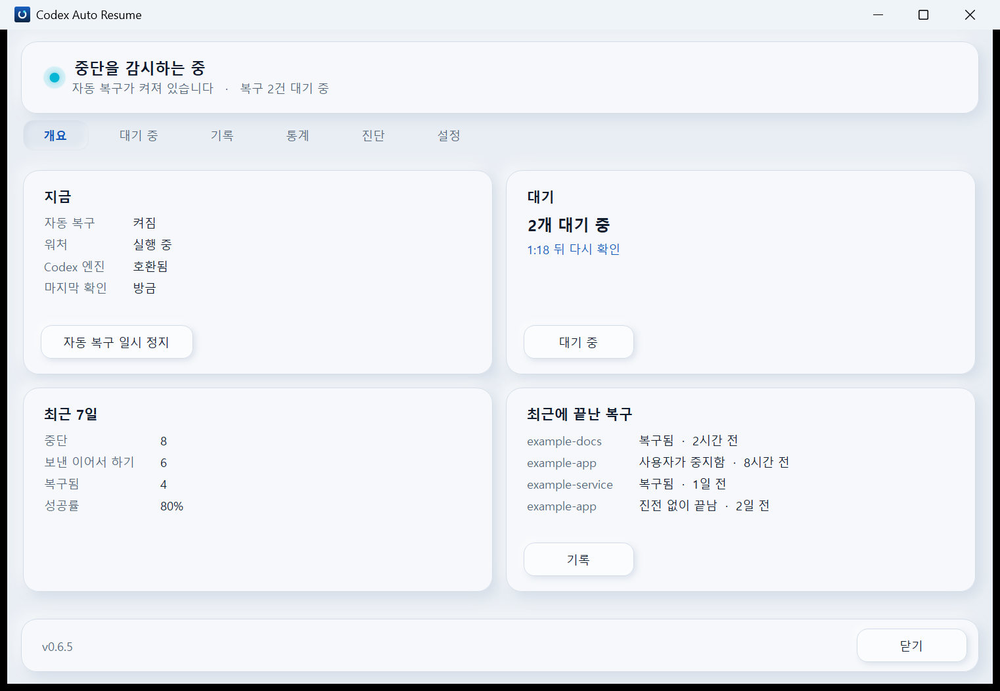
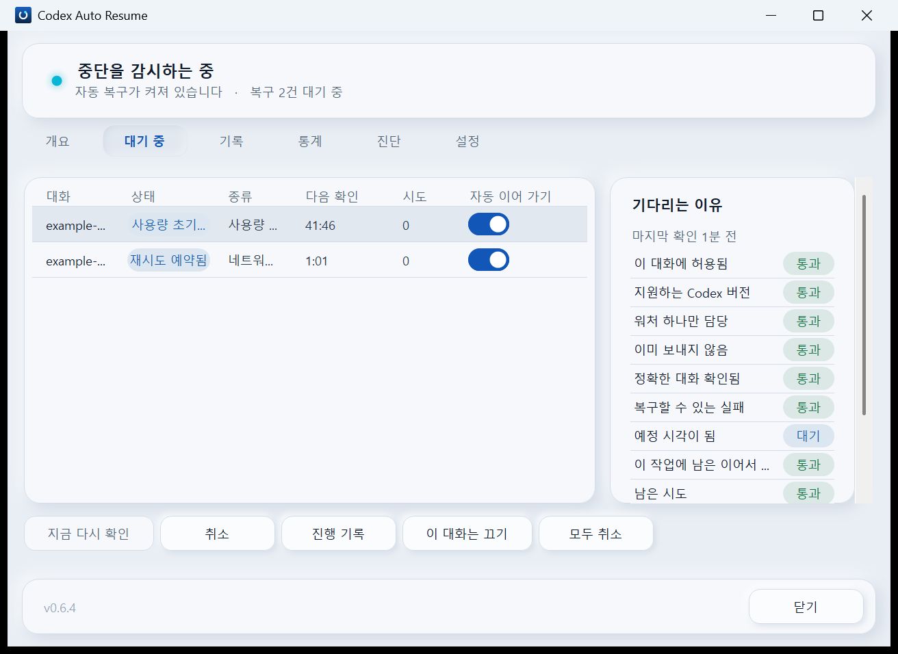
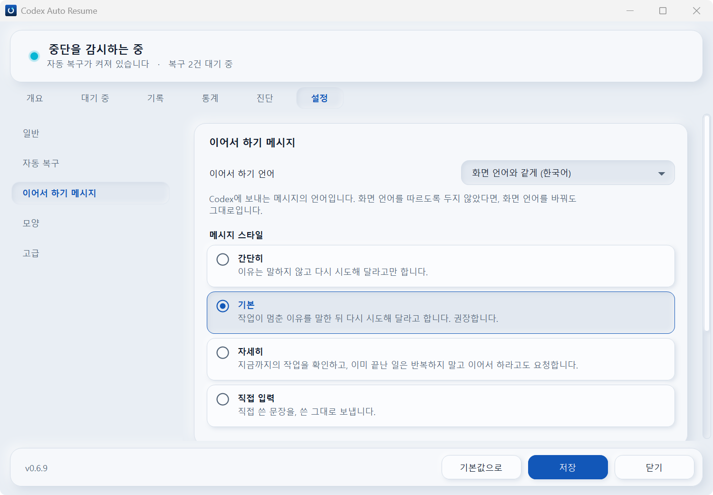

# Codex Auto Resume 로드맵: v0.6.7부터 v0.6.14까지

> 🌐 한국어 문서입니다. English version: [`main` 브랜치의 docs/ROADMAP.md](https://github.com/songyb111-gachon/codex-auto-resume-windows/blob/main/docs/ROADMAP.md)

v0.6.6 이후 Codex Auto Resume가 나아가려는 개발 방향입니다.

이 문서는 **계획한 로드맵이지 약속이 아닙니다**. Codex가 달라지거나, 테스트하다가 더 낫거나 더
안전한 구현 방법이 보이면 세부 사항은 바뀔 수 있습니다.

전체 방향은 다음과 같습니다.

**UI 마무리 → 호환성 판단 추가 → 창의 렉 개선 → Python 정리 → 비슷한 어떤 프로그램보다 많은 고급 기능을
두 판으로 추가 → Python 안정화 → 코어를 Rust로 교체하고 Rust다운 구조로 재편 → Rust 안정화**

기본 복구 동작은 여기의 모든 릴리스 내내 늘 그랬듯 보수적으로 유지합니다. v0.6.11이 더하는 것은 사람이 켜는
것이고, 스스로 켜지는 일은 없습니다.

---

## v0.6.3 — 출시됨 ✅

v0.6.3은 기능과 사용 경험을 크게 넓힌 릴리스였습니다.

무엇보다 다음을 더했습니다.

- 아홉 개의 화면 언어
- 화면 언어와 이어서 하기 메시지 언어의 분리
- 중단 이유에 맞춘 이어서 하기 메시지
- 간단히 / 기본 / 자세히 / 직접 입력 메시지 스타일
- 모든 이유에 쓰는 직접 입력 메시지와 이유별 직접 입력 메시지
- 더 풍부해진 대시보드와 알림 영역 컨트롤
- 나아진 알림
- 더 넓어진 Python CI 범위

복구의 안전 모델은 일부러 보수적으로 두었습니다.

---

## v0.6.4 — 디자인 일관성, 뉴모피즘 다듬기, 반응성 ✅

**출시되었습니다.**

v0.6.4는 복구 엔진을 넓히기보다 v0.6.3에서 선보인 UI를 마무리했습니다.

- 대시보드와 설정 창, 알림 영역 팝업, Codex 안의 패널이 패널에서 가져온 하나의 뉴모피즘 디자인을
  씁니다.
- 기본으로 Windows를 따르고 설정에서 고를 수 있는 밝은 테마와 어두운 테마가 생겼습니다.
- 창이 1000 × 632로 열리고, 첫 화면은 스크롤되지 않습니다.
- Windows의 스크롤 막대 대신 부드러운 막대를 씁니다.
- 켜고 끄는 것은 스위치, 목록에서 고르는 것은 체크박스입니다.
- 언어와 테마를 바꾸면 곧바로 적용되고, 필요하면 창이 스스로 다시 열립니다.
- 페이지 전환이 약 100ms에서 약 22ms로, 쓸 수 있는 화면이 약 3초 빨라졌습니다.
- 상태 불빛이 v0.6.3 이전의 색으로 돌아와 은은하게 빛납니다.

복구가 내리는 결정은 v0.6.3과 똑같습니다.

### 스크린샷

#### 대시보드 — 개요



#### 대시보드 — 대기 중



#### 알림 영역 팝업


#### 설정 — 한국어



---

## v0.6.5 — Codex 호환성 레지스트리, 화면 다듬기, 구조 정리의 기반 ✅

**출시되었습니다.**

v0.6.5에는 Codex 호환성 레지스트리와 v0.6.4를 써 보며 나온 화면 작업이 들어가고, Python 구현을
나누기 위한 기반을 마련합니다. 실제로 나누는 작업은 v0.6.10의 알파로 옮겼습니다.

### Codex 호환성 레지스트리

이 릴리스에서는 Codex 호환성 상태도 명시적으로 도입할 계획입니다.

- **VERIFIED** — 메인테이너가 직접 테스트함
- **COMPATIBLE** — 로컬 구조 검사는 통과했지만 아직 정식으로 검증하지 않음
- **INCOMPATIBLE** — 안전하지 않거나 호환되지 않는다고 알려짐
- **UNKNOWN** — 호환성을 확인할 수 없음

쓸모가 있는 곳에서는 호환성을 Codex 버전 전체 단위로만 따지지 않고 기능 단위로도 추적합니다.

예를 들면 다음과 같습니다.

```text
Codex x.y.z

사용량 한도 감지        ✓ 검증됨
정확한 스레드 복구      ✓ 검증됨
복구 턴 추적            ✓ 검증됨
빈 응답 복구            ? 미검증
notLoaded 복구          — 지원 안 함
```

원격 호환성 데이터는 **실패한 로컬 안전 검사를 절대 뒤집지 못합니다**.

레지스트리에 연결할 수 없을 때 의도한 대체 순서는 다음과 같습니다.

```text
검증된 캐시
    ↓
로컬 구조 검사
    ↓
그래도 불확실하면 UNKNOWN / 보내지 않고 멈춤(fail closed)
```

이 체계에는 텔레메트리가 필요하지 않습니다.

호환성 레지스트리의 데이터는 릴리스마다 함께 들어가고, 요청할 때만 새로 받습니다. 진단 화면에서
새로 고치거나 업데이트를 확인할 때입니다. 평소에 오가는 통신은 없습니다. 이 기능이 처음 들어가는
릴리스에서는 VERIFIED로 표시되는 기능이 하나도 없습니다. 그 상태에는 기록된 증거가 필요하기
때문입니다.

### 화면

v0.6.4를 써 보며 나온 화면 작업입니다.

- 숨 쉬는 것이 실제로 보이는 상태 불빛
- 알림 영역 아이콘 자체의 움직임: 감시하는 동안에는 천천히 숨 쉬다 가끔 천천히 한 바퀴 돌고,
  복구를 보내는 동안에는 호가 돕니다
- 제품의 디자인으로 그린 알림 카드. 같은 알림이 알림 센터에 조용히 남고, 카드를 띄우면 안 되는
  때(잠긴 화면, 전체 화면 앱, 방해 금지, 화면 낭독기 사용 중)에는 Windows의 알림이 대신 뜹니다
- 알림 영역 팝업 안쪽의 입체감
- 첫 화면 카드 버튼을 다시 왼쪽 아래로, 그에 맞춘 비율
- 카드와 같은 뉴모피즘 재질로 그린 선택 목록(창과 패널 모두)
- 켜고 끌 때 미끄러지듯 움직이는 스위치
- 옆으로 넘치지 않는 목록

### 수정과 구조 정리의 기반

- 구조 정리를 계획하며 찾은 수정 세 가지
- 코드를 옮겨도 안전 검사가 모르는 사이에 그 코드를 놓치지 않도록, 패키지 전체를 읽는 테스트
- 어떤 파일이 바뀌었는지가 아니라 창에 무엇이 전달되는지로 확인하는 스크린샷 검사

---

## v0.6.6 — 정석대로의 숨쉬기, 설치된 곳에서도 움직이는 작업 표시줄 단추, 그리고 마지막 기본 컨트롤들 ✅

**공개되었습니다.**

하루 써 보고 드러난 것들입니다. 복구에 대한 것은 아무것도 바뀌지 않았습니다.

상태등은 이제 보통의 숨쉬기입니다. 4.4초에 걸친 대칭 코사인 하나를 빛에서 그려 화면의 감마로
변환하고, 진폭은 깊게 두며, 번짐은 밝기를 따라가고 픽셀 수가 아니라 점 크기의 일정 비율까지
퍼집니다. 창과 알림 영역 팝업, Codex 안의 패널, 알림 카드가 표 하나를 함께 읽으므로 네 곳이 같이
숨 쉬고, 같은 리듬을 읽는 아이콘의 숨쉬기와 회전도 그에 맞춥니다.

v0.6.5는 창의 작업 표시줄 단추에서 마크를 움직이게 했지만, 설치된 창에서는 한 번도 움직이지
않았습니다. 설치된 창은 설치 프로그램이 등록한 애플리케이션으로 인식되고, 그런 단추는 창 자신의
아이콘이 아니라 그 정체성이 지닌 아이콘을 입기 때문입니다. 이제 창이 자기만의 작업 표시줄 정체성을
가지므로, 실제로 쓰는 자리에서 단추가 움직입니다.

그리고 아직 Windows나 브라우저의 것이던 컨트롤이 제품의 것이 되었습니다. 어디에 생기든, 가로든
세로든 모든 스크롤바가 그러하며, 홈 색은 그것이 놓인 바닥에 맞춰 정해집니다. 메시지 상자도 창 자신의
재질로 된 대화창이 되어, 예/아니요 대신 무슨 일이 일어날지를 단추에 적습니다. 문서의 그림은
움직이고, `PrintWindow`가 그리지 않던 검은 창틀도 더는 달고 있지 않습니다. 창에 맞춰 잘라내고,
Windows가 둥글리는 모서리도 그림에서 둥급니다.

Codex 안의 패널은 테마 바로 아래에 자기 테마인 Codex 안의 테마를 갖습니다. 기본값이자 지금까지 모든
패널이 하던 테마와 같게, Codex 테마 따르기, 밝게, 어둡게 가운데 고릅니다. 창, 팝업, 알림 카드는 테마를
그대로 따릅니다.

---

## v0.6.7 — 단계로 나눈 호환성, 이 PC에서 실패, 그리고 숨 쉬는 알림 카드 ✅

**공개되었습니다.**

호환성 레지스트리가 자기 말 뒤에 근거가 얼마나 있는지를 말하게 되고, 알림 카드의 불빛도 다른 곳들과
함께 숨 쉽니다. 데이터가 아무 말도 하지 않는 Codex 버전에서는 복구가 v0.6.6과 똑같이 결정합니다.

이제 기능마다, 정확한 Codex 버전마다 여섯 상태 가운데 하나로 정해집니다. 순서는 다음과 같습니다.

- **VERIFIED**(검증됨) — 바로 이 버전에서 실제 복구가 그 기능을 거쳤고, 실패한 것이 없음
- **CHECKED**(점검됨) — 새 상태. 바로 이 버전에서 메인테이너의 로컬 검사가 통과했고, 그 이상
  확인된 것은 없음
- **COMPATIBLE**(호환됨) — 데이터에 아무 주장이 없고, 이 컴퓨터의 검사가 통과함
- **FAILED_HERE**(이 PC에서 실패) — 새 상태. 데이터는 바로 이 버전을 점검했거나 검증했지만 이
  컴퓨터에서 검사가 실패함. 원인은 Codex 버전보다 이 컴퓨터일 가능성이 큼
- **INCOMPATIBLE**(호환되지 않음) — 아무도 점검하지 않은 버전에서 이 컴퓨터의 검사가 실패했거나,
  데이터에 작동하지 않는다고 되어 있음
- **UNKNOWN**(알 수 없음) — 호환성을 확인할 수 없음

규칙은 그대로입니다. 실패한 로컬 검사가 언제나 이기며, 그 결과는 이제 INCOMPATIBLE 또는
FAILED_HERE입니다. 데이터는 제한하거나, 정확한 버전에 한해 로컬 통과를 CHECKED나 VERIFIED로 올릴
수만 있습니다. CHECKED는 COMPATIBLE, VERIFIED와 똑같이 보냅니다. VERIFIED처럼 기록된 증거가 필요하고,
받아 온 데이터와 함께 만료됩니다. FAILED_HERE는 INCOMPATIBLE과 똑같이 모든 보내기를 막고, 그렇다고
알립니다. 그 상태가 붙잡은 복구에는 *이 PC에서 Codex 검사 실패*라고 나오고, 알림 영역 팝업과 그
아이콘은 확인이 필요하다고 알립니다. 그때 계획한 고급 단계는 VERIFIED에만 열렸고, 아래 v0.6.11의 계획이 새로 더하는 것에 대해서는 그것을 풉니다.

main의 데이터는 설치된 모든 릴리스가 받아 가므로, 각 릴리스는 가장 새 데이터를 자기 검증기로 통째로
받아들여야 합니다. v0.6.5와 v0.6.6은 자기가 모르는 상태인 CHECKED를 건너뛰고, 그 릴리스들이 내리는
결정은 하나도 움직이지 않습니다. 그리고 새 데이터를 릴리스 사이에 게시해도 main이 빨갛게 되지
않습니다. 동작 테스트와 그림은 v0.6.6 데이터의 고정된 사본을 읽고, 실제 파일은 여전히 증거 규칙에
붙잡혀 있습니다.

알림 카드의 상태등이 창, 팝업, Codex 안의 패널과 같은 표로 숨 쉽니다. v0.6.6에서는 일부러 켜진 채
멈춰 그렸습니다. 움직임 줄이기와 고대비에서는 멈춰 있습니다.

---

## v0.6.8 — 배지 없는 트레이 아이콘, 그리고 멈추지 않는 불빛 ✅

**공개되었습니다.**

알림 영역 아이콘은 창의 작업 표시줄 단추에는 없는 작은 상태 점을 모서리에 달고 있어서, 복구 중에는
트레이에만 불빛이 하나 더 보였습니다. 그 점을 없앴습니다. 이제 마크의 머리 혼자 상태를 말하고, 트레이
아이콘과 작업 표시줄 단추는 같은 그림입니다.

확인 필요와 실패는 한 번 맥박친 뒤 멈춰 있었습니다. 이제 둘 다 그 상태가 이어지는 동안 멈추지 않습니다.
확인 필요의 주황 불빛은 감시 중의 4.4초보다 느린 5.6초마다 천천히, 실패의 빨간 불빛은 1.2초마다 빠르게
숨 쉽니다. 전에는 무엇도 실패 상태로 바꾸지 않던 트레이 아이콘과 작업 표시줄 단추가, 이제 복구가 실패하면
빨개져 머리가 복구 중보다 두 배 빠르게 고리를 따라 쓸고 가면서 깜빡이고, 사용자가 볼 때까지 그대로 있습니다. 움직임 줄이기와 고대비에서는 여전히 모든 불빛이 멈춰 있습니다.

---

## v0.6.9 — 창의 렉, 그리고 Codex와 함께 시작하기 ✅

**공개되었습니다.**

먼저, 따로 다룰 만큼의 무게로: 창의 반응성, 곧 창에 아직 남아 있는 렉(몇몇 쪽에서 특히 심합니다)과 영어가
아닌 모든 언어에서 더 느리게 느껴지는 로딩(v0.6.8 때 알려졌습니다)입니다. 일어나는 곳에서 재고, 원인을 찾아
고치고, 잰 것은 테스트로 남깁니다. 나누기 뒤가 아니라 앞에 하는 까닭은, 그래야 나누기의 기준 사본이 빨라진
창을 붙잡고 나누기가 그것을 그대로 옮기기 때문입니다. 뒤에 하면 막 옮긴 코드에서 다시 고쳐야 합니다. 창이
얼마나 빠른지를 바꾸고, 그것만으로도 릴리스로 낼 만합니다.

### v0.6.9-alpha ✅ — Codex와 함께 시작하기, 직접 재기 (프리 릴리스)

Codex와 함께 시작하기에는 어떤 소스 코드에서도 읽어 낼 수 없는 사실이 두 가지 있습니다. Codex가 플러그인의
MCP 서버를 언제 시작하는지, 그리고 그 서버가 시작한 워처가 Codex가 닫힐 때 어떻게 되는지입니다. 둘 다 실제
제품이 도는 컴퓨터만 답할 수 있어서, 스위치와 그것을 재는 장치를 먼저 만들어 **v0.6.9-alpha** 프리 릴리스로
냈습니다. 그것만으로 릴리스로 낼 만한 단계가 아니라, 개발을 나누어야 해서 생긴 단계입니다. 아무에게도 배달되지
않습니다. `releases/latest`는 프리 릴리스를 답하지 않고, main에도 없으므로 플러그인 경로로도 오지 않습니다.
아래의 불빛과 그림 수정도 함께 들어 있습니다.

### Codex와 함께 시작하기: 재어 보았고, 내지 않습니다

지금은 Windows에 로그인할 때 워처가 시작됩니다. 다른 선택지, 곧 Codex가 시작될 때 함께 시작하는 것은
v0.6.9-alpha로 만들어 실제 기계에서 재었습니다. 어떤 소스 코드에서도 읽어 낼 수 없는 사실이 두 가지 있었기
때문입니다. 2026-09-23, Codex 26.915에서 둘 다 답이 나왔습니다.

- **Codex는 플러그인의 MCP 서버를 언제 시작하는가?** 앱이 열린 뒤 약 22초, 여러 번이고, 도구 목록을 읽은 뒤
  몇 초 만에 각각을 취소합니다.
- **그 서버가 시작한 워처는 어떻게 되는가?** 서버와 함께 죽습니다. Codex는 MCP 서버를 `KILL_ON_JOB_CLOSE`가
  걸려 있고 `BREAKAWAY_OK`는 없는 Windows 작업 개체 안에서 돌립니다. 그래서 거기서 시작된 프로세스는 작업
  개체를 떠날 수 없고, 작업 개체가 닫힐 때 함께 끝납니다. 여섯 번 시작했고, 여섯 워처 모두 약 6초 안에
  사라졌습니다.

시작한 지 몇 초 만에 죽는 워처가 계속 되풀이되는 것은 이 제품이 지향하는 것의 정반대입니다. 한 틱 중간에 멈춘
워처는 이어가기를 보냈는지 증명할 수 없기 때문입니다. 그래서 이 스위치는 제공하지 않습니다.
`Control.start_for_codex`는 작업 개체가 워처를 끝낼 상황이면 시작하지 않고, 작업 개체가 무엇이라고 했는지를
`logs/codex-start.log`에 적습니다. 다음 Codex는 그 한 줄로 다시 잴 수 있고, 고급판은 v0.6.11에서 이것을 제대로
만듭니다. 호스트의 작업 개체 밖에서 프로세스를 시작하는 일이야말로 그 판이 사람에게 켜게 해 주려는 것입니다.

### 더 짧은 README

README가 천 줄 가까이 길어졌습니다. README는 짧은 안내 - 이 제품이 하는 일, 설치 방법, 알아야 할 제한 하나,
나머지가 있는 곳 - 가 되고, 전체 내용은 그대로 [안내서](GUIDE.ko.md)로 옮깁니다. 두 언어 모두 그렇습니다.

---

## v0.6.10 — Python 모듈화, 매듭지은 디자인, 그리고 남의 보고를 위한 등급

**다음 릴리스입니다.**


v0.6.10은 두 단계로 나옵니다. 프리 릴리스인 **v0.6.10-alpha**는 모듈화뿐이고, 최종 **v0.6.10**은 알파가
남긴 경계 위에서 하는 디자인 점검과 모양 고르기, 그리고 새 등급 보고됨입니다. 프리 릴리스는 정식 버전으로 내기에는 애매하지만 개발을
단계로 나누어야 할 때 씁니다. 모듈화가 그렇습니다. 누가 볼 수 있는 변화가 없어 그것만으로는 릴리스로 낼 만하지
않지만, 그 위에 올릴 것보다 먼저 끝내고 내야 합니다. 디자인은 그 반대입니다. 모든 것의 생김새를 바꾸므로
릴리스입니다.

### v0.6.10-alpha — Python 모듈화 (프리 릴리스)

알파는 Python 구현의 구조를 크게 정리하는 단계로 계획하고 있습니다. 앞선 계획에서는 v0.6.5의 중심이었고,
그다음에는 v0.6.8과 v0.6.9의 중심이었습니다. v0.6.5에는 그 기반이 들어가고, 실제로 나누는 작업은 여기서 합니다.
그 전까지는 줄 수 한도가 아무것도 막지 않으며, 앞선 기능들이 필요한 만큼 모듈이 커져도 됩니다. 알파부터는 다시
한도를 지킵니다.

무엇이든 옮기기 전에:

- 창과 Codex 안의 패널이 받는 응답의 기준 사본. 나누는 작업이 한 바이트라도 바꾸면 실패합니다
- 여러 번 적혀 있던 규칙을 하나로 모으기, 공통 식별자와 용어, 계층 사이의 타입이 정해진 계약

주요 목표:

- 너무 커진 모듈 나누기
- 책임을 더 분명하게 가르기
- 엔진, 상태, 저장소, 어댑터, 제어 계층 사이의 경계 분명히 하기
- 중복 없애기
- 타입이 정해진 계약 강화하기
- 순수하고 테스트하기 쉬운 로직을 더 많이 떼어 내기
- 뒤에 올 Rust 이전을 위해 깔끔한 경계 마련하기

창의 가장 큰 C# 파일들도 같은 방식의 안전망을 먼저 두고 나눌 수 있습니다.

GitHub에서 저장소의 첫 화면도 같은 단계에서 정리합니다. 어차피 경로가 옮겨지는 때에, 최상위에 놓인
파일을 줄입니다.

이 리팩터링 중에 발견한 버그는 회귀 테스트와 함께 고치지만, 알파는 **저장소 전체를 샅샅이
뒤지는 버그 찾기를 목표로 하지 않습니다**. 그것은 v0.6.12가 합니다. 알파는 모듈화뿐이고, 기능도, 누가 볼 수
있는 변화도 없습니다.


### v0.6.10 — 디자인 점검과 모양 고르기

최종 v0.6.10은 디자인을 매듭짓는 일과, 그와 함께 오는 낱말 하나(아래의 보고됨)입니다. 릴리스로 낼 만하니 릴리스로 냅니다. 모든 화면의 생김새를
바꾸는 일이고, 그것이야말로 사람이 보는 것이기 때문입니다. 여기에 두는 까닭은 넷입니다. 알파 뒤인 것은 네 가지
모양을 밝게·어둡게 만드는 일이 그리기 코드가 모듈로 나뉜 뒤라야 안전해서입니다. 두 판보다 앞인 것은 두 판이
하나의 매듭지어진 디자인을 물려받게 하기 위해서이고, 그래야 같은 점검을 두 번 하지 않습니다. Rust보다 앞인 것은
이전이 완성된 모양을 그대로 옮기게 하기 위해서입니다. 그리고 점검이 고르기보다 먼저인 것은, 다른 모양들을 지금
디자인에서 끌어내므로 지금 디자인이 먼저 옳아야 하기 때문입니다.

- Codex 안의 패널, 앱, 알림 영역 팝업, 알림 카드를 밝게·어둡게 나란히 놓고 하나의 제품처럼 보이지 않는
  곳을 모두 고치는 디자인 점검. 상태를 말하면서 움직이지 않는 불빛도 여기에 들어갑니다. 패널의 자동 복구
  타일에 있는 8px 점은 그 위의 상태등이 숨 쉬는 동안 멈춰 있는데, 제품이 돌고 있다고 말하는 불빛은 가만히
  있지 않는다는 것이 사용자의 규칙입니다. 그림도 따라갑니다. 생성기는 지금 한 화면에 불빛 하나만
  움직이지만, 그 화면이 움직이는 모든 불빛을 움직이게 합니다
- 모양 고르기: 지금 디자인, 같은 디자인에서 움직임 없이, v0.6.2의 단순한 모양(상태 불빛은 지금
  방식), 완전히 단순한 모양. 모두 밝게와 어둡게 지원
- 그다음에 위의 고급 기능과 두 판

---

### 다른 사람의 호환성 보고

이 일을 맡을 프로그램 두 개는 이미 있습니다. 제품 바깥, 릴리스 바깥입니다. 하나는 관리자 자신의 관리용
프로그램이고, 다른 하나는 누구나 자기 컴퓨터에서 돌려 보고 하나를 쓰고 보낼 수 있는
[codex-compat-reporter](https://github.com/songyb111-gachon/codex-compat-reporter)입니다. v0.6.10에 남은 것은
이 저장소 쪽입니다. 그런 풀 리퀘스트를 데이터로만 읽는 검사와, 도착한 것을 버전 옆에 보여 주는 일입니다.
어느 보고도 티 나지 않게 지어낼 수는 없습니다.

- **보고는 사람이 적은 것이 아니라 프로그램이 잰 것입니다.** 프로그램이 기여자의 컴퓨터에서 직접 점검을 돌리고
  보고를 스스로 씁니다. 읽어 낸 Codex 버전과 엔진 지문, 돌린 점검 하나하나와 그 결과입니다. 사람이 고르고 싶어질
  만한 항목 - 그 버전이 어느 등급을 받는지, 점검이 실제로 실행된 것으로 치는지 - 은 측정에서 끌어내며, 보고가
  도착하면 저장소가 그것을 다시 끌어내므로 손으로 고친 결론은 남지 않습니다.
- **보고는 풀 리퀘스트로 오고, 데이터로만 검사합니다.** 그런 풀 리퀘스트마다 도는 검사는 파일 안의 어떤 것도
  실행하지 않고 읽기만 하며, 기여자 자신의 GitHub 이름(풀 리퀘스트를 연 사람) 아래의 새 파일만 받고, 버전·지문·
  날짜가 그럴듯하지 않은 보고와 중복된 보고는 거절합니다. 그래도 관리자가 하나하나 검토해 합치고, 틀린 것으로
  드러난 보고는 공개적으로 철회할 수 있습니다.
- **다른 사람의 보고는 보여 주기만 하고, 아무것도 바꾸지 않습니다.** 보고는 자기 등급인 *보고됨*을 가지며,
  검증됨·점검됨·호환됨·이 PC에서 실패의 사다리 옆에 서고 어떤 경우에도 그중 하나가 되지 않습니다. 버전 옆에,
  같은 말을 한 컴퓨터가 몇 대인지와 함께 놓입니다. N대가 동작을, M대가 실패를, K대가 어느 쪽도 보이지 않음을
  보고했다는 식입니다. 보고 하나는 전달된 기록 가운데 하나라도 `recovered` 상태로 끝났으면 동작으로 세고,
  전달된 기록 가운데 하나라도 `recovery_turn_failed`·`failed`·`terminal_failure`로 끝났으면 실패로 세며,
  아무것도 전달되지 않았으면 어느 쪽도 아님으로 셉니다. 한 보고 안에서 기록들이 서로 다른 말을 하면 그 보고는
  두 칸 모두에 셀 수 있고, 그것은 정리하지 않고 그대로 보여 줍니다. 보고됨은 어떤 버전도 검증됨이나 점검됨으로
  올리지 않고 - 그 버전의 자체 근거가 아무 말도 하지 않으면 보고가 몇 건 오든 호환됨으로 남습니다 - 제품이
  스스로 할 수 있는 일도 바꾸지 않습니다. 그 등급은 지금처럼 관리자가 직접 얻은 근거로만 매깁니다.

한계도 솔직하게 적습니다. 기여자 자신의 컴퓨터에서 보고를 지어내지 않았다는 것까지 증명할 방법은 없습니다.
그래서 다른 사람의 보고는 참고가 되고, 결정은 관리자 자신의 근거만 합니다.

관리용 프로그램은 따로 된 프로그램으로 남고, 그 기능은 고급판에도 들어갑니다. 고급판을 쓰는 사람은 두 번째 도구
없이 보고를 기록하고 낼 수 있습니다. 기본판은 여기서 보내는 것도 더해지는 것도 없습니다. 보고는 작성자가 풀
리퀘스트를 열 때만 GitHub로 갑니다.

---

## v0.6.11 — 두 판의 고급 기능

v0.6.11은 지금까지의 어느 릴리스보다 멀리 갑니다. 비슷한 프로그램들이 제공하는 기능을 모두, 그리고 그
이상을 공격적으로 제공할 계획입니다. 만들기 전에 이런 일을 하는 도구들을 살펴보고, 그중 어느 하나라도 제공하는
기능은 모두 목록에 올립니다.

사용자가 정한 두 원칙을 따릅니다.

- **지금까지의 기능은 지금의 제약을 그대로 지킵니다.** 이미 하고 있는 일은 하나도 느슨해지지 않고, 기본값도
  바뀌지 않습니다. 처음 보낸 이어가기가 이미 전달됐을 수도 있으면 다시 보내지 않는 것도 늘 그랬듯 그대로입니다.
- **지금의 제약에서는 만들 수 없었던 기능은 모두 만들되, 원하는 사용자만 씁니다.** 그런 기능은 사람이 하나씩
  켜기 전까지 꺼져 있고, 켜기 전에 무엇을 하는지 분명히 말합니다. 이미 전달됐을 수도 있을 때 다시 보내는 것도
  그렇게 켤 수 있습니다. 앞선 계획이 이렇게 제공할 수 있는 것에 두었던 제약 - 안전이 증명된 것만, VERIFIED인
  Codex 버전에서만, "후보일 뿐 보장하지 않음" - 은 더 이상 이 릴리스를 묶지 않습니다.

### 두 판을 함께 냅니다

꺼 둔 스위치도 코드는 거기 있습니다. 새 기능을 한 제품 안에 넣어 내면, 처음부터 이 제품을 다르게 만든 것 -
이어가기를 두 번 보내지 않고, 정확히 한 대화로만 읽고 보내며, 실패하면 닫힌다는 것 - 이 코드가 아니라 설정 하나로만
지켜지게 됩니다. 그래서 v0.6.11부터는 한 저장소에서 두 판을 만들어, 같은 버전으로 동시에 냅니다.

- **기본판**은 지금의 제품 그대로입니다. 새 기능은 아예 들어 있지 않습니다. 그 코드는 이 판의 압축 파일에서
  빠지고, 만들어진 압축 파일에 그것이 하나도 없음을 테스트가 증명합니다.
- **고급판**에는 모두 들어 있고, 새 기능은 사용자가 하나씩 켜기 전까지 꺼져 있습니다.

판마다 압축 파일, 고정된 해시, 빌드 증명이 따로 있습니다. 설치본은 같은 판 안에서만 업데이트되고, 다른 판으로
옮기는 것은 업데이트가 아니라 일부러 하는 재설치입니다. Rust 코어도 두 판을 그대로 이어받습니다(v0.6.13).

목록은 앞선 계획의 후보에서 시작합니다.

- notLoaded 복구
- 빈 응답 복구
- Goal과 비슷한 이어서 하기
- 하위 에이전트 복구
- 복구할 수 있는 모든 장애 종류
- Codex가 허락하는 모든 곳에서의 더 넓은 복구

### 다른 사람의 호환성 보고

등급 자체와, 이 저장소가 보고로 하는 일은 모두 위의 v0.6.10에 있습니다. 여기에 남는 것은 고급판의
몫입니다. 고급판은 두 번째 프로그램 없이 스스로 보고를 기록하고 보내므로, 그 판을 쓰는 사람은 별도
도구가 필요하지 않습니다. 기본판은 여기서 아무것도 보내지 않고 아무것도 얻지 않습니다. 보고는 그것을
쓴 사람이 풀 리퀘스트를 열 때에만 깃허브로 갑니다.

---

## v0.6.12 — Python 최종 감사, 두 판 모두

v0.6.12는 마지막 Python 릴리스입니다. 저장소 전체를 두 판 모두 버그 찾기에 거치게 하고, Rust 이전이 그대로
재현할 Python 참조 구현이 됩니다.

v0.6.12는 두 판 모두에 걸쳐 Python 구현을 마지막으로 종합 감사하는 릴리스로 계획하고 있습니다.

v0.6.10-alpha의 리팩터링과 달리 이 릴리스는 일부러 넓게 버그를 찾습니다.

살펴볼 영역은 다음과 같습니다.

- 상태 기계 동작
- 경합 조건과 동시성
- 재시도와 연쇄 복구 횟수 계산
- SQLite와 스키마 마이그레이션
- 충돌과 재시작 때의 동작
- 설치 / 업데이트 / 설치 고치기 / 제거
- MCP / 알림 영역 / 대시보드 / CLI
- Windows 프로세스 수명 주기
- 절전 / 절전 해제
- 형식이 잘못되었거나, 낡았거나, 손상된 상태
- 결함 주입
- 실제 Codex와의 연동
- 고급 / 실험적 복구 경로
- 모든 언어에서의 반응성: v0.6.9가 남긴 렉이 있다면 그것
- 두 판 모두, 그리고 기본판에 여전히 고급 코드가 하나도 없는지

확인된 버그에는 회귀 테스트를 붙입니다.

그렇게 다듬어진 동작이 Rust 이전의 기준이 되는

> **최종 Python 참조 구현**

이 됩니다.

---

## v0.6.13 — Rust: 코어를 그대로 교체하고, 그다음 Rust답게

v0.6.13도 두 단계로 나옵니다. 프리 릴리스인 **v0.6.13-alpha**는 제품의 Python 코어를 그대로 Rust로 바꾸고,
최종 **v0.6.13**은 그 코어를 자연스럽게 Rust다운 모습으로 만듭니다. 알파를 프리 릴리스로 내는 까닭은, 그대로 옮긴
코어가 Rust다운 코어로 가는 길의 한 단계일 뿐 그것만으로 낼 만한 릴리스가 아니기 때문입니다.

### v0.6.13-alpha — Rust 코어로 완전히 교체 (프리 릴리스)

알파에서는 제품에 들어가는 Python 코어를 그대로 Rust로 바꿀 계획입니다.

개발하는 동안에는 조금씩 옮길 수 있지만, 릴리스 자체는 Python과 Rust가 오래 섞인 제품을 내놓는 대신
완성된 Rust 코어로 한 번에 넘어가는 것을 목표로 합니다.

규칙은 하나입니다.

> **동작이 아니라 구현을 바꾼다.**

Rust 구현은 최종 v0.6.12의 동작을 현실적으로 가능한 한 그대로 재현해야 합니다.

목표:

- Python/Rust 차등 테스트
- 기존 데이터베이스와의 호환
- 기존 설정과의 호환
- Conservative와 Advanced 동작 보존, 그리고 두 판의 보존. 기본판은 고급 코드 없이 만들어집니다
- 호환성 레지스트리의 의미 보존
- 정확한 스레드와 실패하면 닫힘(fail closed)이라는 안전 보장 보존
- 준비가 되면 제품에서 Python 코어와 런타임 제거

Windows UI는 Rust로 옮길 **계획이 없습니다**.

의도한 구성은 다음과 같습니다.

```text
C# / .NET
- 대시보드
- 설정
- 알림 영역
- 알림
- 네이티브 Windows UI

        │
        ▼

Rust
- 워처
- 복구 엔진
- 분류기 / 정책
- 상태 기계
- 스케줄러 / 상태 맞추기
- 영속 저장
- Codex 어댑터
- 제어 / MCP 백엔드
```

PowerShell은 부트스트랩, 설치, 업데이트 같은 Windows 배포 작업을 맡는 얇은 계층으로 남을 수
있습니다.

### v0.6.13 — Rust다운 구조 재편과 최적화

알파는 동작을 똑같이 맞추는 것을 먼저 챙깁니다.

그래서 첫 Rust 구현에는 Python 모양 그대로인 구조가 어느 정도 남을 수 있습니다.

최종 v0.6.13에서는 코드베이스를 더 자연스럽게 Rust다운 모습으로 바꿀 계획입니다.

해 볼 만한 작업:

- 소유권 중심의 데이터 흐름
- 더 강한 enum과 newtype
- 더 분명한 오류 타입
- 더 나은 동시성 구조
- 더 깔끔한 모듈 / crate 경계
- 불필요한 복제와 직렬화 없애기
- 더 깔끔한 SQLite / IPC / 프로세스 추상화
- Python 시절 구조에서 온 가정 걷어 내기
- 시작 속도, 메모리, 성능 개선

이 재편 중에 발견한 버그는 회귀 테스트와 함께 고칩니다.

시스템 전체를 대상으로 하는 마지막 버그 찾기는 이 릴리스의 목표가 아닙니다.

---

## v0.6.14 — Rust 최종 감사와 안정화: Rust 버그 찾기

v0.6.14는 마지막 종합 안정화 작업으로 계획하고 있습니다.

중점적으로 볼 것은 다음과 같습니다.

- 경합 조건과 교착 상태
- panic 경로
- 스레드 / 핸들 / 메모리 / 리소스 누수
- 프로세스 수명 주기
- SQLite 트랜잭션 동작
- IPC와 제어 프로토콜
- 오래 실행되는 워처의 안정성
- 재시작과 절전 / 절전 해제
- 탐색기(Explorer) 재시작
- 설치 / 업데이트 / 설치 고치기 / 제거
- 형식이 잘못되었거나 손상된 상태
- 호환성 레지스트리의 캐시 / 오프라인 / 실패 시 동작
- 고급 / 실험적 기능
- 실제 Codex 복구
- 쓸모가 있는 곳에서는 퍼징이나 속성 기반 테스트

그 결과가 이 프로젝트의

> **최종 안정 Rust 기준선**

이 됩니다.

---

## 장기 방향

의도한 최종 구성은 다음과 같습니다.

- **Rust** — 복구 코어와 백엔드
- **C# / .NET** — 네이티브 Windows UI
- **최소한의 PowerShell** — 여전히 쓸모 있는 배포 관련 작업

지금은 **v0.7.0 기능 개발 주기를 계획하고 있지 않습니다**.

v0.6.14 이후에는 주로 유지 보수 단계로 넘어갈 것으로 봅니다.

- Codex 호환성 업데이트
- 호환성 레지스트리 업데이트
- 버그 수정
- 보안 수정
- 앞으로 Codex 동작이 바뀌면서 필요해지는 변경

---

## 요약

```text
v0.6.3  ✅ 출시됨
기능 / UX 확장

        ↓

v0.6.4  ✅ 출시됨
UI 디자인 일관성
밝은 테마와 어두운 테마
설정 / 알림 영역 / MCP 통일
UI 지연 줄이기

        ↓

v0.6.5  ✅ 출시됨
Codex 호환성 레지스트리
+ 아이콘 움직임, 알림 카드, 화면 다듬기
+ Python 구조 정리의 기반

        ↓

v0.6.6  ✅ 공개됨
은은해진 상태등
+ 설치된 곳에서도 움직이는 작업 표시줄 단추

        ↓

v0.6.7  ✅ 공개됨
단계로 나눈 호환성: 검증됨, 점검됨, 호환됨
+ 이 PC에서 실패, 숨 쉬는 알림 카드

        ↓

v0.6.8  ✅ 공개됨
배지 없는 트레이 아이콘
+ 천천히 숨 쉬는 확인 필요, 빠르게 움직이는 실패

        ↓

v0.6.9  ✅ 공개됨
창의 렉, 재어서 고침
+ Codex와 함께 시작하기: 재어 보고 내지 않음, 더 짧은 README

        ↓

v0.6.10-alpha → v0.6.10
Python 모듈화와 GitHub 첫 화면 정리, 프리 릴리스로
+ 디자인 점검과 모양 고르기, 최종판으로

        ↓

v0.6.11
비슷한 어떤 프로그램보다 많은 고급 기능을 두 판으로
+ 다른 사람의 호환성 보고

        ↓

v0.6.12
Python 최종 감사, 두 판 모두
→ Python 참조 동작 고정

        ↓

v0.6.13-alpha → v0.6.13
Rust 코어로 완전히 교체, 프리 릴리스로
+ Rust다운 구조 재편과 최적화, 최종판으로

        ↓

v0.6.14
Rust 최종 감사와 안정화: Rust 버그 찾기
→ 최종 안정 Rust 기준선

        ↓

유지 보수
```

이 문서는 지금의 방향을 기록합니다. 이번 릴리스는 공개되었고, 다음은 v0.6.10입니다.
